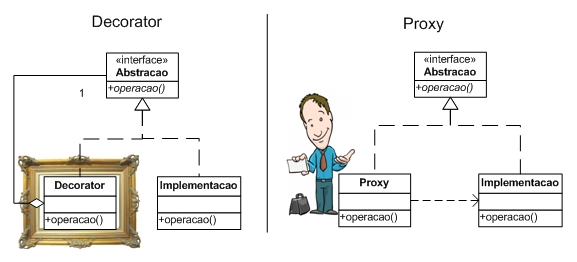
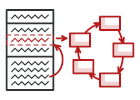

# **Design Pattern**

> *Design Patterns ou Padrões de Projetos são soluções generalistas para problemas recorrentes durante o desenvolvimento de um software. Não se trata de um framework ou um código pronto, mas de uma definição de alto nível de como um problema comum pode ser solucionado.*

### O que é um Design Pattern?

Design Pattern ou também chamado de **Padrões de Projeto** são soluções típicas para problemas comuns em projeto de software. Eles são como plantas de obra pré fabricadas que você pode customizar para resolver um problema de projeto recorrente em seu código.

Você não pode apenas encontrar um padrão e copiá-lo para dentro do seu programa, como você faz com funções e bibliotecas que encontra por aí. O padrão não é um pedaço de código específico, mas um conceito geral para resolver um problema em particular. Você pode seguir os detalhes do padrão e implementar uma solução que se adeque às realidades do seu próprio programa.

### Origem

Esses conceitos ficaram realmente conhecidos em 1994, quando os engenheiros de software Erich Gamma, Richard Helm, Ralph Johnson e John Vlissides escreveram o livro **“Design Patterns: Elements of Reusable Object-Oriented Software”** com o objetivo de catalogar problemas comuns aos projetos de desenvolvimento de software e as formas de resolver esses problemas. Os autores catalogaram 23 padrões que utilizaram ao longo de suas carreiras. 

### O que consiste um padrão?

A maioria dos padrões são descritos formalmente para que as pessoas possam reproduzi-los em diferentes contextos. Aqui estão algumas seções que são geralmente presentes em uma descrição de um padrão:

- O **Propósito** do padrão descreve brevemente o problema e a solução.
- A **Motivação** explica a fundo o problema e a solução que o padrão torna possível.
- As **Estruturas** de classes mostram cada parte do padrão e como se relacionam.
- **Exemplos de código** em uma das linguagens de programação populares tornam mais fácil compreender a ideia por trás do padrão.

### Quais os benefícios de utilizar Design Pattern?

Design Patterns são modelos que já foram utilizados e testados anteriormente, portanto podem representar um bom **ganho de produtividade** para os desenvolvedores. Seu uso também contribui para a **organização e manutenção** de projetos, já que esses padrões se baseiam em baixo ***acoplamento*** entre as classes e padronização do código. Além disso, com a padronização dos termos, as **discussões técnicas** são **facilitadas**. É mais fácil falar o nome de um Design Pattern em vez de ter que explicar todo o seu comportamento.

Os autores do livro **“Design Patterns: Elements of Reusable Object-Oriented Software”** agruparam os Design Patterns em três tipos diferentes: Creational (Criação), Structural (Estrutura), Behavioral (Comportamental). Assim como podemos ver na tabela abaixo. 

> **Observação:** Nessa tabela também foram acrescentadas novos Design Patterns. 

| Creational Patterns | Structural Patterns |   Behavioral Patterns   |
| :-----------------: | :-----------------: | :---------------------: |
|  Abstract Factory   |       Adapter       | Chain of Responsibility |
|       Builder       |       Bridge        |         Command         |
|   Factory Method    |      Composite      |       Interpreter       |
|      Prototype      |      Decorator      |        Iterator         |
|      Singleton      |       Facade        |        Mediator         |
|                     |      Flyweight      |         Memento         |
|                     |        Proxy        |       Null Object       |
|                     |                     |        Observer         |
|                     |                     |          State          |
|                     |                     |        Strategy         |
|                     |                     |     Template Method     |
|                     |                     |         Visitor         |

## Creational Patterns

> Os padrões de criação fornecem vários mecanismos de criação de objetos, que aumentam a flexibilidade e reutilização de código já existente.

 
### Abstract Factory  

#### **Definição**

>  *É um padrão de projeto de criação que permite que você produza famílias de objetos relacionados sem ter que especificar suas classes concretas.*

#### **Aplicabilidade**

1. Use o *Abstract Factory* quando seu código precisa ***trabalhar com diversas famílias de produtos relacionados***, mas que você ***não quer depender de classes concretas daqueles produtos***. Eles podem ser desconhecidos de antemão ou você simplesmente quer permitir uma futura escalabilidade.
2. O Abstract Factory fornece a você uma interface para a ***criação de objetos de cada classe das famílias de produtos***. Desde que seu código crie objetos a partir dessa interface, você ***não precisará se preocupar em criar uma variante errada de um produto que não coincida com produtos já criados*** por sua aplicação.
   - Considere implementar o *Abstract Factory* quando você tem uma classe com um conjunto de *Factory Method* que desfoquem sua responsabilidade principal.
   - Em um programa bem desenvolvido ***cada classe é responsável por apenas uma coisa***. Isso respeita o ***Single Responsibility Principle*** (Princípio da Responsabilidade Única). Quando uma classe lida com múltiplos tipos de produto, pode valer a pena extrair seus *Factory Method* em uma classe *Factory* sozinha ou uma implementação plena do *Abstract Factory*.

> **Observação:** o fato da *Abstract Factory* ser definida a partir de uma abstração **permite que os clientes possam interagir de forma transparente em diferentes contextos**. Essa abstração também **permite que cada classe tenha suas particularidades**.

#### Classes de exemplo

```kotlin
//Arquivo Shape.kt
interface Shape{
    fun draw()
}
//Arquivo RoundedRectangle.kt
class RoundedRectangle: Shape {
    override fun draw() {
        println("Inside RoundedRectangle::draw() method.")
    }
}
//Arquivo RoundedSquare.kt
class RoundedSquare: Shape {
    override fun draw() {
        println("Inside RoundedSquare::draw() method.")
    }
}
//Arquivo Rectangle.kt
class Rectangle: Shape {
    override fun draw(){
        println("Inside Rectangle::draw() method.")
    }
}
//Arquivo Square.kt
class Square: Shape {
    override fun draw(){
        println("Inside Square::draw() method.")
    }
}
//Arquivo AbstractFactoryPattern.kt
abstract class AbstractFactoryPattern {
    abstract fun getShape(shapeType:String): Shape?
}
//Arquivo ShapeFactory.kt
class ShapeFactory:AbstractFactoryPattern() {
    override fun getShape(shapeType: String): Shape? {
        when (shapeType) {
            "RECTANGLE" -> {
                return Rectangle()
            }
            "SQUARE" -> {
                return Square()
            }
        }
        return null
    }
}
//Arquivo RoundedShapeFactory.kt
class RoundedShapeFactory: AbstractFactoryPattern() {

    override fun getShape(shapeType: String): Shape? {
        when (shapeType) {
            "RECTANGLE" -> {
                return RoundedRectangle()
            }
            "SQUARE" -> {
                return RoundedSquare()
            }
        }
        return null
    }
}
//Arquivo Producer.kt
class Producer {
    fun getFactory(rounded:Boolean): AbstractFactoryPattern {
        return if (rounded){
            RoundedShapeFactory()
        } else{
            ShapeFactory()
        }
    }
}
//Arquivo AbstractFactory.kt
fun main() {

    val shapeFactory1 = Producer().getFactory(false)

    val shape1 = shapeFactory1.getShape("RECTANGLE")
    shape1?.draw()

    val shape2 = shapeFactory1.getShape("SQUARE")
    shape2?.draw()

    val shapeFactory2 = Producer().getFactory(true)

    val shape3 = shapeFactory2.getShape("RECTANGLE")
    shape3?.draw()

    val shape4 = shapeFactory2.getShape("SQUARE")
    shape4?.draw()

}
```

#### **Saída**

```
Inside Rectangle::draw() method.
Inside Square::draw() method.
Inside RoundedRectangle::draw() method.
Inside RoundedSquare::draw() method.
```

#### **Pontos Positivos**👍

- **Leitura mais eficiente do código:** assim como todos os outros padrões de projeto, quando usamos esse padrão em nosso projeto, isso torna o nosso *código mais legível e organizado*. Além disso, ela *facilita a leitura e entendimento por parte de outros programadores*.
- **Compatibilidade:** você pode ter certeza que *os produtos que você obtém de uma fábrica são compatíveis entre si*.

- **Você evita um vínculo forte entre produtos concretos e o código cliente**.

- **Manutenção:** você pode *extrair o código de criação do produto para um lugar*, fazendo o código ser de fácil manutenção. 

- **Código maleável:** Você pode *introduzir novas variantes de produtos sem quebrar o código cliente existente*. Isso respeita o **Open-Closed Principle** (Princípio Aberto-Fechado).

- **Encapsulamento de Código:** quando há o encapsulamento do código de criação em pontos únicos do projeto, isso remove o forte acoplamento entre as classes que não deveriam ter um alto nível de relacionamento umas com as outras.

#### **Pontos Negativos**👎

- **Complexidade do código:** o código pode tornar-se mais complicado do que deveria ser, uma vez que muitas novas interfaces e classes são introduzidas junto com o padrão. Isso também pode piorar a performance do projeto.

#### Relações com outros padrões

- **Muitos projetos começam usando o padrão de projeto** *Factory Method* (menos complicado e tem mais customização através de subclasses) e evoluem para os padrões *Abstract Factory*, *Prototype*, ou *Builder* (ele é mais flexíveis e complicado).
- O padrão de projeto *Abstract Factory* se especializa em **criar famílias de objetos relacionados**. Já o padrão de projeto *Builder* foca em **construir objetos complexos passo a passo**. O *Abstract Factory* **retorna o produto imediatamente**, enquanto que o *Builder* permite que você **execute algumas etapas de construção antes de buscar o produto**.
- As classes *Abstract Factory* são **quase sempre baseadas em um conjunto de** *Factory Method*, mas você também pode usar o *Prototype* para **compor métodos dessas classes**.
- O *Abstract Factory* pode **servir como uma alternativa para o padrão** *Facade* quando você precisa apenas **esconder do código cliente a forma com que são criados os objetos do subsistema**.
- Você pode **usar o** *Abstract Factory* **junto com o padrão** *Bridge*. Esse pareamento é **útil quando algumas abstrações definidas pelo** *Bridge* **só podem trabalhar com implementações específicas**. Neste caso, o *Abstract Factory* pode **encapsular essas relações e esconder a complexidade do código cliente**.
- Os padrões de projeto *Abstract Factory*, *Builder* e *Prototype* podem **todos ser implementados como um** *Singleton*.


###  Builder 

#### Definição

> *É um padrão de projeto de criação que permite que você construa objetos complexos passo a passo. Ele também permite que você produza diferentes tipos e representações de um objeto usando o mesmo código de construção.*

#### Aplicabilidade

1. Use o padrão *Builder* para se **livrar de um *“construtor telescópico”***. 
   - Digamos que você tenha um construtor com dez parâmetros opcionais. Chamar um monstro desses é muito inconveniente; portanto, você sobrecarrega o construtor e cria diversas versões curtas com menos parâmetros. Esses construtores ainda se referem ao principal, passando alguns valores padrão para qualquer parâmetro omitido.
   - O padrão *Builder* permite que você ***construa objetos passo a passo, usando apenas aquelas etapas que você realmente precisa***. Após implementar o padrão, você não vai mais precisar amontoar dúzias de parâmetros em seus construtores.
2. Use o padrão *Builder* quando você quer que seu código seja **capaz de criar diferentes representações do mesmo produto**.
   - O padrão *Builder* pode ser aplicado quando a ***construção de várias representações do produto envolvem etapas similares que diferem apenas nos detalhes***.
   - A interface base do *Builder*  ***define todas as etapas de construção possíveis***, e os construtores concretos implementam essas etapas para construir representações particulares do produto (entenda aqui como função ou método) . Enquanto isso, a classe que implementa a interface (essa classe também pode ser chamada de diretor) guia a ordem de construção.
3. Use o *Builder* para construir árvores *Composite* ou outros objetos complexos.
   - O padrão *Builder* permite que você construa produtos passo a passo. ***Você pode adiar a execução de algumas etapas sem quebrar o produto final***. Você pode até *chamar etapas **recursivamente**, o que é bem útil quando você precisa construir uma árvore de objetos*.
   - Um classe *Builder* ***não expõe o produto não finalizado enquanto o processo de construção estiver executando etapas***. Isso previne o código cliente de obter um resultado incompleto.

#### Classes de exemplo

```kotlin
//Arquivo Embalagem.kt
interface Embalagem{
    fun pacote():String
}
//Arquivo Item.kt
interface Item{
    fun nome():String
    fun embalagem():Embalagem
    fun preco():Float
}
//Arquivo Embrulho.kt
class Embrulho:Embalagem{
    override fun pacote(): String = "Embrulho"
}
//Arquivo Garrafa.kt
class Garrafa:Embalagem{
    override fun pacote(): String = "Garrafa"
}
//Arquivo Hamburguer.kt
abstract class Hamburguer:Item{
    override fun embalagem(): Embalagem = Embrulho()
}
//Arquivo BebidaGelada.kt
abstract class BebidaGelada:Item{
    override fun embalagem(): Embalagem = Garrafa()
}
//Arquivo HamburguerVegetariano.kt
class HamburguerVegetariano:Hamburguer(){
    override fun nome(): String = "Hamburguer Vegetariano"
    override fun preco(): Float = 25.0f
}
//Arquivo HamburguerFrango.kt
class HamburguerFrango:Hamburguer(){
    override fun nome(): String = "Hamburguer de Frango"
    override fun preco(): Float = 50.5f
}
//Arquivo Cola.kt
class Cola:BebidaGelada(){
    override fun nome(): String = "Coca Cola"
    override fun preco(): Float = 30.0f
}
//Arquivo Pepsi.kt
class Pepsi:BebidaGelada(){
    override fun nome(): String = "Pepsi"
    override fun preco(): Float = 35.0f
}
//Arquivo Refeicao.kt
class Refeicao{
    
    private val items = mutableListOf<Item>()
    
    fun addItem(item: Item){
        items.add(item)
    }
    fun getCusto():Float{
        var custo = 0.0f
        items.forEach { item-> custo += item.preco() }
            return custo
    }
    fun mostrarItens(){
        for (item in items){
            println("Item: ${item.nome()}, Embalagem: ${item.embalagem().pacote()}, Preço: ${item.preco()}")
        }
    }
}
//Arquivo RefeicaoBuilder.kt
class RefeicaoBuilder{
    
    fun prepararRefeicaoVegetariana():Refeicao{
        
        val refeicao = Refeicao()
        refeicao.addItem(HamburguerVegetariano())
        refeicao.addItem(Cola())
        
        return refeicao
    }
    
    fun prepararRefeicaoNaoVegetariana():Refeicao{
        
        val refeicao = Refeicao()
        refeicao.addItem(HamburguerFrango())
        refeicao.addItem(Pepsi())

        return refeicao
    }
}
//Arquivo Builder.kt
fun main() {

    val refeicaoBuilder = RefeicaoBuilder()

    val refeicaoVegetariana = refeicaoBuilder.prepararRefeicaoVegetariana()
    println("Refeição Vegetariana")
    refeicaoVegetariana.mostrarItens()
    println("Custo total: ${refeicaoVegetariana.getCusto()}\n")
    
    val refeicaoNaoVegetariana = prepararRefeicaoNaoVegetariana()
    println("Refeição Não Vegetariana")
    refeicaoNaoVegetariana.mostrarItens()
    println("Custo total: ${refeicaoNaoVegetariana.getCusto()}")
    
}
```

#### Saída

```
Refeição Vegetariana 
Item: Hamburguer Vegetariano, Embalagem: Embrulho, Preço: 25.0
Item: Coca Cola, Embalagem: Garrafa, Preço: 30.0
Custo total: 55.0
    
Refeição Não Vegetariana
Item: Hamburguer de Frango, Embalagem: Embrulho, Preço: 50.5
Item: Pepsi, Embalagem: Garrafa, Preço: 35.0
Custo total: 85.5
```

#### **Pontos Positivos**👍

- **Leitura mais eficiente do código:** assim como todos os outros padrões de projeto, quando usamos esse padrão em nosso projeto, isso torna o nosso *código mais legível e organizado*. Além disso, ela *facilita a leitura e entendimento por parte de outros programadores*.
- **Facilidade:** de *construir objetos passo a passo*, *adiar as etapas de construção* ou *rodar etapas recursivamente*.

- **Reusabilidade:** você pode reutilizar o mesmo código de construção quando *construindo várias representações de produtos*.
- **Isolamento do Código:** você pode *isolar um código de construção complexo da lógica de negócio do produto*.

#### **Pontos Negativos**👎

- **Alta Complexidade:** a complexidade geral do código *aumenta uma vez que o padrão exige criar múltiplas classes novas*.

#### Relações com outros padrões

- **Muitos projetos começam usando o padrão de projeto** *Factory Method* (menos complicado e tem mais customização através de subclasses) e evoluem para os padrões *Abstract Factory*, *Prototype*, ou *Builder* (ele é mais flexíveis e complicado).
- O padrão de projeto *Builder* foca em **construir objetos complexos passo a passo**. Já o padrão *Abstract Factory* se especializa em **criar famílias de objetos relacionados**. O padrão *Builder* permite que você **execute algumas etapas de construção antes de buscar o produto**, enquanto o padrão *Abstract Factory* **retorna o produto imediatamente**.
- Você pode usar o Builder quando criar árvores Composite complexas porque **você pode programar suas etapas de construção para trabalhar recursivamente**.
- **Você pode combinar o Builder com o Bridge**: a classe principal chamada diretor tem um papel de abstração, enquanto que diferentes construtores agem como implementações.
- Os padrões de projeto *Abstract Factory*, *Builder* e *Prototype* podem **todos ser implementados como um** *Singleton*.


###  Factory Method

#### Definição

> *É um padrão de projeto de criação que fornece uma interface para criar objetos em uma superclasse, mas permite que as subclasses alterem o tipo de objetos que serão criados.*

> **Observação:** O padrão *Factory Method* utiliza um ***hook method*** para delegar a criação da instância para a subclasse. Isso permite que métodos mais gerais na superclasse possam utilizar essa instância mesmo sem conhecer a classe concreta. Isso pode ser feito invocando o método abstrato
> de criação que é implementado na subclasse.

#### Aplicabilidade

1. Use o *Factory Method* quando **não souber de antemão os tipos e dependências exatas dos objetos com os quais seu código deve funcionar**.
   - O *Factory Method* *separa o código de construção do produto do código que realmente usa o produto*. Portanto, é mais fácil estender o código de construção do produto independentemente do restante do código.
2. Use o Factory Method quando **desejar fornecer aos usuários da sua biblioteca ou framework uma maneira de estender seus componentes internos**.
   - Herança é provavelmente a maneira mais fácil de estender o comportamento padrão de uma biblioteca ou framework. Mas como o framework reconheceria que sua subclasse deve ser usada em vez de um componente padrão? A solução é reduzir o código que constrói componentes no framework em um único método fábrica e permitir que qualquer pessoa sobrescreva esse método, além de estender o próprio componente.
3. Use o Factory Method quando **deseja economizar recursos do sistema reutilizando objetos existentes em vez de recriá-los sempre**.
   - Você irá enfrentar essa necessidade ao lidar com objetos grandes e pesados, como conexões com bancos de dados, sistemas de arquivos e recursos de rede, por exemplo.

#### Classes de exemplo

```kotlin
//Arquivo Notification
interface Notification {
    fun notifyUser()
}
//Arquivo SmsNotification
class SmsNotification : Notification {
    override fun notifyUser() = println("Sending an SMS notification")
}
//Arquivo EmailNotification
class EmailNotification : Notification {
    override fun notifyUser() = println("Sending an e-mail notification")
}
//Arquivo PushNotification
class PushNotification : Notification {
    override fun notifyUser() = println("Sending a push notification")
}
//Arquivo FactoryMethod.kt
class FactoryMethod{

    fun createNotification(channel:String): Notification? {

        if (channel.isEmpty()){
            return null
        }
        when (channel) {
            "SMS" -> {
                return SmsNotification()
            }
            "EMAIL" -> {
                return EmailNotification()
            }
            "PUSH" -> {
                return PushNotification()
            }
        }

        return null

    }
}
fun main() {

    val factoryMethod = FactoryMethod()

    val notification = factoryMethod.createNotification("SMS")
    notification?.notifyUser()

    //Saída
    //Sending an SMS notification

    /*
    val notification = factoryMethod.createNotification("EMAIL")
    notification?.notifyUser()

    //Saída
    //Sending an e-mail notification

    val notification = factoryMethod.createNotification("PUSH")
    notification?.notifyUser()

    //Saída
    //Sending a push notification
    */

}
```

#### Saída

```
Sending an SMS notification
```

#### **Pontos Positivos**👍

- **Leitura mais eficiente do código:** assim como todos os outros padrões de projeto, quando usamos esse padrão em nosso projeto, isso torna o nosso *código mais legível e organizado*. Além disso, ela *facilita a leitura e entendimento por parte de outros programadores*.
- **Baixo *acoplamento*:** você *evita acoplamentos firmes entre o criador e os produtos concretos*.
- **Manutenção**: você pode *mover o código de criação do produto para um único local do programa, facilitando a manutenção do código*. Isso também respeita o ***Single Responsibility Principle***.
- **Código consistente:** você pode *introduzir novos tipos de produtos no programa sem quebrar o código cliente existente*. Isso também respeita o **Open-Closed Principle**. 
- **Ótimo uso de *Encapsulamento*:** esse padrão é ótimo para encapsular os códigos das instâncias de classes. *Cada código de criação fica em um único local, em sua própria classe, criando assim um ponto único de atualização*. Por exemplo: caso tenha de alterar o construtor da classe, digo, como ele é utilizado pelas classes clientes, deverá alterar apenas esse algoritmo no método de criação e não em todos os códigos clientes que utilizariam a criação direta.

#### **Pontos Negativos**👎

- **Complicação no código:** o código pode se tornar mais complicado, pois você precisa introduzir muitas subclasses novas para implementar o padrão. O melhor cenário é quando você está introduzindo o padrão em uma hierarquia existente de classes criadoras.

#### Relações com outros padrões

- **Muitos projetos começam usando o padrão de projeto** *Factory Method* (menos complicado e tem mais customização através de subclasses) e evoluem para os padrões *Abstract Factory*, *Prototype*, ou *Builder* (ele é mais flexíveis e complicado).
- As classes *Abstract Factory* são **quase sempre baseadas em um conjunto de** *Factory Method*, mas você também pode usar o *Prototype* para **compor métodos dessas classes**.
- Você pode usar o *Factory Method* junto com o *Iterator* para **permitir que uma coleção de subclasses retornem diferentes tipos de iteradores que são compatíveis com as coleções**.
- O *Prototype* não é baseado em heranças, então ele não tem os inconvenientes dela. Por outro lado, o *Prototype* precisa de uma inicialização complicada do objeto clonado. O *Factory Method* é **baseado em herança mas não precisa de uma etapa de inicialização**.
- O *Factory Method* **é uma especialização do** *Template Method*. Ao mesmo tempo, o *Factory Method* pode servir como um *Template Method* grande.

 
### Prototype

#### Definição

> *É um padrão de projeto de criação que permite copiar objetos existentes sem fazer seu código ficar dependente de suas classes.*

#### Aplicabilidade

1. Utilize o padrão *Prototype* quando seu código **não deve depender de classes concretas de objetos que você precisa copiar**.

   - Isso acontece muito quando seu código funciona com objetos passados para você de um código de terceiros através de alguma interface. As classes concretas desses objetos são desconhecidas, e você não pode depender delas mesmo que quisesse.

   - O padrão *Prototype* fornece o código cliente com uma interface geral para trabalhar com todos os objetos que suportam clonagem. Essa interface faz o código do cliente ser independente das classes concretas dos objetos que ele clona.

2. Utilize o padrão Prototype quando você precisa **reduzir o número de subclasses que somente diferem na forma que inicializam seus respectivos objetos**. Alguém pode ter criado essas subclasses para ser capaz de criar objetos com uma configuração específica.

   - O padrão Prototype permite que você use um conjunto de objetos pré construídos, configurados de diversas formas, como protótipos.

   - Ao invés de instanciar uma subclasse que coincide com alguma configuração, o cliente pode simplesmente procurar por um protótipo apropriado e cloná-lo.

#### Classes de exemplo

```kotlin
//Arquivo Color.kt
abstract class Color : Cloneable {

    abstract fun addColor()
    override fun clone(): Any {
        var clone: Any? = null
        try {
            clone = super.clone()
        } catch (e: CloneNotSupportedException) {
            e.printStackTrace()
        }
        return clone!!
    }
}
//Arquivo BlueColor.kt
class BlueColor : Color() {
    override fun addColor() = println("Blue color added")
}
//Arquivo BlackColor.kt
class  : Color() {
    override fun addColor() = println("Black color added")
}
//Arquivo ColorStore.kt
class ColorStore {

    private val colorMap: MutableMap<String, Color> = HashMap()

    fun getColor(colorName: String): Color = colorMap[colorName]!!.clone() as Color

    init {
        colorMap["blue"] = BlueColor()
        colorMap["black"] = BlackColor()
    }
}
//Arquivo Prototype.kt
fun main() {

    ColorStore().getColor("blue").addColor()
    ColorStore().getColor("black").addColor()
    ColorStore().getColor("black").addColor()
    ColorStore().getColor("blue").addColor()

}
```

####  Saída

```
Blue color added
Black color added
Black color added
Blue color added
```

#### Pontos Positivos👍

- **Leitura mais eficiente do código:** assim como todos os outros padrões de projeto, quando usamos esse padrão em nosso projeto, isso torna o nosso *código mais legível e organizado*. Além disso, ela *facilita a leitura e entendimento por parte de outros programadores.*
- **Clonagem:** Você pode *clonar objetos sem acoplá-los a suas classes concretas*.
- **Protótipos pré-construídos:** você pode se *livrar de códigos de inicialização repetidos* em troca de clonar protótipos pré-construídos.

- **Facilidade na criação de objetos complexos:** Você pode *produzir esses objetos de uma forma mais convenientemente*.
- **Alternativa para Herança:** Você tem uma alternativa para herança *quando lidar com configurações pré determinadas para objetos complexos*.

#### Pontos Negativos👎

- **Clonagem de objetos complexos:** clonar objetos complexos que têm referências circulares pode ser bem complicado.

#### Relações com outros padrões

- **Muitos projetos começam usando o padrão de projeto** *Factory Method* (menos complicado e tem mais customização através de subclasses) e evoluem para os padrões *Abstract Factory*, *Prototype*, ou *Builder* (ele é mais flexíveis e complicado).
- As classes *Abstract Factory* são **quase sempre baseadas em um conjunto de** *Factory Method*, mas você também pode usar o *Prototype* para **compor métodos dessas classes**.
- O *Prototype* pode ajudar quando você **precisa salvar cópias de comandos no histórico**.
- Projetos que fazem um uso pesado de *Composite* **e do** *Decorator* **podem se beneficiar com frequência do uso do** *Prototype*. Aplicando o padrão **permite que você clone estruturas complexas ao invés de reconstruí-las do zero**.
- O *Prototype* **não é baseado em heranças**, então ele não tem os inconvenientes dela. Por outro lado, o *Prototype* **precisa de uma inicialização complicada do objeto clonado**. O *Factory Method* é baseado em herança mas não precisa de uma etapa de inicialização.
- Algumas vezes o *Prototype* **pode ser uma alternativa mais simples a um** *Memento*. Isso funciona se o **objeto no qual você quer armazenar na história é razoavelmente intuitivo e não tem ligações para recursos externos**, ou as ligações são fáceis de se restabelecer.
- Os padrões de projeto *Abstract Factory*, *Builder* e *Prototype* podem **todos ser implementados como um** *Singleton*.


### Singleton

#### Definição

> *É um padrão de projeto de criação que permite a você garantir que uma classe tenha apenas uma instância, enquanto provê um ponto de acesso global para essa instância.*

#### Aplicabilidade

1. Utilize o padrão Singleton quando uma **classe em seu programa deve ter apenas uma instância disponível para todos seus clientes**; por exemplo, um objeto de base de dados único compartilhado por diferentes partes do programa.
   - O padrão Singleton desabilita todos os outros meios de criar objetos de uma classe, exceto pelo método especial de criação. Esse método tanto cria um novo objeto ou retorna um objeto existente se ele já tenha sido criado.
2. Utilize o padrão Singleton quando **você precisa de um controle mais estrito sobre as variáveis globais**.
   - Ao contrário das variáveis globais, o padrão Singleton garante que há apenas uma instância de uma classe. Nada, a não ser a própria classe Singleton pode substituir a instância salva em cache.
   - Observe que você sempre pode ajustar essa limitação e permitir a criação de qualquer número de instâncias Singleton. O único pedaço de código que requer mudanças é o corpo do método `getInstance`.

#### Classe de exemplo

```kotlin
object Singleton {
    init {
        println("Initializing with object: $this")
    }

    fun print() = println("Printing with object: $this")
}
//Arquivo Singleton.kt
fun main() {
    println("Start")
    Singleton.print()
}
```

####  Saída

```
Start
Initializing with object: Singleton@29453f44
Printing with object: Singleton@29453f44
```

> **Observações:** a linguagem Kotlin oferece um suporte de primeira classe para o padrão *Singleton*. Ele faz isso por meio do uso da ***declaração de objetos***. O exemplo acima mostra um exemplo do uso da ***declaração de objetos***. Para mais detalhes clique aqui.

#### Pontos Positivos👍

- **Leitura mais eficiente do código:** assim como todos os outros padrões de projeto, quando usamos esse padrão em nosso projeto, isso torna o nosso *código mais legível e organizado*. Além disso, ela *facilita a leitura e entendimento por parte de outros programadores.*
- **Única instância:** Você pode ter certeza que *uma classe só terá uma única instância*. 
- **Acesso global:** Você ganha um *ponto de acesso global para aquela instância*, ou seja, ela é compartilhada por qualquer objeto na aplicação.
- **Iniciado somente uma vez:** o objeto Singleton é *inicializado somente quando for pedido pela primeira vez*.
- **Melhora o desempenho do software:** quando *utilizado em classes que nunca mudam de estado ou que sempre precisam de somente uma instância executando*.

#### Pontos Negativos👎

- **Viola o *Single Responsibility Principle***. O padrão *resolve dois problemas de uma só vez*.
- **O padrão Singleton pode mascarar um design ruim: **por exemplo, quando os *componentes do programa sabem muito sobre cada um*.
- **Tratamento especial:** o padrão requer *tratamento especial em um ambiente multithread para que múltiplas threads não possam criar um objeto Singleton várias vezes*.
- **Dificuldade em realizar testes unitários:** pode ser difícil realizar testes unitários do código cliente do Singleton *porque muitos frameworks de teste dependem de herança quando produzem objetos simulados*. Já que o construtor da classe Singleton é privado e sobrescrever métodos estáticos é impossível na maioria das linguagem, você terá que pensar em uma maneira criativa de simular o Singleton. Ou apenas não escreva os testes. Ou não use o padrão Singleton.
- **Problema de desempenho:** utilizar a versão de inicialização direta, ainda na declaração da instância Singleton, *pode trazer problemas de desempenho se seu software não for utilizar com frequência a classe que implementa o padrão*.

#### Relações com outros padrões

- Uma classe *Facade* **pode frequentemente ser transformada em um** *Singleton* já que um único objeto fachada é suficiente na maioria dos casos.
- O *Flyweight* **seria parecido com o** *Singleton* **se você, de algum modo, reduzisse todos os estados de objetos compartilhados para apenas um objeto** *Flyweight*. Mas há duas mudanças fundamentais entre esses padrões:
  1. Deve haver apenas uma única instância *Singleton*, enquanto que uma classe *Flyweight* pode ter múltiplas instâncias com diferentes estados intrínsecos.
  2. O objeto *Singleton* pode ser mutável. Objetos *Flyweight* são imutáveis.
- Os padrões de projeto *Abstract Factory*, *Builder* e *Prototype* podem **todos ser implementados como um** *Singleton*.

## Structural Patterns

> Os padrões estruturais explicam como montar objetos e classes em estruturas maiores mas ainda mantendo essas estruturas flexíveis e eficientes.


### Adapter

#### Definição

> *É um padrão de projeto estrutural que permite que objetos com interfaces incompatíveis colaborarem entre si.*

#### Aplicabilidade

1. Utilize a classe Adaptador quando **você quer usar uma classe existente, mas sua interface não for compatível com o resto do seu código**.
   - O padrão *Adapter* permite que *você crie uma classe de meio termo que serve como um tradutor entre seu código e a classe antiga, uma classe de terceiros, ou qualquer outra classe com uma interface estranha*.
2. Utilize o padrão quando **você quer reutilizar diversas subclasses existentes que não possuam alguma funcionalidade comum que não pode ser adicionada a superclasse**.
   - Você pode *estender cada subclasse e colocar a funcionalidade faltante nas novas classes filhas*. Contudo, você terá que duplicar o código em todas as novas classes, o que cheira muito mal (**Code Smells**).
   - Uma solução muito mais elegante seria *colocar a funcionalidade faltante dentro da classe adaptadora*. Então você encobriria os objetos com as funcionalidades faltantes dentro do adaptador, ganhando tais funcionalidades de forma dinâmica. Para isso funcionar, as classes alvo devem ter uma interface em comum, e o campo do adaptador deve seguir aquela interface. Essa abordagem se parece muito com o padrão *Decorator*.

> **Curiosidade:** o padrão *Adapter* tende a *ser implementado em código já existente que realmente precisa de uma adaptação onde herança não é a melhor escolha*, ou seja, ele é quase um método de **refatoração**.

#### Classes de exemplo

```kotlin
//Arquivo Pato.kt
interface Pato {
    fun grasnar()
    fun voar()
}
//Arquivo PatoMarreco.kt 
class PatoMarreco : Pato {
    override fun grasnar() = println("Quack, quack, quack")
    override fun voar() = println("Voar, voar, voar")
}
//Arquivo Peru.kt
interface Peru {
    fun soar()
    fun voar()
}
//Arquivo PeruAustraliano.kt
class PeruAustraliano : Peru {
    override fun soar() = println("Blulu, brulu, brulu")
    override fun voar() = println("Voar")
}
//Arquivo PeruAdapter.kt
class PeruAdapter(private val peru: Peru) : Pato {

    override fun grasnar() = peru.soar()
    override fun voar() = peru.voar()

}
//Arquivo Adapter.kt
fun main() {

    val patoMarreco = PatoMarreco()
    val peru = PeruAustraliano()

    val peruAdapter = PeruAdapter(peru)

    val patos = arrayOf(patoMarreco, peruAdapter)

    patos.forEach { pato->
        pato.grasnar()
        pato.voar()
    }
    
}
```

#### Saída

```
Quack, quack, quack
Voar, voar, voar
Blulu, brulu, brulu
Voar
```

#### **Pontos Positivos**👍

- **Leitura mais eficiente do código:** assim como todos os outros padrões de projeto, quando usamos esse padrão em nosso projeto, isso torna o nosso *código mais legível e organizado*. Além disso, ela *facilita a leitura e entendimento por parte de outros programadores.*
- **Separação das classes:** você pode *separar a conversão de interface ou de dados da lógica primária do negócio do programa*. Isso também respeita o ***Single Responsibility Principle***.
- **Facilidade em introduzir novas classes Adapter:** você pode introduzir novos tipos de adaptadores no programa sem quebrar o código cliente existente, desde que eles trabalhem com os adaptadores através da interface cliente. Isso também respeita o **Open-Closed Principle**. 
- **Fácil modularidade:** ela modulariza o projeto ainda mais, evitando condicionais grandes e complexas.

#### **Pontos Negativos**👎

- **Alta complexidade:** a complexidade geral do código *aumenta porque você precisa introduzir um conjunto de novas interfaces e classes*. Algumas vezes é mais simples mudar a classe serviço para que ela se adeque com o resto do seu código.
- **Uso de mais de uma versão adaptadora:** cair na tentação de suportar mais de uma versão em uma classe adaptadora é, ao menos, o problema de leitura de código criado, prejudicando a fácil evolução dele.

#### Relações com outros padrões

- O padrão *Adapter* é comumente **usado em aplicações existentes para fazer com que classes incompatíveis trabalhem bem juntas**. Por outro lado, o padrão *Bridge* é geralmente definido com antecedência, permitindo que você desenvolva partes de uma aplicação independentemente umas das outras. 
- O *Adapter* **muda a interface de um objeto existente**, enquanto que o *Decorator* **melhora um objeto sem mudar sua interface**. Além disso, o *Decorator* **suporta *composição recursiva***, o que não seria possível quando você usa o *Adapter*.
- O *Adapter* **fornece uma interface diferente para um objeto encapsulado**, o *Proxy* **fornece a ele a mesma interface**, e o *Decorator* **fornece a ele com uma interface melhorada**.
- O *Adapter* tenta **fazer uma interface existente ser utilizável**, enquanto que o *Facade* **define uma nova interface para objetos existentes**. O *Adapter* geralmente **envolve apenas um objeto**, enquanto que o *Facade* **trabalha com um inteiro subsistema de objetos**.
- O *Bridge*, *State*, *Strategy* (e de certa forma o *Adapter*) têm estruturas muito parecidas. De fato, **todos esses padrões estão baseados em *composição***. Contudo, **todos eles resolvem problemas diferentes**. Um padrão não é apenas uma receita para estruturar seu código de uma maneira específica. Ele também pode comunicar a outros desenvolvedores o problema que o padrão resolve.


### Bridge

#### Definição

> *É um padrão de projeto estrutural que permite que você divida uma classe grande ou um conjunto de classes intimamente ligadas em duas hierarquias separadas—abstração e implementação—que podem ser desenvolvidas independentemente umas das outras.*

#### Aplicabilidade

1. Utilize o padrão *Bridge* quando **você quer dividir e organizar uma classe monolítica que tem diversas variantes da mesma funcionalidade** (por exemplo, se a classe pode trabalhar com diversos servidores de base de dados).

   - Quanto maior a classe se torna, mais difícil é de entender como ela funciona, e mais tempo se leva para fazer mudanças. *As mudanças feitas para uma das variações de funcionalidade podem precisar de mudanças feitas em toda a classe, o que quase sempre resulta em erros ou falha em lidar com efeitos colaterais*.
   - O padrão *Bridge* permite que *você divida uma classe monolítica em diversas hierarquias de classe*. Após isso, você pode modificar as classes em cada hierarquia independentemente das classes nas outras. Essa abordagem simplifica a manutenção do código e minimiza o risco de quebrar o código existente.

2. Utilize o padrão *Bridge* se **você precisar ser capaz de trocar implementações durante o momento de execução**.

   - Embora seja opcional, o padrão *Bridge* *permite que você substitua o objeto de implementação dentro da abstração*. É tão fácil quanto designar um novo valor para um campo.

     > **Observação:** este último item é o maior motivo pelo qual muitas pessoas confundem o *Bridge* com o padrão *Strategy*. Lembre-se que **um padrão é mais que apenas uma maneira de estruturar suas classes**. Ele também pode **comunicar intenções e resolver um problema**.

3. Utilize o padrão *Bridge* quando **você precisa estender uma classe em diversas dimensões ortogonais (independentes)**.

   - O *Bridge* sugere que *você extraia uma hierarquia de classe separada para cada uma das dimensões*. A classe original delega o trabalho relacionado para os objetos pertencentes àquelas hierarquias ao invés de fazer tudo por conta própria.

> **Nota:** Um ponto interessante no *Bridge* é o fato de ***sua solução utilizar ao mesmo tempo herança e composição***. Muitas desenvolvedores dizem para utilizar sempre a composição no lugar da herança, porém a palavra "sempre” é muito complicada no contexto de design de software, pois **não existe bala de prata nem uma solução mágica que irá resolver todos os seus problemas**. A composição tem sim suas vantagens, porém é importante sempre avaliar com cuidado o problema e os requisitos da solução para que se busque a mais apropriada.

> **Observação:** o padrão *Bridge*, por exemplo, utiliza ao mesmo tempo um ***Hook Method*** e uma ***Hook Class*** como *forma de separar dois pontos de extensão cujo comportamento pode variar de modo independente*. Dessa maneira, *é importante não apenas conhecer os padrões, mas compreender os princípios por trás de sua estrutura para entender melhor as consequências trazidas por uma decisão de design*.

#### Classes de exemplo

```kotlin
//Arquivo DesenhoAPI.kt
interface DesenhoAPI {
    fun desenharCirculo(raio: Int, x: Int, y: Int)
}
//Arquivo CirculoVermelho.kt
class CirculoVermelho : DesenhoAPI {
    override fun desenharCirculo(raio: Int, x: Int, y: Int) {
        println("Desenhando Circulo [cor:vermelho, raio: $raio, x: $x, y: $y]")
    }
}
//Arquivo CirculoVerde.kt
class CirculoVerde : DesenhoAPI {
    override fun desenharCirculo(raio: Int, x: Int, y: Int){
        println("Desenhando Circulo [cor:verde, raio: $raio, x: $x, y: $y]")
    }
}
//Arquivo Forma.kt
abstract class Forma(protected val desenhoApi: DesenhoAPI) {
    abstract fun desenhar()
}
//Arquivo Circulo.kt
class Circulo(private val x: Int, private val y: Int, private val raio: Int, desenhoAPI: DesenhoAPI) : Forma(desenhoAPI) {
    override fun desenhar() = desenhoApi.desenharCirculo(raio, x, y)
}
//Arquivo Bridge.kt
fun main() {

    val circuloVermelho = Circulo(100, 100, 10, CirculoVermelho())
    val circuloVerde = Circulo(100, 100, 10, CirculoVerde())

    circuloVermelho.desenhar()
    circuloVerde.desenhar()

}
```

#### Saída

```
Desenhando Circulo [cor:vermelho, raio: 10, x: 100, y: 100]
Desenhando Circulo [cor:verde, raio: 10, x: 100, y: 100]
```

#### **Pontos Positivos**👍

- **Leitura mais eficiente do código:** assim como todos os outros padrões de projeto, quando usamos esse padrão em nosso projeto, isso torna o nosso *código mais legível e organizado*. Além disso, ela *facilita a leitura e entendimento por parte de outros programadores.*
- **Classes independentes:** você pode *criar classes e aplicações independentes de plataforma*.
- **Trabalhar com classes abstratas de alto nível:** o código cliente trabalha com abstrações em alto nível. *Ele não fica exposto os detalhes da plataforma*.
- **Novas abstrações e implementações independentes:** você pode introduzir novas abstrações e implementações independentemente uma das outras. Isso respeita o ***Open-Closed Principle***.
- **Foco maior na lógica de alto nível do seu projeto:** você pode focar na lógica de alto nível na abstração e em detalhes de plataforma na implementação. Isso respeita o ***Single Responsibility Principle***.

#### **Pontos Negativos**👎

- **Código muito complexo:** você pode *tornar o código mais complicado ao aplicar o padrão em uma classe altamente **coesa***.

#### Relações com outros padrões

- O *Bridge* é geralmente **definido com antecedência, permitindo que você desenvolva partes de uma aplicação independentemente umas das outras**. Por outro lado, o Adapter é comumente usado em aplicações existentes para fazer com que classes incompatíveis trabalhem bem juntas.
- O *Bridge*, *State*, *Strategy* (e de certa forma o *Adapter*) têm estruturas muito parecidas. De fato, **todos esses padrões estão baseados em *composição***. Contudo, **todos eles resolvem problemas diferentes**. Um padrão não é apenas uma receita para estruturar seu código de uma maneira específica. Ele também pode **comunicar a outros desenvolvedores o problema que o padrão resolve**.
- **Você pode usar o** *Abstract Factory* **junto com o padrão** *Bridge*. Esse pareamento **é útil quando algumas abstrações definidas pelo** *Bridge* **só podem trabalhar com implementações específicas**. Neste caso, o *Abstract Factory* pode encapsular essas relações e esconder a complexidade do código cliente.
- **Você pode combinar o** *Bridge* **com o** *Builder*:  a classe diretor tem um papel de abstração, enquanto que diferentes construtores agem como implementações.


### Composite

#### Definição

> *É um padrão de projeto estrutural que permite que você componha objetos em estruturas de árvores e então trabalhe com essas estruturas como se elas fossem objetos individuais.*

#### Aplicabilidade

1. Utilize o padrão *Composite* quando **você tem que implementar uma estrutura de objetos tipo árvore**.
   - O padrão *Composite* *fornece a você com dois tipos básicos de elementos que compartilham uma interface comum: folhas simples e contêineres complexos*. Um **contêiner** pode ser *composto tanto de folhas como por outros contêineres*. Isso *permite a você construir uma estrutura de objetos recursiva aninhada que se assemelha a uma árvore*.
2. Utilize o padrão *Composite* quando **você quer que o código cliente trate tanto os objetos simples como os compostos de forma uniforme**.
   - *Todos os elementos definidos pelo padrão* *Composite* *compartilham uma interface comum*. Usando essa interface o cliente não precisa se preocupar com a classe concreta dos objetos com os quais está trabalhando.

#### Classes de exemplo

```kotlin
//Arquivo Empregado.kt
class Empregado(private val nome: String, private val departamento: String, private val salario: Int) {

    private val subordinados: MutableList<Empregado> = ArrayList()
    
    fun adicionar(e: Empregado) = subordinados.add(e)
    fun getSubordinados(): List<Empregado> = subordinados

    override fun toString(): String {
        return "Empregado:[Nome:$nome, departamento:$departamento, salario:$salario]"
    }
}
//Arquivo Composite.kt
fun main() {

    val ceo = Empregado("João", "CEO", 30000)
    val chefeVendas = Empregado("Roberto", "Chefe de Vendas", 20000)
    val chefeMarkerting = Empregado("Michel", "Chefe de Markerting", 20000)

    val escriturario1 = Empregado("Laura", "Marketing", 10000)
    val escriturario2 = Empregado("Bob", "Marketing", 10000)

    val executivoVendas1 = Empregado("Richard", "Vendas", 10000)
    val executivoVendas2 = Empregado("Lucas", "Vendas", 10000)

    ceo.adicionar(chefeVendas)
    ceo.adicionar(chefeMarkerting)

    chefeVendas.adicionar(executivoVendas1)
    chefeVendas.adicionar(executivoVendas2)

    chefeMarkerting.adicionar(escriturario1)
    chefeMarkerting.adicionar(escriturario2)

    //Lista com todos os empregados da empresa
    println(ceo)
    ceo.getSubordinados().forEach { chefeEmpregados->

        println(chefeEmpregados)

        chefeEmpregados.getSubordinados().forEach { empregado -> println(empregado)}

    }

}
```

#### Saída

```
Empregado:[Nome:João, departamento:CEO, salario:30000]
Empregado:[Nome:Roberto, departamento:Chefe de Vendas, salario:20000]
Empregado:[Nome:Richard, departamento:Vendas, salario:10000]
Empregado:[Nome:Lucas, departamento:Vendas, salario:10000]
Empregado:[Nome:Michel, departamento:Chefe de Markerting, salario:20000]
Empregado:[Nome:Laura, departamento:Marketing, salario:10000]
Empregado:[Nome:Bob, departamento:Marketing, salario:10000]
```

#### **Pontos Positivos**👍

- **Leitura mais eficiente do código:** assim como todos os outros padrões de projeto, quando usamos esse padrão em nosso projeto, isso torna o nosso *código mais legível e organizado*. Além disso, ela *facilita a leitura e entendimento por parte de outros programadores.*
- **Uso mais fácil de estruturas de árvore complexas:** você pode trabalhar com estruturas de árvore complexas mais convenientemente. Utilize o ***polimorfismo*** e a ***recursão*** a seu favor.
- **Inserção de novos tipos de elementos na aplicação:** Você pode fazer isso sem quebrar o código existente, o que agora funciona com a árvore de objetos. Isso também respeita o **Open-Closed Principle**. 

#### Pontos Negativos👎

- **Generalização de interface:** pode ser *difícil providenciar uma interface comum para classes cuja funcionalidade difere muito*. Em certos cenários, você precisaria *generalizar muito a interface componente, fazendo dela uma interface de difícil compreensão*.

#### Relações com outros padrões

- **Você pode usar o** *Builder* **quando criar árvores** *Composite* complexas porque *você pode programar suas etapas de construção para trabalhar recursivamente*.

- O *Chain of Responsibility* **é frequentemente usado em conjunto com o** *Composite*. Neste caso, *quando um componente folha recebe um pedido, ele pode passá-lo através de uma corrente de todos os componentes pai até a raiz do objeto árvore*.

- **Você pode usar** *Iteradores* para *percorrer árvores* *Composite*.

- Você pode usar o Visitor para *executar uma operação sobre uma árvore Composite inteira*.

- **Você pode implementar nós folha compartilhados da árvore** *Composite* **como** *Flyweights para salvar RAM*.

- O *Composite* e o *Decorator* **tem diagramas estruturais parecidos já que ambos dependem de composição recursiva para organizar um número indefinido de objetos**.

  > **Um** *Decorador* **é como um** *Composite* **mas tem apenas um componente filho**. Há outra diferença significativa: o *Decorador* **adiciona responsabilidades adicionais ao objeto envolvido**, enquanto que o *Composite* **apenas “soma” o resultado de seus filhos**.
  >
  > Contudo, os padrões também podem cooperar: **você pode usar o** *Decorador* **para estender o comportamento de um objeto específico na árvore** *Composite*

- **Projetos que fazem um uso pesado de** *Composite* **e do** *Decorator* **podem se beneficiar com frequência do uso do** *Prototype*. *Aplicando o padrão permite que você clone estruturas complexas ao invés de reconstruí-las do zero*.


### Decorator

#### Definição

> *É um padrão de projeto estrutural que permite que você acople novos comportamentos para objetos ao colocá-los dentro de invólucros de objetos que contém os comportamentos.*

#### Aplicabilidade

1. Utilize o padrão *Decorator* quando você **precisa ser capaz de projetar comportamentos adicionais para objetos em tempo de execução sem quebrar o código que usa esses objetos**.

   - O *Decorator* lhe *permite estruturar sua lógica de negócio em camadas, criar um decorador para cada camada, e compor objetos com várias combinações dessa lógica durante a execução*. O código cliente pode tratar de todos esses objetos da mesma forma, como todos seguem a mesma interface comum.

2. Utilize o padrão quando é **complicado ou impossível estender o comportamento de um objeto usando herança**.

   - Muitas linguagens de programação tem a palavra chave `final` que pode ser usada para prevenir a extensão de uma classe. Para uma classe final, a *única maneira de reutilizar seu comportamento existente seria envolver a classe com seu próprio invólucro usando o padrão* *Decorator*.

     > **Nota:** O design da linguagem Kotlin reconhece esse problema e trata as classes como `final` por padrão. Isso garante que *somente as classes concebidas para serem estendidas poderão ter herdeiros*. Ao trabalhar com uma classe desse tipo, você verá que ela é aberta e poderá ter em mente que as modificações devem ser compatíveis com as classes derivadas. 
     >
     > Com frequência, porém é necessário acrescentar comportamentos em outra classe, mesmo que ela não tenha sido projetada para ser estendida. Uma forma comumente utilizada para implementar isso é conhecida como o padrão *Decorator*.
     >
     > Em Kotlin, há um suporte de primeira de primeira classe para *delegação* como um recurso da linguagem. Sempre que estiver implementando uma interface, você poderá dizer que está delegando a implementação da interface para outro objeto usando a palavra reservada `by`. 

> **Observação:** o principal objetivo desse padrão é *acrescentar funcionalidades a classes existentes de uma forma transparente a quem as utiliza*. Isso também pode ser *utilizado para uma melhor distribuição de responsabilidades, permitindo que a principal se foque na regra de negócio central e que outras classes que a encapsulam cuidem de outras funcionalidades*.

> **Nota:** A estrutura do *Proxy* e do *Decorator* utiliza a **composição recursiva**. Isso significa que *ambos são compostos por uma classe que possui a mesma abstração que eles*.
>
> ​                                                           
>
> Observe na imagem que eles *são muito similares e permitem que a instância de uma classe encapsule um objeto e possa assumir o seu lugar*. Dessa forma, os clientes dela *não terão conhecimento de se estão lidando com a original ou com uma que a está encapsulando*.

> **Curiosidade:** O padrão *Decorator* recebeu esse nome relacionado ao fato de “decorar” *uma classe existente adicionando uma nova funcionalidade*. Imagine como se a classe principal fosse um quadro e o *Decorator* fosse a moldura, que está acrescentando elementos no visual do quadro.

#### Classes de exemplo

```kotlin
//Arquivo Shape.kt
interface Shape {
    fun desenhar()
}
//Arquivo Retangulo.kt
class Retangulo : Shape {
    override fun desenhar() = println("Forma: Retângulo")
}
//Arquivo CirculoDecorator.kt
class CirculoDecorator : Shape {
    override fun desenhar() = println("Forma: Circulo")
}
//Arquivo FormaDecorator.kt
abstract class FormaDecorator(private val decoratedForma: Shape) : Shape {
    override fun desenhar() = decoratedForma.desenhar()
}
//Arquivo FormaVermelhaDecorator.kt
class FormaVermelhaDecorator(private val decoratedForma: Shape) : FormaDecorator(decoratedForma) {
    
    override fun desenhar() {
        decoratedForma.desenhar()
        setBordaVermelha()
    }

    private fun setBordaVermelha() = println("Cor da Borda: Vermelha")

}
//Arquivo Decorator.kt
fun main() {

    val circulo = CirculoDecorator()
    val circuloVermelho = FormaVermelhaDecorator(CirculoDecorator())
    val retanguloVermelho = FormaVermelhaDecorator(Retangulo())
    println("Circulo com a borda normal")
    circulo.desenhar()

    println("\nCirculo com a borda Vermelha")
    circuloVermelho.desenhar()

    println("\nRetângulo com a borda Vermelha")
    retanguloVermelho.desenhar()
    
}
```

#### Saída

```
Circulo com a borda normal
Forma: Circulo
    
Circulo com a borda Vermelha
Forma: Circulo
Cor da Borda: Vermelha
    
Retângulo com a borda Vermelha
Forma: Retângulo
Cor da Borda: Vermelha
```

#### **Pontos Positivos**👍

- **Leitura mais eficiente do código:** assim como todos os outros padrões de projeto, quando usamos esse padrão em nosso projeto, isso torna o nosso *código mais legível e organizado*. Além disso, ela *facilita a leitura e entendimento por parte de outros programadores.*
- **Facilidade de estender um comportamento:** você pode *estender o comportamento de um objeto sem fazer um nova subclasse*.
- **Facilidade de adicionar ou remover responsabilidades:** Você pode *adicionar ou remover responsabilidades de um objeto no momento da execução*.
- **Combinação de diversos comportamentos:** você pode *combinar diversos comportamentos ao envolver o objeto com múltiplos decoradores*.
- **Facilidade em dividir uma classe monolítica:**  Você pode *dividir uma classe monolítica que implementa muitas possíveis variantes de um comportamento em diversas classes menores*. Isso respeita o ***Single Responsibility Principle***.
- **Maior flexibilidade e evolução do código:** A expansão das funcionalidades é *dinâmica, em tempo de execução, e não estática, em tempo de compilação*.
- **Simplicidade:** as classes de componente concreto *continuam simples e movem o embelezamento (novas funcionalidades) para classes decoradoras*.

#### **Pontos Negativos**👎

- **Dificuldade de remoção:** é difícil *remover um invólucro de uma pilha de invólucros*.
- **Dificuldade de implementação de um decorador:** é *difícil implementar um decorador de tal maneira que seu comportamento não dependa da ordem do pilha de decoradores*.
- **Design ruim:** *a configuração inicial do código de camadas pode ficar bastante feia*.
- **Aumento no número de classes utilizadas no projeto:** aumenta muito o número de classes utilizadas no projeto quando *comparado com a versão que tinha somente mais atributos e métodos na* **classe base** *para a implementação das funcionalidades extras*.
- **Leitura e manutenção prejudicados:** isso pode acontecer *caso muitas classes sejam necessárias no projeto*.
- **Diminuição da eficiência do projeto:** isso pode acontecer *caso muitas classes decoradoras forem necessárias para um componente abstrato com muitos métodos públicos* (lembrando que classes decoradoras têm que ter a mesma interface pública que classes componente concreto).

#### Relações com outros padrões

- O *Decorator* ***melhora um objeto sem mudar sua interface***, enquanto que o *Adapter* muda a interface de um objeto existente. Além disso, o *Decorator* suporta **composição recursiva**, o que não seria possível quando você usa o *Adapter*.
- O *Adapter* fornece uma interface diferente para um objeto encapsulado, o *Proxy* fornece a ele a mesma interface, e o *Decorator* ***fornece a ele com uma interface melhorada***.
- O *Chain of Responsibility* e o *Decorator* têm ***estruturas de classe muito parecidas***. Ambos ***os padrões dependem de*** **composição recursiva** ***para passar a execução através de uma série de objetos***. Contudo, há algumas diferenças cruciais.
  - Os handlers do *Chain of Responsibility* podem executar operações arbitrárias independentemente uma das outras. Eles também podem parar o pedido de ser passado adiante em qualquer ponto. Por outro lado, ***vários decoradores podem estender o comportamento do objeto enquanto mantém ele consistente com a interface base***. Além disso, ***os decoradores não tem permissão para quebrar o fluxo do pedido***.
- O *Decorator* e o *Composite*  tem ***diagramas estruturais parecidos já que ambos dependem de*** **composição recursiva** ***para organizar um número indefinido de objetos***.
  - Um *Decorator* ***é como um*** *Composite* ***mas tem apenas um componente filho***. Há outra diferença significativa: ***o*** *Decorator* ***adiciona responsabilidades adicionais ao objeto envolvido***, enquanto que o *Composite* ***apenas “soma” o resultado de seus filhos***.
  - Contudo, os padrões também podem cooperar: ***você pode usar o*** *Decorator* ***para estender o comportamento de um objeto específico na árvore*** *Composite*.
- **Projetos que fazem um uso pesado de** *Composite* **e do** *Decorator* **podem se beneficiar com frequência do uso do** *Prototype*. *Aplicando o padrão permite que você clone estruturas complexas ao invés de reconstruí-las do zero*.
- O padrão *Decorator* permite que você ***mude a aparência externa de um objeto***. Já o padrão *Strategy* permite que você ***mude o que tem dentro de um objeto***.
- O *Decorator* e o *Proxy* têm ***estruturas semelhantes, mas propósitos muito diferentes***. Alguns padrões são construídos no princípio de composição, onde um objeto deve delegar parte do trabalho para outro. A diferença é que o *Proxy* geralmente gerencia o ciclo de vida de seu objeto serviço por conta própria, enquanto que ***a composição do decoradores é sempre controlada pelo cliente***.


### Facade

#### Definição

> *É um padrão de projeto estrutural que fornece uma interface simplificada para uma biblioteca, um framework, ou qualquer conjunto complexo de classes.*

#### Aplicabilidade

1. Utilize o padrão *Facade* quando **você precisa ter uma interface limitada mas simples para um subsistema complexo**.
   - Com o passar do tempo, subsistemas ficam mais complexos. Até mesmo aplicar padrões de projeto tipicamente leva a criação de mais classes. Um subsistema pode tornar-se mais flexível e mais fácil de se reutilizar em vários contextos, mas a quantidade de códigos padrão e de configuração que ele necessita de um cliente cresce cada vez mais. O *Facade* tenta *consertar esse problema fornecendo um atalho para as funcionalidades mais usadas do subsistema que corresponde aos requerimentos do cliente*.
2. Utilize o *Facade* quando **você quer estruturar um subsistema em camadas**.
   - *Crie fachadas para definir pontos de entrada para cada nível de um subsistema*. *Você pode reduzir o* **acoplamento** *entre múltiplos subsistemas fazendo com que eles se comuniquem apenas através de fachadas*.

#### Classes de exemplo

```kotlin
//Arquivo Formas.kt
interface Formas {
    fun desenharCircle()
    fun desenharRectangle()
    fun desenharSquare()
}
//Arquivo Rectangle.kt
class Rectangle : Forma {
    override fun desenhar() = println("Rectangle::desenhar()")
}
//Arquivo Square.kt
class Square : Forma {
    override fun desenhar() = println("Square::desenhar()")
}
//Arquivo Circle.kt
class Circle : Forma {
    override fun desenhar() = println("Circle::desenhar()")
}
//Arquivo CriadorForma.kt
class CriadorForma : Formas {

    private val circle: Forma = Circle()
    private val rectangle: Forma = Rectangle()
    private val square: Forma = Square()

    override fun desenharCircle() = circle.desenhar()
    override fun desenharRectangle() = rectangle.desenhar()
    override fun desenharSquare() = square.desenhar()
}
//Arquivo Facade.kt
fun main() {

    val criadorForma = CriadorForma()
    criadorForma.desenharCircle()
    criadorForma.desenharRectangle()
    criadorForma.desenharSquare()
    
}
```

#### Saída

```
Circle::desenhar()
Rectangle::desenhar()
Square::desenhar()
```

#### Pontos Positivos👍

- **Leitura mais eficiente do código:** assim como todos os outros padrões de projeto, quando usamos esse padrão em nosso projeto, isso torna o nosso *código mais legível e organizado*. Além disso, ela *facilita a leitura e entendimento por parte de outros programadores.*
- **Isolamento de código:** você pode *isolar seu código da complexidade de um subsistema*.

#### Pontos Negativos👎

- **Ele pode se tornar um *antipattern*:** uma *Facade* pode se tornar um **god object** *acoplado a todas as classes de uma aplicação*. Um **god object** vai totalmente contra o ***Single Responsability Principle***.

#### Relações com outros padrões

- O *Facade* define uma **nova interface para objetos existentes**, enquanto que o *Adapter* tenta fazer uma interface existente ser utilizável. O *Facade* **trabalha com um inteiro subsistema de objetos**, enquanto o *Adapter* geralmente envolve apenas um objeto.
- O *Abstract Factory* pode servir como uma alternativa para o *Facade* quando você *precisa apenas esconder do código cliente a forma com que são criados os objetos do subsistema*.
- O *Facade* mostra como **fazer um único objeto que represente um subsistema inteiro**, enquanto o *Flyweight* mostra como fazer vários pequenos objetos.
- O *Facade* e o *Mediator* **têm trabalhos parecidos**: eles ***tentam organizar uma colaboração entre classes firmemente acopladas***.
  - O *Facade* ***define uma interface simplificada para um subsistema de objetos, mas ele não introduz qualquer nova funcionalidade***. O próprio subsistema não está ciente da fachada. Objetos dentro do subsistema podem se comunicar diretamente.
  - O *Mediator* centraliza a comunicação entre componentes do sistema. Os componentes só sabem do objeto mediador e não se comunicam diretamente.
- Uma classe *Facade* **pode frequentemente ser transformada em um** *Singleton* **já que um único objeto** *Facade* **é suficiente na maioria dos casos**.
- O *Facade* é **parecido com o** *Proxy* no quesito que ***ambos colocam em*** **buffer** ***uma entidade complexa e inicializam ela sozinhos***. Ao contrário do *Facade*, o *Proxy* tem a mesma interface que seu objeto de serviço, o que os torna intermutáveis.


### Flyweight

#### Definição

> *É um padrão de projeto estrutural que permite a você colocar mais objetos na quantidade de RAM disponível ao compartilhar partes comuns de estado entre os múltiplos objetos ao invés de manter todos os dados em cada objeto.*

#### Aplicabilidade

- Utilize o padrão Flyweight **apenas quando seu programa deve suportar um grande número de objetos que mal cabem na RAM disponível**.
  - O benefício de *aplicar o padrão depende muito de como e onde ele é usado*. Ele é mais útil quando:
    - Uma aplicação precisa ***gerar um grande número de objetos similares***
    - Isso ***drena a RAM disponível no dispositivo alvo***
    - Os objetos contém ***estados duplicados que podem ser extraídos e compartilhados entre múltiplos objetos***

#### Classes de exemplo

```kotlin
//Arquivo Shape.kt
interface Shape {
    fun desenhar()
}
//Arquivo CircleFlyweight.kt
class CircleFlyweight(private val color: String) : Shape {

    var x: Int = 0
    var y: Int = 0
    var radius: Int = 0

    override fun desenhar() {
        println("CircleFlyweight: Draw() [Color:$color, x:$x, y:$y, radius:$radius]")
    }

}
//Arquivo ShapeFactory.kt
class ShapeFactory {
    private val circleMap: HashMap<*, *> = HashMap<Any?, Any?>()

    fun getCircle(color: String): Shape {
        var circle = circleMap[color] as CircleFlyweight?

        if (circle == null) {
            circle = CircleFlyweight(color)
            println("Criando a cor do circulo: $color")
        }
        return circle
    }
}
//Arquivo Flyweight.kt
class Flyweight{
    
    private val colors = arrayOf("Red", "Green", "Blue", "White", "Black")

    fun getRandomColor():String = colors[(Math.random() * colors.size).toInt()]
    fun getRandomX():Int = (Math.random() * 100).toInt()
    fun getRandomY():Int = (Math.random() * 100).toInt()
    
}
fun main() {

    for (i in 0..19){
        val circle = Flyweight.ShapeFactory().getCircle(Flyweight().getRandomColor()) as Flyweight.CircleFlyweight
        circle.x = Flyweight().getRandomX()
        circle.y = Flyweight().getRandomY()
        circle.radius = 100
        circle.desenhar()
    }

}
```

#### Saída

```
Criando a cor do circulo: Green
CircleFlyweight: Draw() [Color:Green, x:39, y:51, radius:100]
Criando a cor do circulo: White
CircleFlyweight: Draw() [Color:White, x:4, y:44, radius:100]
Criando a cor do circulo: Red
CircleFlyweight: Draw() [Color:Red, x:74, y:14, radius:100]
Criando a cor do circulo: Blue
CircleFlyweight: Draw() [Color:Blue, x:53, y:52, radius:100]
Criando a cor do circulo: Blue
CircleFlyweight: Draw() [Color:Blue, x:26, y:8, radius:100]
Criando a cor do circulo: Red
CircleFlyweight: Draw() [Color:Red, x:35, y:77, radius:100]
Criando a cor do circulo: Black
CircleFlyweight: Draw() [Color:Black, x:66, y:35, radius:100]
Criando a cor do circulo: Red
CircleFlyweight: Draw() [Color:Red, x:82, y:55, radius:100]
Criando a cor do circulo: Red
CircleFlyweight: Draw() [Color:Red, x:82, y:2, radius:100]
Criando a cor do circulo: Red
CircleFlyweight: Draw() [Color:Red, x:90, y:18, radius:100]
Criando a cor do circulo: White
CircleFlyweight: Draw() [Color:White, x:57, y:36, radius:100]
Criando a cor do circulo: Green
CircleFlyweight: Draw() [Color:Green, x:17, y:49, radius:100]
Criando a cor do circulo: Blue
CircleFlyweight: Draw() [Color:Blue, x:19, y:87, radius:100]
Criando a cor do circulo: Blue
CircleFlyweight: Draw() [Color:Blue, x:1, y:9, radius:100]
Criando a cor do circulo: White
CircleFlyweight: Draw() [Color:White, x:65, y:89, radius:100]
Criando a cor do circulo: White
CircleFlyweight: Draw() [Color:White, x:4, y:98, radius:100]
Criando a cor do circulo: Blue
CircleFlyweight: Draw() [Color:Blue, x:6, y:50, radius:100]
Criando a cor do circulo: Red
CircleFlyweight: Draw() [Color:Red, x:10, y:63, radius:100]
Criando a cor do circulo: White
CircleFlyweight: Draw() [Color:White, x:97, y:92, radius:100]
Criando a cor do circulo: Blue
CircleFlyweight: Draw() [Color:Blue, x:78, y:32, radius:100]
```

#### Pontos Positivos👍

- **Leitura mais eficiente do código:** assim como todos os outros padrões de projeto, quando usamos esse padrão em nosso projeto, isso torna o nosso *código mais legível e organizado*. Além disso, ela *facilita a leitura e entendimento por parte de outros programadores.*
- **Economia de RAM:** você pode economizar muita RAM, *desde que seu programa tenha muitos objetos similares*.

#### Pontos Negativos👎

- **Troca de RAM po ciclos de CPU:** você pode estar trocando RAM por ciclos de CPU *quando parte dos dados de contexto precisa ser recalculado cada vez que alguém chama um método* *Flyweight*.
- **Código complicado:** o código fica muito mais complicado. *Novos membros de equipe sempre se perguntarão por que o estado de uma entidade foi separado de tal forma*.

#### Relações com outros padrões

- Você pode **implementar nós folha compartilhados** da árvore *Composite* como *Flyweights* **para salvar RAM**.
- O *Flyweight* mostra como **fazer vários pequenos objetos**, enquanto o *Facade* mostra como fazer um único objeto que represente um subsistema inteiro.
- O *Flyweight* **seria parecido com o** *Singleton* ***se você, de algum modo, reduzisse todos os estados de objetos compartilhados para apenas um objeto*** *Flyweight*. Mas há *duas mudanças fundamentais entre esses padrões*:
  1. Deve haver apenas uma única instância *Singleton*, enquanto que uma classe *Flyweight* pode ter múltiplas instâncias com diferentes estados intrínsecos.
  2. Objetos *Flyweight* são imutáveis. O objeto *Singleton* pode ser mutável. 


### Proxy

#### Definição

> *É um padrão de projeto estrutural que permite que você forneça um substituto ou um espaço reservado para outro objeto. Um proxy controla o acesso ao objeto original, permitindo que você faça algo ou antes ou depois do pedido chegar ao objeto original.*

#### Aplicabilidade

Há várias maneiras de utilizar o padrão *Proxy*. Vamos ver os usos mais populares.

1. **Proxy Virtual** (também chamado de **Inicialização Preguiçosa**)**:** este é quando **você tem um objeto do serviço peso-pesado que gasta recursos do sistema por estar sempre rodando, mesmo quando você precisa dele de tempos em tempos**.

   - Ao invés de criar um objeto quando a aplicação inicializa, *você pode atrasar a inicialização do objeto para um momento que ele é realmente necessário*.

   > **Curiosidade:** A linguagem Kotlin fornece dois recursos que utilizam esse tipo de *Proxy*. Eles são usados em contextos diferentes e de formas diferentes. A linguagem Kotlin utiliza as palavras reservadas `lateinit` e `lazy`.
   >
   > **LateInit:** A partir dela, podemos declarar **propriedades** similares a atributos no Java, ou seja, sem inicializar em sua declaração. Todas as vezes que utilizarmos uma declaração `lateinit`, ela *precisa de uma inicialização, caso contrário, será lançada uma exceção*. 
   >
   > **Lazy:** A ideia do `lazy` é *permitir a inicialização da propriedade na primeira vez que for utilizada*, e então, nas próximas vezes de uso, o valor atribuído é devolvido imediatamente, como se fosse um *cache*.

2. **Proxy de Proteção** (também chamado de **Controle de Acesso**)**:** este é quando **você quer que apenas clientes específicos usem o objeto do serviço**; por exemplo, quando seus objetos são partes cruciais de um sistema operacional e os clientes são várias aplicações iniciadas (incluindo algumas maliciosas).

   - O proxy pode *passar o pedido para o objeto de serviço somente se as credenciais do cliente coincidem com certos critérios*.

3. **Proxy Remoto** (ou também conhecido como **Executor Local de Serviço Remoto**)**:**  este é quando **o objeto do serviço está localizado em um servidor remoto**.

   - Neste caso, o proxy *passa o pedido do cliente pela rede, lidando com todos os detalhes sujos pertinentes a se trabalhar com a rede*.

4. **Proxy de Registro** (também conhecido como **Registrador de Pedidos**)**:** este é quando **você quer manter um histórico de pedidos ao objeto do serviço**.

   - O proxy pode *fazer o registro de cada pedido antes de passar ao serviço*.

5. **Proxy de Cache** (também conhecido como **Cache de Resultados de Pedidos**)**:** este é quando **você precisa colocar em cache os resultados de pedidos do cliente e gerenciar o ciclo de vida deste cache, especialmente se os resultados são muito grandes**.

   - O proxy pode *implementar o armazenamento em cache para pedidos recorrentes que sempre acabam nos mesmos resultados*. O proxy pode usar como parâmetros dos pedidos as chaves de cache.

6. **Referência Inteligente:** este é para quando **você precisa ser capaz de se livrar de um objeto peso-pesado assim que não há mais clientes que o usam**.

   - O proxy pode *manter um registro de clientes que obtiveram uma referência ao objeto serviço ou seus resultados*. De tempos em tempos, o proxy pode *verificar com os clientes se eles ainda estão ativos*. Se a lista cliente ficar vazia, o proxy pode remover o objeto serviço e liberar os recursos de sistema que ficaram empatados.
   - O proxy pode também *fiscalizar se o cliente modificou o objeto do serviço*. Então os objetos sem mudança podem ser reutilizados por outros clientes.

#### Classes de exemplo

```kotlin
//Arquivo Image.kt
interface Image {
    fun display()
}
//Arquivo RealImage.kt
class RealImage(private val fileName: String) : Image {

    init {
        loadFromDisk(fileName)
    }

    override fun display() = println("Displaying: $fileName\n")

    private fun loadFromDisk(fileName: String) = println("Loading $fileName")

}
//Arquivo ProxyImage.kt
class ProxyImage(private val fileName: String) : Image {

    private var realImage: RealImage? = null
    override fun display() {

        if (realImage == null) {
            realImage = RealImage(fileName)
        }
        realImage!!.display()
    }

}
//Arquivo Proxy.kt
fun main() {

    val image = ProxyImage("MinhaFoto.png")

    //Imagem será lida pelo disco
    image.display()
    //Imagem não será lida pelo disco
    image.display()

}
```

#### Saída

```
Loading MinhaFoto.png
Displaying: MinhaFoto.png

Displaying: MinhaFoto.png
```

#### Pontos Positivos👍

- **Leitura mais eficiente do código:** assim como todos os outros padrões de projeto, quando usamos esse padrão em nosso projeto, isso torna o nosso *código mais legível e organizado*. Além disso, ela *facilita a leitura e entendimento por parte de outros programadores.*
- **Melhor controle do objeto:** você pode *controlar o objeto do serviço sem os clientes ficarem sabendo*.
- **Gerenciamento do ciclo de vida de um objeto:** você pode gerenciar o ciclo de vida de um objeto do serviço *quando os clientes não se importam mais com ele*.
- **Facilidade na inicialização de um objeto:** o *Proxy* trabalha *até mesmo se o objeto do serviço ainda não está pronto ou disponível*.
- **Acréscimo de novas classes *Proxy*:** você pode *introduzir novos proxies sem mudar o serviço ou clientes*. Isso também respeita o **Open-Closed Principle**. 

#### Pontos Negativos👎

- **Código complicado:** o código pode ficar mais complicado uma vez que *você precisa introduzir uma série de novas classes*.
- **A resposta de um serviço pode ter atrasos**.

#### Relações com outros padrões

- O *Adapter* fornece uma interface diferente para um objeto encapsulado, o *Proxy* **fornece a ele a mesma interface**, e o *Decorator* fornece a ele com uma interface melhorada.
- O *Facade* é parecido como o *Proxy* no quesito que *ambos colocam em* **buffer** *uma entidade complexa e inicializam ela sozinhos*. Ao contrário do *Facade*, o *Proxy* tem **a mesma interface que seu objeto de serviço, o que os torna intermutáveis**.
- O *Proxy* e o *Decorator* **têm estruturas semelhantes, mas propósitos muito diferentes**. Alguns padrões são construídos no princípio de composição, onde um objeto deve delegar parte do trabalho para outro. A diferença é que o *Proxy* geralmente **gerencia o ciclo de vida de seu objeto serviço por conta própria**, enquanto que a composição do decoradores é sempre controlada pelo cliente.

## Behavioral Patterns

>  Os padrões comportamentais são voltados aos algoritmos e a designação de responsabilidades entre objetos.


### Chain of Responsibility

#### Definição

> *É um padrão de projeto comportamental que permite que você passe pedidos por uma corrente de handlers. Ao receber um pedido, cada handler decide se processa o pedido ou o passa adiante para o próximo handler na corrente.*

#### Aplicabilidade

1. Utilize o padrão quando é **esperado que seu programa processe diferentes tipos de pedidos em várias maneiras**, mas os exatos tipos de pedidos **e suas sequências são desconhecidos de antemão**.
   - Esse padrão permite que você ligue vários **handlers** em uma corrente e, ao receber um pedido, perguntar para cada handler se ele pode ou não processá-lo. Dessa forma *todos os handlers tem a chance de processar o pedido*.
2. Utilize o padrão quando é **essencial executar diversos handlers em uma ordem específica**.
   - Já que você pode ligar os handlers em uma corrente em qualquer ordem, *todos os pedidos irão atravessar a corrente exatamente como você planejou*.
3. Utilize o padrão quando o **conjunto de handlers e suas encomendas devem mudar no momento da execução**.
   - Se você providenciar setters para um campo de referência dentro das classes handler, você será *capaz de inserir, remover, ou reordenar os handlers de forma dinâmica*.

#### Classes de exemplo

```kotlin
//Arquivo AbstractLogger.kt
abstract class AbstractLogger {

    companion object {
        const val INFO = 1
        const val DEBUG = 2
        const val ERROR = 3
    }

    var nextLogger: AbstractLogger? = null

    open var level = 0

    open fun logMessage(level: Int, message: String?) {
        if (this.level <= level) {
            write(message)
        }
        nextLogger?.logMessage(level, message)
    }

    protected abstract fun write(message: String?)

}
//Arquivo ConsoleLogger.kt
class ConsoleLogger(override var level: Int) : AbstractLogger() {

    override fun write(message: String?) = println("Standard Console::Logger:$message")
}
//Arquivo ErrorLogger.kt
class ErrorLogger(override var level: Int) : AbstractLogger() {

    override fun write(message: String?) = println("Error Console::Logger:$message")
}
//Arquivo FileLogger.kt
class FileLogger(override var level: Int) : AbstractLogger() {

    override fun write(message: String?) = println("File::Logger:$message")
}
//Arquivo ChainOfResponsibility.kt
class ChainOfResponsibility{
    fun getChainOfLoggers():AbstractLogger{
        
        val errorLogger = ErrorLogger(ERROR)
        val fileLogger = FileLogger(DEBUG)
        val consoleLogger = ConsoleLogger(INFO)

        errorLogger.nextLogger = fileLogger
        fileLogger.nextLogger = consoleLogger

        return errorLogger
    }
}
fun main() {

    val loggerChain = ChainResponsibility().getChainOfLoggers()
    loggerChain.logMessage(INFO, "This is an information.")
    loggerChain.logMessage(DEBUG, "This is an debug level information.")
    loggerChain.logMessage(ERROR, "This is an error information.")
    
}
```

#### Saída

```
Standard Console::Logger:This is an information.
File::Logger:This is an debug level information.
Standard Console::Logger:This is an debug level information.
Error Console::Logger:This is an error information.
File::Logger:This is an error information.
Standard Console::Logger:This is an error information.
```

#### Pontos Positivos👍

- **Leitura mais eficiente do código:** assim como todos os outros padrões de projeto, quando usamos esse padrão em nosso projeto, isso torna o nosso *código mais legível e organizado*. Além disso, ela *facilita a leitura e entendimento por parte de outros programadores.*
- **Tratamento:** você pode *controlar a ordem de tratamento dos pedidos*.
- **Melhor desacoplação no código:** você pode desacoplar classes que *invocam operações de classes que realizam operações*. Isso também respeita o ***Single Responsibility Principle***.
- **Acréscimo de novos handles:** você pode introduzir novos handlers na aplicação *sem quebrar o código cliente existente*. Isso também respeita o **Open-Closed Principle**. 

#### Pontos Negativos👎

- **Alguns pedidos podem acabar sem tratamento**.

#### Relações com outros padrões

- Os padrões *Chain of Responsibility*, *Command*, *Mediator* e *Observer* **abrangem várias maneiras de se conectar remetentes e destinatários de pedidos**:
  - O *Chain of Responsibility* ***passa um pedido sequencialmente ao longo de um corrente dinâmica de potenciais destinatários até que um deles atua no pedido***.
  - O *Command* estabelece conexões unidirecionais entre remetentes e destinatários.
  - O *Mediator* elimina as conexões diretas entre remetentes e destinatários, forçando-os a se comunicar indiretamente através de um objeto mediador.
  - O *Observer* permite que destinatários inscrevam-se ou cancelem sua inscrição dinamicamente para receber pedidos.
- O *Chain of Responsibility* é **frequentemente usado em conjunto com o** *Composite*. Neste caso, **quando um componente folha recebe um pedido, ele pode passá-lo através de uma corrente de todos os componentes pai até a raiz do objeto árvore**.
- **Handlers** em uma *Chain of Responsibility* **podem ser implementados como** um *Command*. Neste caso, você **pode executar várias operações diferentes sobre o mesmo objeto contexto, representado por um pedido**.
  - Contudo, há outra abordagem, onde o próprio pedido é um objeto *Command*. Neste caso, você ***pode executar a mesma operação em uma série de diferentes contextos ligados em uma corrente***.
- O *Chain of Responsibility* e o *Decorator* têm **estruturas de classe muito parecidas**. *Ambos* os padrões *dependem de* **composição recursiva** *para passar a execução através de uma série de objetos*. Contudo, há algumas diferenças cruciais.
  - Os **handlers** do *Chain of Responsibility* podem ***executar operações arbitrárias independentemente uma das outras***. Eles também podem ***parar o pedido de ser passado adiante em qualquer ponto***. Por outro lado, vários decoradores podem estender o comportamento do objeto enquanto mantém ele consistente com a interface base. Além disso, os decoradores não tem permissão para quebrar o fluxo do pedido.


### Command

#### Definição

> *É um padrão de projeto comportamental que transforma um pedido em um objeto independente que contém toda a informação sobre o pedido. Essa transformação permite que você parametrize métodos com diferentes pedidos, atrase ou coloque a execução do pedido em uma fila, e suporte operações que não podem ser feitas.*

#### Aplicabilidade

1. Utilize o padrão quando **você quer parametrizar objetos com operações**.
   - O padrão *Command* podem ***tornar uma chamada específica para um método em um objeto separado***. Essa mudança abre várias possibilidades de usos interessantes. Por exemplo: você pode passar comandos como argumentos do método, armazená-los dentro de outros objetos, trocar comandos ligados no momento de execução, etc.
2. Utilize o padrão quando **você quer colocar operações em fila, agendar sua execução, ou executá-las remotamente**.
   - Como qualquer outro objeto, um objeto *Command* ***pode ser serializado***, o que significa ***convertê-lo em uma*** *String* ***que pode ser facilmente escrita em um arquivo ou base de dados***. Mais tarde a *String* pode ser restaurada no objeto comando inicial. Dessa forma você pode adiar e agendar execuções do comando. Mas isso não é tudo! Da mesma forma, você pode colocar em fila, fazer registro de log ou enviar comandos por uma rede.
3. Utilize o padrão quando **você quer implementar operações reversíveis**.
   - Embora haja muitas formas de implementar o desfazer/refazer, ***o padrão*** *Command* ***é talvez a mais popular de todas***.
   - Para ser capaz de reverter operações, você precisa implementar o histórico de operações realizadas. ***O histórico de um*** *Command* ***é uma pilha que contém todos os objetos comando executados junto com seus backups do estado da aplicação relacionados***. Esse método tem duas desvantagens:
     1. Se *não for fácil salvar o estado da aplicação por parte dela ser privada*. Esse problema *pode ser facilmente mitigado com o* padrão *Memento*. 
     2. Os *backups de estado podem consumir uma considerável quantidade de RAM*. Portanto, algumas vezes *você pode recorrer a uma implementação alternativa: ao invés de restaurar a um estado passado*, o *Command* faz a *operação inversa*. A operação reversa também cobra um preço: ela pode ter sua implementação difícil ou até impossível.

#### Classes de exemplo

```kotlin
//Arquivo Pedido.kt
interface Pedido {
    fun executar()
}
//Arquivo Estoque.kt
class Estoque {

    private val nome = "ABC"
    private val quantidade = 10

    fun comprar() = println("Estoque [Nome: $nome, Quantidade: $quantidade] comprado")

    fun vender() = println("Estoque [Nome: $nome, Quantidade: $quantidade] vendido")

}
//Arquivo ComprarEstoque.kt
class ComprarEstoque(private val estoque: Estoque) : Pedido {
    override fun executar() = estoque.comprar()

}
//Arquivo VenderEstoque.kt
class VenderEstoque(private val estoque: Estoque) : Pedido {
    override fun executar() = estoque.vender()
}
//Arquivo Corretor.kt
class Corretor {

    private val listaPedidos: MutableList<Pedido> = ArrayList()

    fun levarPedido(pedido: Pedido) {
        listaPedidos.add(pedido)
    }

    fun colocarPedidos() {

        listaPedidos.forEach { pedido -> pedido.executar() }
        listaPedidos.clear()

    }
}
//Arquivo Command.kt
fun main() {

    val estoque = Estoque()

    val comprarPedidosEstoque = ComprarEstoque(estoque)
    val venderPedidosEstoque = VenderEstoque(estoque)

    val corretor = Corretor()
    corretor.levarPedido(comprarPedidosEstoque)
    corretor.levarPedido(venderPedidosEstoque)

    corretor.colocarPedidos()
    
}
```

#### Saída

```
Estoque [Nome: ABC, Quantidade: 10] comprado
Estoque [Nome: ABC, Quantidade: 10] vendido
```

#### Pontos Positivos👍

- **Leitura mais eficiente do código:** assim como todos os outros padrões de projeto, quando usamos esse padrão em nosso projeto, isso torna o nosso *código mais legível e organizado*. Além disso, ela *facilita a leitura e entendimento por parte de outros programadores.*
- **Fácil desacoplação de classes:** você pode *desacoplar classes que invocam operações de classes que fazem essas operações*. Isso também respeita o ***Single Responsibility Principle***.
- **Facilidade em acrescentar novos comandos:** você pode *introduzir novos comandos na aplicação sem quebrar o código cliente existente*. Isso também respeita o **Open-Closed Principle**.
-  Você pode **implementar desfazer/refazer**.
-  Você pode **implementar a execução adiada de operações**.
-  Você pode **montar um conjunto de comandos simples em um complexo**.

#### Pontos Negativos👎

- **Código complicado:** O código pode ficar mais complicado uma vez que você está *introduzindo uma nova camada entre remetentes e destinatários*.

#### Relações com outros padrões

- Os padrões *Chain of Responsibility*, *Command*, *Mediator* e *Observer* **abrangem várias maneiras de se conectar remetentes e destinatários de pedidos**:
  - O *Chain of Responsibility* passa um pedido sequencialmente ao longo de um corrente dinâmica de potenciais destinatários até que um deles atua no pedido.
  - O *Command* ***estabelece conexões unidirecionais entre remetentes e destinatários***.
  - O *Mediator* elimina as conexões diretas entre remetentes e destinatários, forçando-os a se comunicar indiretamente através de um objeto mediador.
  - O *Observer* permite que destinatários inscrevam-se ou cancelem sua inscrição dinamicamente para receber pedidos.
- **Handlers** em uma *Chain of Responsibility* podem ser implementados como um *Command*. Neste caso, você pode executar várias operações diferentes sobre o mesmo objeto contexto, representado por um pedido.
  - Contudo, há outra abordagem, onde o próprio pedido é um objeto *Command*. Neste caso, você pode executar a mesma operação em uma série de diferentes contextos ligados em uma corrente.
- Você pode **usar o** *Command* e o *Memento* **juntos quando implementando um** *“desfazer”*. Neste caso, os *Command* são **responsáveis pela realização de várias operações sobre um objeto alvo**, enquanto que os *Memento* salvam o estado daquele objeto momentos antes de um comando ser executado.
- O *Command* e o *Strategy* podem ser **parecidos porque você pode usar ambos para parametrizar um objeto com alguma ação**. Contudo, eles têm **propósitos bem diferentes**.
  - Você pode usar o *Command* para ***converter qualquer operação em um objeto***. Os parâmetros da operação se transformam em campos daquele objeto. ***A conversão permite que você atrase a execução de uma operação, transforme-a em uma fila, armazene o histórico de comandos, envie comandos para serviços remotos, etc***.
  - Por outro lado, o *Strategy* geralmente descreve diferentes maneiras de fazer a mesma coisa, permitindo que você troque esses algoritmos dentro de uma única classe contexto.
- O *Prototype* pode *ajudar quando você precisa salvar cópias de comandos no histórico*.
- Você pode tratar um *Visitor* ***como uma poderosa versão do padrão*** *Command*. Seus objetos ***podem executar operações sobre vários objetos de diferentes classes***.

### Interpreter

#### Definição

> *É um padrão de projeto comportamental que define uma representação para sua gramática (dada uma determinada linguagem) juntamente com um interpretador que usa a representação para interpretar sentenças na língua. Ela mapeia um domínio para uma língua, a língua para uma gramática e a gramática para um projeto de design hierárquico orientado a objetos.*

#### Aplicabilidade

1. Use o padrão quando **houver uma linguagem para interpretar e quando puder representar sentenças da linguagem como árvores sintáticas abstratas**.
2. Use o padrão quando **a gramática é simples**. Para gramáticas complexas, a hierarquia de classes para a gramática se torna grande e incontrolável. Em tais casos, ferramentas tais como geradores de analisadores são uma alternativa melhor. *Elas podem interpretar expressões sem a construção de árvores sintáticas abstratas, que pode economizar espaço, e possivelmente, tempo*.
3. Use o padrão quando a **eficiência não é uma preocupação crítica**. Os *interpretadores mais eficientes normalmente não são implementados pela interpretação direta de árvores de análise sintática, mas pela sua tradução para uma outra forma*. Por exemplo: expressões regulares são frequentemente transformadas em máquinas de estado. Porém, mesmo assim, o tradutor pode ser implementado pelo padrão *Interpreter*, sendo o padrão, portanto, ainda aplicável.

> **Nota:** O padrão *Interpreter* é amplamente usado em compiladores implementados com linguagem orientada a objetos. Além disso, ele comumente usado nos sistemas de menus de muitos aplicativos como uma IDE, por exemplo.

#### Classes de exemplo

```kotlin
//Arquivo Expression.kt
interface Expression {
    fun interpret(context: String): Boolean
}
//Arquivo TerminalExpression.kt
class TerminalExpression(private val data: String) : Expression {
    override fun interpret(context: String): Boolean {
        if (context.contains(data)) {
            return true
        }

        return false
    }

}
//Arquivo OrExpression.kt
class OrExpression(private val firstExpression: Expression, private val secondExpression: Expression) : Expression {
    override fun interpret(context: String): Boolean =
        firstExpression.interpret(context) || secondExpression.interpret(context)
}
//Arquivo AndExpression.kt
class AndExpression(private val firstExpression: Expression, private val secondExpression: Expression) : Expression {
    override fun interpret(context: String): Boolean =
        firstExpression.interpret(context) && secondExpression.interpret(context)
}
//Arquivo Interpreter.kt
class Interpreter{
    
    //Regra: Roberto e John são do gênero masculino
    fun getMaleExpression():Expression{

        val roberto = TerminalExpression("Roberto")
        val john = TerminalExpression("John")

        return OrExpression(roberto, john)

    }
    //Regra: Julia é uma mulher casada
    fun getMarriedWomanExpression():Expression{

        val julia = TerminalExpression("Julia")
        val married = TerminalExpression("Casada")

        return AndExpression(julia, married)
    }
}
fun main() {

    val isMale = Interpreter().getMaleExpression()
    val isMarriedWoman = Interpreter().getMarriedWomanExpression()

    println("John é do gênero masculino? Resposta: ${isMale.interpret("John")}")
    println("Julia é uma mulher casada? Resposta: ${isMarriedWoman.interpret("Julia Casada")}")

}
```

#### Saída

```
John é do gênero masculino? Resposta: true
Julia é uma mulher casada? Resposta: true
```

#### Pontos Positivos👍

- **Leitura mais eficiente do código:** assim como todos os outros padrões de projeto, quando usamos esse padrão em nosso projeto, isso torna o nosso *código mais legível e organizado*. Além disso, ela *facilita a leitura e entendimento por parte de outros programadores.*
- **Modular:** é fácil *mudar e estender a gramática*, porque o padrão *usa classes para representar regras gramaticais*. Nesse contexto, *você pode usar herança para alterar ou estender a gramática*. As expressões existentes *podem ser modificadas de forma incremental e as novas expressões podem ser definidas como variações das antigas*.
- **Fácil implementação:** *implementar a gramática também é fácil*. As classes que definem nós na árvore de sintaxe abstrata têm implementações semelhantes. Essas classes são fáceis de escrever e, muitas vezes, *sua criação pode ser automatizada por um compilador*.

#### Pontos Negativos👎

- **Gramáticas complexas:** o padrão *Interpreter* define pelo menos uma classe para cada regra da gramática, razão pela qual *gramáticas contendo muitas regras podem ser difíceis de gerenciar e manter*. Outros padrões de projeto podem ser aplicados para resolver esse problema (como o uso do padrão *State*, por exemplo), mas quando a gramática é muito complexa, outras técnicas são mais apropriadas. 

#### Relações com outros padrões

- Ele é considerado em sua forma mais geral (isto é, uma operação distribuída por uma hierarquia de classes com base no padrão *Composite*), quase todo uso do padrão *Composite* também conterá o padrão *Interpreter*. Mas o padrão *Interpreter* ***deve ser reservado para os casos em que você deseja pensar nessa hierarquia de classes como definindo um idioma***.
- O *Interpreter* pode usar o *State* para ***definir contextos de análise***.
- A árvore de sintaxe abstrata de *Interpreter* é um *Composite* (portanto, *Iterator* e *Visitor* também são aplicáveis).
- Os ***símbolos de terminais dentro da árvore de sintaxe abstrata*** do *Interpreter* ***podem ser compartilhados com o*** *Flyweight*.


### Iterator

#### Definição

> *É um padrão de projeto comportamental que permite a você percorrer elementos de uma coleção sem expor as representações dele (lista, pilha, árvore, etc.)*

#### Aplicabilidade

1. Utilize o padrão quando sua **coleção tiver uma estrutura de dados complexa por debaixo dos panos, mas você quer esconder a complexidade dela de seus clientes** (seja por motivos de conveniência ou segurança).
   - O iterador encapsula os detalhes de se trabalhar com uma estrutura de dados complexa, fornecendo ao cliente vários métodos simples para acessar os elementos da coleção. Embora essa abordagem seja muito conveniente para o cliente, ***ela também protege a coleção de ações descuidadas ou maliciosas que o cliente poderia fazer se estivesse trabalhando com as coleções diretamente***.
2. Utilize o padrão para **reduzir a duplicação de código de travessia em sua aplicação**.
   - O código de algoritmos de iteração não triviais tendem a ser muito pesados. Quando colocados dentro da lógica de negócio da aplicação, ele pode desfocar a responsabilidade do código original e torná-lo um código de difícil manutenção. ***Mover o código de travessia para os iteradores designados pode ajudar você a tornar o código da aplicação mais enxuto e limpo***.
3. Utilize o padrão quando **você quer que seu código seja capaz de percorrer diferentes estruturas de dados ou quando os tipos dessas estruturas são desconhecidos de antemão**.
   - O padrão fornece um par de interfaces genérica tanto para coleções como para iteradores. ***Já que seu código agora usa essas interfaces, ele ainda vai funcionar se você passar diversos tipos de coleções e iteradores que implementam essas interfaces***.

#### Classes de exemplo

```kotlin
//Arquivo Iterator.kt
interface Iterator {
    fun hasNext(): Boolean
    fun next(): Any?
}
//Arquivo Container.kt
interface Container {
    fun getIterator(): Iterator
}
//Arquivo NameRepository.kt
class NameRepository : Container {

    val names = arrayOf("Roberto", "John", "Julia", "Larissa")

    override fun getIterator(): Iterator {
        return NameIterator()
    }

    inner class NameIterator : Iterator {

        private var index: Int = 0

        override fun hasNext(): Boolean {
            if (index < names.size) {
                return true
            }
            return false
        }

        override fun next(): Any? {
            if (hasNext()) {
                return names[index++]
            }
            return null
        }

    }
    
}
//Arquivo Iterator.kt
fun main() {

    val namesRepository = NameRepository()

    val iterator = getIterator()
    
    while (iterator.hasNext()){
        val name = iterator.next() as String
        println("Nome: $name")
    }
    
}
```

#### Saída

```
Nome: Roberto
Nome: John
Nome: Julia
Nome: Larissa
```

#### Pontos Positivos👍

- **Leitura mais eficiente do código:** assim como todos os outros padrões de projeto, quando usamos esse padrão em nosso projeto, isso torna o nosso *código mais legível e organizado*. Além disso, ela *facilita a leitura e entendimento por parte de outros programadores.*
- **Melhor separação de código:** você pode ***limpar o código cliente e as coleções ao extrair os pesados algoritmos de travessia para classes separadas***. Isso também respeita o ***Single Responsibility Principle***.
- **Fácil implementação:** você pode ***implementar novos tipos de coleções e iteradores e passá-los para o código existente sem quebrar coisa alguma***. Isso também respeita o **Open-Closed Principle**.
- **Iterar usando a mesma coleção:** você pode iterar sobre a mesma coleção em paralelo ***porque cada objeto iterador contém seu próprio estado de iteração***. Pelas mesmas razões, ***você pode atrasar uma iteração e continuá-la quando necessário***.

#### Pontos Negativos👎

- **Código elegante demais:** Aplicar o padrão pode ser um **preciosismo** se sua aplicação só trabalha com coleções simples
- **Perda de eficiência:** usar um iterador ***pode ser menos eficiente que percorrer elementos de algumas coleções especializadas diretamente***.

> **Preciosismo:** requinte, perfeição ou elegância exagerada ao falar, ao escrever

#### Relações com outros padrões

- Você pode usar o *Iterator* para **percorrer árvores** *Composite*.
- Você pode usar o *Factory Method* junto com o *Iterator* para **permitir que uma coleção de subclasses retornem diferentes tipos de iteradores que são compatíveis com as coleções**.
- Você pode usar o *Memento* junto com o *Iterator* para **capturar o estado de iteração atual e revertê-lo se necessário**.
- Você pode usar o *Visitor* junto com o Iterator para **percorrer uma estrutura de dados complexas e executar alguma operação sobre seus elementos, mesmo se eles todos tenham classes diferentes**.


### Mediator

#### Definição

> *É um padrão de projeto comportamental que permite que você reduza as dependências caóticas entre objetos. O padrão restringe comunicações diretas entre objetos e os força a colaborar apenas através do objeto mediador.*

#### Aplicabilidade

1. Utilize o padrão quando é **difícil mudar algumas das classes porque elas estão firmemente acopladas a várias outras classes**.
   - O padrão lhe permite extrair todas as relações entre classes para uma classe separada, isolando quaisquer mudanças para um componente específico do resto dos componentes.
2. Utilize o padrão quando você não pode **reutilizar um componente em um programa diferente porque ele é muito dependente de outros componentes**.
   - ***Após você aplicar o*** *Mediator*, ***componentes individuais se tornam alheios aos outros componentes***. Eles ainda podem se comunicar entre si, mas de forma indireta, através do objeto mediador. Para reutilizar um componente em uma aplicação diferente, você precisa fornecer a ele uma nova classe mediadora.
3. Utilize o padrão quando você se **encontrar criando um monte de subclasses para componentes apenas para reutilizar algum comportamento básico em vários contextos**.
   - Como todas as relações entre componentes estão contidas dentro do mediador, é ***fácil definir novas maneiras para esses componentes colaborarem introduzindo novas classes mediadoras, sem ter que mudar os próprios componentes***.

#### Classes de exemplo

```kotlin
//Arquivo ChatRoom.kt
class ChatRoom {

    fun mostrarMensagem(usuario: Usuario, message: String) {
        val hoje = LocalDateTime.now().toString()
        println("$hoje [${usuario.nome}]: $message")
    }
}
//Arquivo Usuario.kt
class Usuario(val nome: String) {

    fun enviarMensagem(message: String) {
        ChatRoom().mostrarMensagem(this, message)
    }
}
//Arquivo Mediator.kt
fun main() {

    val robert = Usuario("Roberto")
    val john = Usuario("John")

    robert.enviarMensagem("Olá! John")
    john.enviarMensagem("Oi! Roberto")

}
```

#### Saída

```
2021-06-20T09:50:48.480 [Roberto]: Olá! John
2021-06-20T09:50:48.481 [John]: Oi! Roberto
```

#### Pontos Positivos👍

- **Leitura mais eficiente do código:** assim como todos os outros padrões de projeto, quando usamos esse padrão em nosso projeto, isso torna o nosso *código mais legível e organizado*. Além disso, ela *facilita a leitura e entendimento por parte de outros programadores.*
- **Manutenção:** você pode *extrair as comunicações entre vários componentes para um único lugar*, tornando as de mais fácil entendimento e manutenção. Isso também respeita o ***Single Responsibility Principle***.
- **Acréscimo de novos mediadores:** você pode *introduzir novos mediadores sem ter que mudar os próprios componentes*. Isso também respeita o **Open-Closed Principle**.
- Você pode **reduzir o acoplamento entre os vários componentes de um programa**.
- Você pode **reutilizar componentes individuais mais facilmente**.

#### Pontos Negativos👎

- Com o tempo **um mediador pode evoluir para um god object**. Um **god object** vai totalmente contra o ***Single Responsability Principle***.

#### Relações com outros padrões

- Os padrões *Chain of Responsibility*, *Command*, *Mediator* e *Observer* **abrangem várias maneiras de se conectar remetentes e destinatários de pedidos**:
  - O *Chain of Responsibility* passa um pedido sequencialmente ao longo de um corrente dinâmica de potenciais destinatários até que um deles atua no pedido.
  - O *Command* estabelece conexões unidirecionais entre remetentes e destinatários.
  - O *Mediator* ***elimina as conexões diretas entre remetentes e destinatários, forçando-os a se comunicar indiretamente através de um objeto mediador***.
  - O *Observer* permite que destinatários inscrevam-se ou cancelem sua inscrição dinamicamente para receber pedidos.
- O *Facade* e o *Mediator* **têm trabalhos parecidos**: eles ***tentam organizar uma colaboração entre classes firmemente acopladas***.
  - O *Facade* define uma interface simplificada para um subsistema de objetos, mas ele não introduz qualquer nova funcionalidade. O próprio subsistema não está ciente da fachada. Objetos dentro do subsistema podem se comunicar diretamente.
  - O *Mediator* ***centraliza a comunicação entre componentes do sistema. Os componentes só sabem do objeto mediador e não se comunicam diretamente***.
- **A diferença entre o** *Mediator* **e o** *Observer* **é bem obscura**. Na maioria dos casos, você pode **implementar qualquer um desses padrões; mas às vezes você pode aplicar ambos simultaneamente**. Vamos ver como podemos fazer isso.
  - O objetivo primário do *Mediator* é ***eliminar dependências múltiplas entre um conjunto de componentes do sistema. Ao invés disso, esses componentes se tornam dependentes de um único objeto mediador***. O objetivo do *Observer* é estabelecer comunicações de uma via dinâmicas entre objetos, onde alguns deles agem como subordinados de outros.
  - ***Existe uma implementação popular do padrão*** *Mediator* ***que depende do*** *Observer*. O objeto mediador faz o papel de um publicador, e os componentes agem como assinantes que inscrevem-se ou removem a inscrição aos eventos do mediador. Quando o *Mediator* é implementado dessa forma, ele pode parecer muito similar ao *Observer*.
  - Quando você está confuso, lembre-se que ***você pode implementar o padrão*** *Mediator* ***de outras maneiras***. Por exemplo, você pode ligar permanentemente todos os componentes ao mesmo objeto mediador. Essa implementação não se parece com o *Observer* mas ainda irá ser uma instância do padrão *Mediator*. Agora imagine um programa onde todos os componentes se tornaram publicadores permitindo conexões dinâmicas entre si. Não haverá um objeto mediador centralizado, somente um conjunto distribuído de observadores.


### Memento

#### Definição

> *É um padrão de projeto comportamental que permite que você salve e restaure o estado anterior de um objeto sem revelar os detalhes de sua implementação.*

#### Aplicabilidade

1. Utilize o padrão quando você quer **produzir retratos do estado de um objeto para ser capaz de restaurar um estado anterior do objeto**.
   - O padrão *Memento* ***permite que você faça cópias completas do estado de um objeto, incluindo campos privados, e armazená-los separadamente do objeto***. Embora a maioria das pessoas vão lembrar desse padrão graças ao caso “desfazer”, ele também é indispensável quando se está lidando com transações (isto é, se você precisa reverter uma operação quando se depara com um erro).
2. Utilize o padrão quando o **acesso direto para os campos/getters/setters de um objeto viola seu encapsulamento**.
   - O padrão *Memento* ***faz o próprio objeto ser responsável por criar um retrato de seu estado. Nenhum outro objeto pode ler o retrato, fazendo do estado original do objeto algo seguro e confiável***.

#### Classes de exemplo

```kotlin
//Arquivo MementoPattern.kt
data class MementoPattern(val state: String)
//Arquivo Originator.kt
class Originator {

    lateinit var state: String

    fun saveStateToMemento(): MementoPattern = MementoPattern(state)
    fun getStateFromMemento(memento: MementoPattern) {
        state = memento.state
    }
}
//Arquivo CareTaker.kt
class CareTaker {

    private val mementoList: MutableList<MementoPattern> = arrayListOf()

    fun add(state: MementoPattern) = mementoList.add(state)
    fun getIndex(index: Int): MementoPattern = mementoList[index]

}
//Arquivo Memento.kt
fun main() {

    val originator = Originator()
    val careTaker = CareTaker()

    originator.state = "State #1"
    originator.state = "State #2"
    careTaker.add(originator.saveStateToMemento())

    originator.state = "State #3"
    careTaker.add(originator.saveStateToMemento())

    originator.state = "State #4"
    println("Current State: ${originator.state}")

    originator.getStateFromMemento(careTaker.getIndex(0))
    println("First saved state: ${originator.state}")
    originator.getStateFromMemento(careTaker.getIndex(1))
    println("Second saved state: ${originator.state}")

}
```

#### Saída

```
Current State: State #4
First saved state: State #2
Second saved state: State #3
```

#### Pontos Positivos👍

- **Leitura mais eficiente do código:** assim como todos os outros padrões de projeto, quando usamos esse padrão em nosso projeto, isso torna o nosso *código mais legível e organizado*. Além disso, ela *facilita a leitura e entendimento por parte de outros programadores.*
- **Histórico de estado:** você pode ***simplificar o código da originadora permitindo que a cuidadora mantenha o histórico do estado da originadora***.
- Você pode **produzir retratos do estado de um objeto sem violar seu encapsulamento**.

#### Pontos Negativos👎

- **Consumo de RAM:** a aplicação pode consumir muita RAM ***se os clientes criarem objetos Mementos com muita frequência***.
- **Acompanhamento do ciclo de vida:** as cuidadoras devem ***acompanhar o ciclo de vida da originadora para serem capazes de destruir mementos obsoletos***.
- **Nem sempre o estado do** ***Memento*** **fica intacto:** a maioria das linguagens de programação dinâmicas, tais como PHP, Python, e JavaScript, ***não conseguem garantir que o estado dentro do memento permaneça intacto***.

#### Relações com outros padrões

- **Você pode usar o** *Command* **e o** *Memento* **juntos quando implementando um** *“desfazer”*. Neste caso, os *Command* são responsáveis pela realização de várias operações sobre um objeto alvo, enquanto que os *Memento* **salvam o estado daquele objeto momentos antes de um comando ser executado**.
- Você pode usar o *Memento* junto com o *Iterator* para **capturar o estado de iteração atual e revertê-lo se necessário**.
- Algumas vezes o *Prototype* **pode ser uma alternativa mais simples a um** *Memento*. Isso funciona se o **objeto no qual você quer armazenar na história é razoavelmente intuitivo e não tem ligações para recursos externos**, ou as ligações são fáceis de se restabelecer.

### Null Object

**Definição**

> *É um padrão de projeto comportamental que permite que você crie uma classe para representar objetos nulos em uma aplicação.*

#### Aplicabilidade

1. Use esse padrão quando você **desejar que uma classe nula execute um comportamento de uma classe concreta que tivesse um valor e comportamento nulos**. 
   - As condicionais de verificação de null, quando espalhadas por todo o projeto, têm o *sério problema de inflar o projeto caso o trabalho com um objeto vazio ou com valores padrões seja possível*. O padrão *Null Object* tem o objetivo de *remover esses códigos condicionais repetidos (no caso de verificação de campos null) e então permitir o trabalho somente com a lógica de negócio* sem esses blocos de seleção (outro nome para "condicionais").

1. Utilize esse padrão se alguns classes clientes **esperam que o objeto nulo não faça nada de uma maneira e de outra**, nesse caso várias ***classes do padrão Null Object serão necessárias***.
   - Se o **comportamento da classe não faz nada**, então ***a classe deve ser customizada em tempo de execução***. A classe do padrão Null Object exigirá variáveis conectadas para que o cliente possa especificar que o objeto nulo não deve fazer nada. 

> **Observação:** *Null Object* **é uma classe colaborativa.** Ela atua como o colaborador para um cliente que precisa de um. *O comportamento nulo*, ou seja, que não faz nada, *não foi projetado para ser misturado a um objeto que precisa de algum comportamento nulo*. Ele é projetado para uma classe que delega a outra todos os comportamentos que podem ou não ter comportamentos nulos.

#### Classes de exemplo

```kotlin
//Arquivo ClienteAbstrato.kt
abstract class ClienteAbstrato{
    abstract fun isNulo():Boolean
    abstract fun getNome():String
}
//Arquivo ClienteReal.kt
class ClienteReal(private var nome:String):ClienteAbstrato(){
    override fun isNulo(): Boolean = false
    override fun getNome(): String = nome
}
//Arquivo ClienteNulo.kt
class ClienteNulo:ClienteAbstrato(){
    override fun isNulo(): Boolean = true
    override fun getNome(): String = "Não existe esse nome na lista"
}
//Arquivo NullObject.kt
class NullObject {

    private val listaNomes = listOf("Lucas", "João", "Maria")

    fun getCliente(nome: String): ClienteAbstrato {

        listaNomes.forEach { nomes ->

            if (nomes == nome) {
                return ClienteReal(nome)
            }

        }

        return ClienteNulo()

    }

}
fun main() {


    val cliente1 = NullObject().getCliente("Lucas")
    val cliente2 = NullObject().getCliente("Marcelo")
    val cliente3 = NullObject().getCliente("Maria")
    val cliente4 = NullObject().getCliente("Matheus")

    println("Clientes\n")
    println(cliente1.getNome())
    println(cliente2.getNome())
    println(cliente3.getNome())
    println(cliente4.getNome())

}
```

#### Saída

```
Clientes

Lucas
Não existe esse nome na lista
Maria
Não existe esse nome na lista
```

#### Pontos Positivos👍

- **Leitura mais eficiente do código:** assim como todos os outros padrões de projeto, quando usamos esse padrão em nosso projeto, isso torna o nosso *código mais legível e organizado*. Além disso, ela *facilita a leitura e entendimento por parte de outros programadores.*

- **Melhor tratamento de valores nulos no projeto:** uma consequência interessante da aplicação desse padrão é que ele *remove a necessidade de ter lógica especial para verificar cada valor nulo*. 
- **Uso de herança:** esse padrão demonstra bem as *características da herança*, pois ele *permite que o código cliente possa ser utilizado, mesmo para o caso de um objeto nulo*.

> **Dica:** Uma bom teste para verificar se o uso de herança é adequado em uma determinada situação é ver se faz sentido substituir a implementação por uma de suas subclasses em todos os contextos. Isso respeita o ***Princípio da Substituição de Liskov***.

#### Pontos Negativos👎

- **O tratamento de valores nulos não fica explícito:** isso pode *gerar uma certa confusão na hora de ler e dar manutenção nesse código*.
- **Casos específicos:** caso o padrão não seja aplicado da maneira a trabalhar com Interface (estrutura de linguagem) e outros programadores do projeto não estejam ciente da aplicação dele no algoritmo, esses outros programadores podem acabar colocando verificações para valores **nulos** quando esses nunca ocorreram, inflando o código ainda mais.

#### Relação com outros padrões

- **A classe do padrão** *Null Object* **geralmente é implementada como um padrão** *Singleton*. Como um ***objeto nulo geralmente não tem nenhum estado, seu estado não pode ser alterado***, portanto, várias instâncias são idênticas. Em vez de usar várias instâncias idênticas, ***o sistema pode apenas usar uma única instância repetidamente***.
- **Um objeto nulo não se transforma em um objeto real**. Se o objeto decidir parar de fornecer um comportamento que não faz nada e *começar a fornecer um comportamento real, então ele não é um objeto nulo*. **Se um objeto que não faz nada** (ou seja, um objeto nulo), **sofre mudanças para um objeto real**, então ele *deve ser implementado com o padrão State ou talvez o padrão Proxy*. Nesse caso, um Estado Nulo (ou **State Null**) pode ser usado ou o padrão *Proxy* pode conter um objeto nulo.
- **O uso de um objeto nulo pode ser semelhante ao uso do padrão *Proxy***, mas *os dois padrões têm finalidades diferentes*. Um objeto *Proxy* acessa o um objeto real de forma indireta controlando assim o acesso. Um colaborador nulo não oculta um objeto real e controla o acesso a ele, ele substitui o objeto real. Um objeto *Proxy* pode eventualmente sofrer mudanças para começar a agir como um objeto real. Um objeto nulo não sofrerá mudanças para começar a fornecer um comportamento real, ele sempre fornecerá um comportamento nulo, ou seja um comportamento que não faz nada.
- **Um objeto nulo pode ser um caso especial do padrão *Strategy***. O padrão *Strategy* especifica várias classes com diferentes abordagens para realizar uma tarefa. Por exemplo: s*e uma das classes Strategy não faz nada de forma consistente* (essa classe pode ser chamada de ConcreteStrategy, por exemplo), *essa classe é um classe Null Object*.
- **Um objeto nulo pode ser um caso especial do padrão** *State*. Normalmente, cada classe de estado (*State*) tem alguns métodos que não fazem nada, ou seja, métodos nulos. Isso acontece porque eles não são apropriados para aquele tipo de estado. Na verdade, um determinado método é frequentemente implementado para fazer algo útil na maioria dos estados, mas a ação de não fazer nada , ou seja, uma ação nula, acontece em pelo menos um estado. Se uma determinada classe de estado implementa a maioria de seus métodos nulos ou pelo menos fornecer resultados nulos, ele se torna um estado nulo.
- **Um objeto nulo pode ser usado para** permitir que uma classe do padrão *Visitor* *inspecione uma hierarquia com segurança e trate de uma situação nula*.


### Observer

#### Definição

> *É um padrão de projeto comportamental que permite que você defina um mecanismo de assinatura para notificar múltiplos objetos sobre quaisquer eventos que aconteçam com o objeto que eles estão observando.*

#### Aplicabilidade

1. Utilize o padrão quando **mudanças no estado de um objeto podem precisar mudar outros objetos, e o atual conjunto de objetos é desconhecido de antemão ou muda dinamicamente**.

   -  Você pode ***vivenciar esse problema quando trabalhando com classes de interface gráfica do usuário***. Por exemplo, você criou classes de botões customizados, e você quer deixar os clientes colocar algum código customizado para seus botões para que ele ative sempre que usuário aperta um botão.

     > **Curiosidade:** as classes **listeners** usadas em Java e em Kotlin são classes observers, por exemplo.

   - O padrão *Observer* ***permite que qualquer objeto que implemente a interface do assinante possa se inscrever para notificações de eventos em objetos da publicadora***. Você pode adicionar o mecanismo de inscrição em seus botões, permitindo que o cliente coloque seu próprio código através de classes assinantes customizadas.

2. Utilize o padrão quando **alguns objetos em sua aplicação devem observar outros, mas apenas por um tempo limitado ou em casos específicos**.

   - ***A lista de inscrição é dinâmica, então assinantes podem entrar e sair da lista sempre que quiserem***.

#### Classes de exemplo

```kotlin
//Arquivo Observer.kt
abstract class Observer {
    abstract fun atualizar()
}
//Arquivo Sujeito.kt
class Sujeito {
    private val observers: MutableList<Observer> = ArrayList()
    var state = 0
        set(state) {
            field = state
            notifyAllObservers()
        }

    fun attach(observer: Observer) = observers.add(observer)
    fun notifyAllObservers() = observers.forEach { observer -> observer.atualizar() }
}
//Arquivo BinaryObserver.kt
class BinaryObserver(private val sujeito: Sujeito) : Observer() {

    init {
        sujeito.attach(this)
    }

    override fun atualizar(){
        println("Binary String: ${Integer.toBinaryString(sujeito.state)}\n")
    }

}
//Arquivo HexaObserver.kt
class HexaObserver(private val sujeito: Sujeito) : Observer() {

    init {
        sujeito.attach(this)
    }
    
    override fun atualizar() = println("Hexa String: ${Integer.toHexString(sujeito.state).uppercase(Locale.getDefault())}")

}
//Arquivo OctalObserver.kt
class OctalObserver(private val sujeito: Sujeito) : Observer() {

    init {
        sujeito.attach(this)
    }

    override fun atualizar() = println("Octal String: ${Integer.toOctalString(sujeito.state)}")

}
//Arquivo Observer.kt
fun main() {

    val sujeito = Sujeito()
    HexaObserver(sujeito)
    OctalObserver(sujeito)
    BinaryObserver(sujeito)

    println("O primeiro estado muda para: 15")
    sujeito.state = 15
    println("O segundo estado muda para: 10")
    sujeito.state = 10

}
```

#### Saída

```
O primeiro estado muda para: 15
Hexa String: F
Octal String: 17
Binary String: 1111

O segundo estado muda para: 10
Hexa String: A
Octal String: 12
Binary String: 1010
```

#### Pontos Positivos👍

- **Leitura mais eficiente do código:** assim como todos os outros padrões de projeto, quando usamos esse padrão em nosso projeto, isso torna o nosso *código mais legível e organizado*. Além disso, ela *facilita a leitura e entendimento por parte de outros programadores.*
- **Acréscimo de novas classes assinantes:** você pode *introduzir novas classes assinantes sem ter que mudar o código da publicadora (e vice versa se existe uma interface publicadora)*. Isso também respeita o **Open-Closed Principle**.
- **Uso de composição ao invés de implementação:** o código trabalha com notificação via composição ao invés de implementação, o que *permite a evolução mais eficiente do projeto, além do número de instâncias observadoras poder ser atualizado de forma dinâmica*.
- Você pode **estabelecer relações entre objetos durante a execução**.

#### Pontos Negativos👎

- Assinantes são **notificados em ordem aleatória**.
- **Uso de somente um observador e um sujeito:** outra problemática é quando seu código tem somente um observador e um sujeito, em qualquer circunstância. Implementar o *Observer* nesse cenário é *tornar o código inflado com a aplicação desnecessária de um padrão*.
- **Possível vazamento de memória:** se a *implementação for encadeada*, por exemplo: um *Observer* é também um Subject (algo possível). *Se esse tipo de encadeamento acontecer de forma descontrolada o vazamento de memória será um provável problema*. Mais precisamente, acontecerá um exceção do tipo **OutOfMemoryException**.

#### Relação com outros padrões

- Os padrões *Chain of Responsibility*, *Command*, *Mediator* e *Observer* **abrangem várias maneiras de se conectar remetentes e destinatários de pedidos**:
  - O *Chain of Responsibility* passa um pedido sequencialmente ao longo de um corrente dinâmica de potenciais destinatários até que um deles atua no pedido.
  - O *Command* estabelece conexões unidirecionais entre remetentes e destinatários.
  - O *Mediator* elimina as conexões diretas entre remetentes e destinatários, forçando-os a se comunicar indiretamente através de um objeto mediador.
  - O *Observer* ***permite que destinatários inscrevam-se ou cancelem sua inscrição dinamicamente para receber pedidos***.
- **A diferença entre o** *Mediator* **e o** *Observer* **é bem obscura**. Na maioria dos casos, você pode **implementar qualquer um desses padrões; mas às vezes você pode aplicar ambos simultaneamente**. Vamos ver como podemos fazer isso.
  - O objetivo primário do *Mediator* é ***eliminar dependências múltiplas entre um conjunto de componentes do sistema. Ao invés disso, esses componentes se tornam dependentes de um único objeto mediador***. O objetivo do *Observer* é estabelecer comunicações de uma via dinâmicas entre objetos, onde alguns deles agem como subordinados de outros.
  - ***Existe uma implementação popular do padrão*** *Mediator* ***que depende do*** *Observer*. O objeto mediador faz o papel de um publicador, e os componentes agem como assinantes que inscrevem-se ou removem a inscrição aos eventos do mediador. Quando o *Mediator* é implementado dessa forma, ele pode parecer muito similar ao *Observer*.
  - Quando você está confuso, lembre-se que ***você pode implementar o padrão*** *Mediator* ***de outras maneiras***. Por exemplo, você pode ligar permanentemente todos os componentes ao mesmo objeto mediador. Essa implementação não se parece com o *Observer* mas ainda irá ser uma instância do padrão *Mediator*. Agora imagine um programa onde todos os componentes se tornaram publicadores permitindo conexões dinâmicas entre si. Não haverá um objeto mediador centralizado, somente um conjunto distribuído de observadores.


### State

#### Definição

> *É um padrão de projeto comportamental que permite que um objeto altere seu comportamento quando seu estado interno muda. Parece como se o objeto mudasse de classe.*

#### Aplicabilidade

1. Utilize o padrão quando você tem um **objeto que se comporta de maneira diferente dependendo do seu estado atual, quando o número de estados é enorme, e quando o código estado específico muda com frequência**.
   - O padrão sugere que você extraia todo o código estado específico para um conjunto de classes distintas. Como resultado, ***você pode adicionar novos estados ou mudar os existentes independentemente uns dos outros, reduzindo o custo da manutenção***.
2. Utilize o padrão quando você tem uma **classe populada com condicionais gigantes que alteram como a classe se comporta de acordo com os valores atuais dos campos da classe**.
   - O padrão State permite que você ***extraia ramificações dessas condicionais para dentro de métodos de classes correspondentes***. Ao fazer isso, você também ***limpa para fora da classe principal os campos temporários e os métodos auxiliares envolvidos no código estado específico***.
3. Utilize o padrão quando **você tem muito código duplicado em muitos estados parecidos e transições de uma máquina de estado baseada em condições**.
   - O padrão State permite que você ***componha hierarquias de classes estado e reduza a duplicação ao extrair código comum para dentro de classes abstratas base***.

#### Classes de exemplo

```kotlin
//Arquivo State.kt
interface State {
    fun doAction(context: Context)
}
//Arquivo Context.kt
class Context {
    var state: State? = null
}
//Arquivo IniciarEstado.kt
class IniciarEstado : State {
    override fun doAction(context: Context) {
        println("O jogador iniciou o estado")
        context.state = this
    }

    override fun toString(): String = "Estado Iniciado"

}
//Arquivo PararEstado.kt
class PararEstado : State {
    override fun doAction(context: Context) {
        println("O jogador parou o estado")
        context.state = this
    }

    override fun toString(): String = "Estado Parado"

}
//Arquivo State.kt
fun main() {

    val context = Context()

    val iniciarEstado = IniciarEstado()
    iniciarEstado.doAction(context)

    println(context.state.toString())

    val pararEstado = PararEstado()
    pararEstado.doAction(context)

    println(context.state.toString())

}
```

#### Saída

```
O jogador iniciou o estado
Estado Iniciado
O jogador parou o estado
Estado Parado
```

#### Pontos Positivos👍

- **Leitura mais eficiente do código:** assim como todos os outros padrões de projeto, quando usamos esse padrão em nosso projeto, isso torna o nosso *código mais legível e organizado*. Além disso, ela *facilita a leitura e entendimento por parte de outros programadores.*
- **Fácil organização:** organiza o *código relacionado a estados particulares em classes separadas*. Isso também respeita o ***Single Responsibility Principle***.
- **Acréscimo de novos estados:** você pode *introduzir novos estados sem mudar classes de estado ou contexto existentes*. Isso também respeita o **Open-Closed Principle**.
- **Código simplificado:** simplifica *o código de contexto ao eliminar condicionais de máquinas de estado pesadas*.

#### Pontos Negativos👎

- **Uso exagerado:** aplicar o padrão *pode ser um exagero se a máquina de estado só tem alguns estados ou raramente muda eles*.

#### Relação com outros padrões

- O *Bridge*, *State*, *Strategy* (e de certa forma o *Adapter*) têm estruturas muito parecidas. De fato, **todos esses padrões estão baseados em *composição***. Contudo, **todos eles resolvem problemas diferentes**. Um padrão não é apenas uma receita para estruturar seu código de uma maneira específica. Ele também pode **comunicar a outros desenvolvedores o problema que o padrão resolve**.
- **O** *State* **pode ser considerado como uma extensão do** *Strategy*. Ambos padrões são baseados em composição: eles mudam o comportamento do contexto ao delegar algum trabalho para objetos auxiliares. O *Strategy* faz esses objetos serem completamente independentes e alheios entre si. Contudo, o *State* **não restringe dependências entre estados concretos, permitindo que eles alterem o estado do contexto à vontade**.


### Strategy

#### Definição

> *É um padrão de projeto comportamental que permite que você defina uma família de algoritmos, coloque-os em classes separadas, e faça os objetos deles intercambiáveis.*

#### Aplicabilidade

1. Utilize o padrão quando **você quer usar diferentes variantes de um algoritmo dentro de um objeto e ser capaz de trocar de um algoritmo para outro durante a execução**.
   - O padrão *Strategy* permite que você *altere indiretamente o comportamento de um objeto durante a execução ao associá-lo com diferentes sub-objetos que pode fazer sub-tarefas específicas em diferentes formas*.
2. Utilize o padrão quando **você tem muitas classes parecidas que somente diferem na forma que elas executam algum comportamento**.
   - O padrão *Strategy* permite que você *extraia o comportamento variante para uma hierarquia de classe separada e combine as classes originais em uma, portando reduzindo código duplicado*.
3. Utilize o padrão para **isolar a lógica do negócio de uma classe dos detalhes de implementação de algoritmos que podem não ser tão importantes no contexto da lógica**.
   - O padrão *Strategy* permite que você *isole o código, dados internos, e dependências de vários algoritmos do restante do código. Vários clientes podem obter uma simples interface para executar os algoritmos e trocá-los durante a execução do programa*.
4. Utilize o padrão quando sua **classe tem um operador condicional muito grande que troca entre diferentes variantes do mesmo algoritmo**.
   - O padrão Strategy permite que você se *livre dessa condicional ao extrair todos os algoritmos para classes separadas, todos eles implementando a mesma interface. O objeto original delega a execução de um desses objetos, ao invés de implementar todas as variantes do algoritmo*.

#### Classes de exemplo

```kotlin
//Arquivo OperationStrategy.kt
interface OperationStrategy {
    fun doOperation(num1:Double, num2: Double):Double
}
//Arquivo Soma.kt
class Soma:OperationStrategy {
    override fun doOperation(num1: Double, num2: Double): Double = num1.plus(num2)
}
//Arquivo Subtracao.kt
class Subtracao:OperationStrategy {
    override fun doOperation(num1: Double, num2: Double): Double = num1.minus(num2)
}
//Arquivo Multiplicacao.kt
class Multiplicacao:OperationStrategy {
    override fun doOperation(num1: Double, num2: Double): Double = num1.times(num2)
}
//Arquivo Divisao.kt
class Divisao:OperationStrategy {
    override fun doOperation(num1: Double, num2: Double): Double = num1.div(num2)
}
//Arquivo Context.kt
class Context(private val strategy: OperationStrategy) {

    fun executeOperation(num1:Double, num2:Double):Double = strategy.doOperation(num1, num2)

}
//Arquivo Strategy.kt
fun main() {

    val soma = Context(Soma())
    println("10 + 5 = ${soma.executeOperation(10.0, 5.0)}")
    val subtracao = Context(Subtracao())
    println("10 - 5 = ${subtracao.executeOperation(10.0, 5.0)}")
    val multiplicacao = Context(Multiplicacao())
    println("10 * 5 = ${multiplicacao.executeOperation(10.0, 5.0)}")
    val divisao = Context(Divisao())
    println("10 / 5 = ${divisao.executeOperation(10.0, 5.0)}")

}
```

#### Saída

```
10 + 5 = 15.0
10 - 5 = 5.0
10 * 5 = 50.0
10 / 5 = 2.0
```

#### Pontos Positivos👍

- **Leitura mais eficiente:** quando usamos esse padrão em nosso projeto, ou em parte dele, isso torna o nosso *código mais legível e organizado*. Além disso, ela facilita a leitura e entendimento por parte de outros programadores.
- **Reutilização de código:**  isso é bem evidente nesse padrão de projeto, sendo que as famílias de algoritmos podem ser *utilizadas por outras classes com diversos contextos diferentes*. 
- Você pode **substituir a herança por composição**.
- **Evolução eficiente no seu projeto:** Isso é possível porque o foco aqui é a **composição**. Isso *evita que as classes e subclasses sejam alteradas caso novas funcionalidades sejam adicionadas ou atualizadas*. 
- **Acréscimos de novas estratégias:** você pode introduzir novas estratégias sem mudar o contexto. A partir dessa estrutura, *novas implementações dele podem ser criadas e introduzidas posteriormente*. Isso também respeita o **Open-Closed Principle**.
- **Isolamento das implementações:** você pode *isolar os detalhes de implementação de um algoritmo do código que usa ele*.
- **A lógica condicional na classe principal é reduzida:** como a escolha do algoritmo está na implementação do objeto que está compondo a classe, isso *elimina a necessidade de ter condicionais para selecionar a lógica a ser executada*. 
- **A implementação pode ser trocada em tempo de execução:** isso faz com que o *comportamento da classe possa ser trocado dinamicamente*. Além disso, o seu projeto se *torna mais dinâmico permitindo assim mais opções de funcionalidades*.

#### Pontos Negativos👎

- **Complexidade na criação do objeto:** a instância da dependência *precisa ser criada e configurada*. Caso o atributo seja nulo, *a classe pode apresentar um comportamento inesperado*. 
- **Aumento no número de classes:** há uma para cada algoritmo, criando uma *maior dificuldade em seu gerenciamento*. Isso pode ser muito ruim, se houverem muitas funcionalidades que não podem ser implementadas por classes de uma mesma família de classes Strategy.
- **Complexidade do projeto:** o projeto pode ficar mais *complexo caso uma solução com herança seja mais simples de implementar e manter*.
- **Casos desnecessários:** se você só tem um par de algoritmos e eles raramente mudam, *não há motivo real para deixar o programa mais complicado com novas classes e interfaces que vêm junto com o padrão*.
- **Conhecimento das estratégias no projeto:**  os clientes devem estar *cientes das diferenças entre as estratégias para serem capazes de selecionar a adequada*.
- **Em alguns contextos prefira usar funções anônimas ao invés do** *Strategy*:  Muitas linguagens de programação modernas tem suporte do tipo funcional que permite que você implemente diferentes versões de um algoritmo dentro de um conjunto de funções anônimas. Então *você poderia usar essas funções exatamente como se estivesse usando objetos estratégia, mas sem inchar seu código com classes e interfaces adicionais*.

#### Relação com outros padrões

- O padrão *Strategy* é semelhante ao padrão *Template Method*, exceto em sua **granularidade**.
  - O *Template Method* é ***baseado em herança***: ele *permite que você altere partes de um algoritmo ao estender essas partes em subclasses*. 
  - O *Strategy* é ***baseado em composição***: você pode ***alterar partes do comportamento de um objeto ao suprir ele como diferentes estratégias que correspondem a aquele comportamento***. 
  - O *Template Method* ***funciona a nível de classe, então é estático***. O *Strategy* trabalha a ***nível de objeto, permitindo que você troque os comportamentos durante a execução***.
- O padrão *Strategy* é semelhante ao padrão *State*, exceto em sua ***intenção***. 
  - Nesse contexto, o *State* ***pode ser considerado como uma extensão do*** *Strategy*. ***Ambos padrões são baseados em composição***: eles mudam o comportamento do contexto ao delegar algum trabalho para objetos auxiliares. 
  - O *Strategy* ***faz esses objetos serem completamente independentes e alheios entre si***. Contudo, o *State* não restringe dependências entre estados concretos, permitindo que eles alterem o estado do contexto à vontade.
- O padrão Strategy permite que você ***mude o que tem dentro de um objeto***. Já o padrão *Decorator* permite que você ***mude a aparência externa de um objeto***.
- O *Command* e o *Strategy* podem ser **parecidos porque você pode usar ambos para parametrizar um objeto com alguma ação**. Contudo, eles têm **propósitos bem diferentes**.
  - Você pode usar o *Command* para converter qualquer operação em um objeto. Os parâmetros da operação se transformam em campos daquele objeto. A conversão permite que você atrase a execução de uma operação, transforme-a em uma fila, armazene o histórico de comandos, envie comandos para serviços remotos, etc.
  - Por outro lado, o *Strategy* ***geralmente descreve diferentes maneiras de fazer a mesma coisa, permitindo que você troque esses algoritmos dentro de uma única classe contexto***.
- Os padrões *State*, *Strategy*, *Bridge* (e até certo ponto o padrão *Adapter*) têm ***estruturas de solução semelhantes***. Todos eles compartilham elementos do **Handle-Body Idioms**. 
  - ***Todos esses padrões estão baseados em composição***, o que é delegar o trabalho para outros objetos. Contudo, eles ***diferem em intenções***, ou seja, eles resolvem problemas diferentes. Um padrão não é apenas uma receita para estruturar seu código de uma maneira específica. Ele também pode comunicar a outros desenvolvedores o problema que o padrão resolve.
- O padrão *Strategy* tem ***duas implementações diferentes***, a primeira é semelhante ao padrão *State*. A diferença está no seu **Binding Times** (O padrão Strategy só tem o seu Binding Times uma vez, enquanto o padrão *State* é mais dinâmico).
- Objetos do padrão *Strategy* costumam usar bem o padrão *Flyweight*.


### Template Method

#### Definição

> *É um padrão de projeto comportamental que define o esqueleto de um algoritmo na superclasse, mas deixa as subclasses sobrescreverem etapas específicas do algoritmo sem modificar sua estrutura.*

#### Aplicabilidade

1. Utilize o padrão quando você quer **deixar os clientes estender apenas etapas particulares de um algoritmo, mas não todo o algoritmo e sua estrutura**.
   - O Template Method permite que você ***transforme um algoritmo monolítico em uma série de etapas individuais que podem facilmente ser estendidas por subclasses enquanto ainda mantém intacta a estrutura definida em uma superclasse***.
2. Utilize o padrão quando você tem **várias classes que contém algoritmos quase idênticos com algumas diferenças menores. Como resultado, você pode querer modificar todas as classes quando o algoritmo muda**.
   - Quando você transforma tal algoritmo em um Template Method, ***você também pode erguer as etapas com implementações similares para dentro de uma superclasse, eliminando duplicação de código***. Códigos que variam entre subclasses podem permanecer dentro das subclasses.

#### Classes de exemplo

```kotlin
//Arquivo Game.kt
abstract class Game{
    
    abstract fun initialize()
    abstract fun startPlay()
    abstract fun endPlay()
    
    fun play(){
        initialize()
        startPlay()
        endPlay()
    }
}
//Arquivo Volei.kt
class Volei:Game(){
    override fun initialize() = println("Volei Game Initialized! Start playing.")
    override fun startPlay() = println("Volei Game Started. Enjoy the game!")
    override fun endPlay() = println("Volei Game Finished!")
}
//Arquivo Football.kt
class Football:Game(){
    override fun initialize() = println("Football Game Initialized! Start playing.")
    override fun startPlay() = println("Football Game Started. Enjoy the game!")
    override fun endPlay() = println("Football Game Finished!")
}
//Arquivo TemplateMethod.kt
fun main() {
    
    var game:Game = Volei()
    game.play()
    println()
    game = Football()
    game.play()
    
}
```

#### Saída

```
Volei Game Initialized! Start playing.
Volei Game Started. Enjoy the game!
Volei Game Finished!
    
Football Game Initialized! Start playing.
Football Game Started. Enjoy the game!
Football Game Finished!
```

#### Pontos Positivos👍

- **Leitura mais eficiente:** quando usamos esse padrão em nosso projeto, ou em parte dele, isso torna o nosso *código mais legível e organizado*. Além disso, ela facilita a leitura e entendimento por parte de outros programadores.
- **Facilidade em sobrescrever alguns algoritmos:** você pode deixar clientes sobrescrever apenas certas partes de um algoritmo grande, *tornando-os menos afetados por mudanças que acontece por outras partes do algoritmo*.
- Você pode **elevar o código duplicado para uma superclasse**.

#### Pontos Negativos👎

- **Violação do Liskov Substitution Principle:** você pode violar o *Princípio da Substituição de Liskov* ao *suprimir uma etapa padrão de implementação através da subclasse*.
- **Dificuldade na implementação:** implementações do padrão *Template Method* tendem a ser *mais difíceis de se manter quanto mais etapas eles tiverem*.
- Alguns clientes podem ser **limitados ao fornecer o esqueleto de um algoritmo**.

#### Relação com outros padrões

- O *Factory Method* **é uma especialização do** *Template Method*. Ao mesmo tempo, o *Factory Method* pode servir como um *Template Method* grande.
- O *Template Method*  é **baseado em herança**: ele *permite que você altere partes de um algoritmo ao estender essas partes em subclasses*. O *Strategy* é baseado em composição: você pode alterar partes do comportamento de um objeto ao suprir ele como diferentes estratégias que correspondem a aquele comportamento. O *Template Method* ***funciona a nível de classe, então é estático***. O *Strategy* trabalha a nível de objeto, permitindo que você troque os comportamentos durante a execução.


### Visitor

#### Definição

> *É um padrão de projeto comportamental que permite que você separe algoritmos dos objetos nos quais eles operam.*

#### Aplicabilidade

1. Utilize o padrão quando você **precisa fazer uma operação em todos os elementos de uma estrutura de objetos complexa (por exemplo, uma árvore de objetos)**.
   - O padrão *Visitor* permite que *você execute uma operação sobre um conjunto de objetos com diferentes classes ao ter o objeto visitante implementando diversas variantes da mesma operação, que correspondem a todas as classes alvo*.
2. Utilize o padrão para **limpar a lógica de negócio de comportamentos auxiliares**.
   - O padrão *Visitor* permite que você *torne classes primárias de sua aplicação mais focadas em seu trabalho principal ao extrair todos os comportamentos em um conjunto de classes visitantes*.
3. Utilize o padrão quando um **comportamento faz sentido apenas dentro de algumas classes de uma uma hierarquia de classe, mas não em outras**.
   - Você pode *extrair esse comportamento para uma classe visitante separada e implementar somente aqueles métodos visitantes que aceitam objetos de classes relevantes, deixando o resto vazio*.

#### Classes de exemplo

```kotlin
//Arquivo PartesComputadorVisitor.kt
interface PartesComputadorVisitor {
    fun visit(computador: Computador)
    fun visit(monitor: Monitor)
    fun visit(teclado: Teclado)
    fun visit(mouse: Mouse)
}
//Arquivo PartesComputador.kt
interface PartesComputador {
    fun aceitar(partesComputadorVisitor: PartesComputadorVisitor)
}
//Arquivo Computador.kt
class Computador : PartesComputador {

    private val partes: Array<PartesComputador> = arrayOf(Mouse(), Teclado(), Monitor())

    override fun aceitar(partesComputadorVisitor: PartesComputadorVisitor) {

        partes.forEach { partesComputador -> partesComputador.aceitar(partesComputadorVisitor) }
        partesComputadorVisitor.visit(this)
    }

}
//Arquivo Monitor.kt
class Monitor : PartesComputador {
    override fun aceitar(partesComputadorVisitor: PartesComputadorVisitor) {
        partesComputadorVisitor.visit(this)
    }

}
//Arquivo Teclado.kt
class Teclado : PartesComputador {
    override fun aceitar(partesComputadorVisitor: PartesComputadorVisitor) {
        partesComputadorVisitor.visit(this)
    }

}
//Arquivo Mouse.kt
class Mouse : PartesComputador {
    override fun aceitar(partesComputadorVisitor: PartesComputadorVisitor) {
        partesComputadorVisitor.visit(this)
    }

}
//Arquivo ParteComputadorDisplayVisitor.kt
class ParteComputadorDisplayVisitor : PartesComputadorVisitor {

    override fun visit(computador: Computador) = println("Displaying Computador.")
    override fun visit(monitor: Monitor) = println("Displaying Monitor.")
    override fun visit(teclado: Teclado) = println("Displaying Teclado.")
    override fun visit(mouse: Mouse) = println("Displaying Mouse.")

}
//Arquivo Visitor.kt
fun main() {

    val computador:PartesComputador = Computador()
    computador.aceitar(ParteComputadorDisplayVisitor())

}
```

#### Saída

```
Displaying Mouse.
Displaying Teclado.
Displaying Monitor.
Displaying Computador.
```

#### Pontos Positivos👍

- **Leitura mais eficiente:** quando usamos esse padrão em nosso projeto, ou em parte dele, isso torna o nosso *código mais legível e organizado*. Além disso, ela facilita a leitura e entendimento por parte de outros programadores.
- **Acréscimo de novos comportamentos:** você pode *introduzir um novo comportamento que pode funcionar com objetos de diferentes classes sem mudar essas classes*. Isso também respeita o **Open-Closed Principle**.
- **Facilidade de mover múltiplas versões:** você pode *mover múltiplas versões do mesmo comportamento para dentro da mesma classe*. Isso também respeita o ***Single Responsibility Principle***.
- **Informações do objeto visitante:** um objeto visitante *pode acumular algumas informações úteis enquanto trabalha com vários objetos*. Isso pode ser interessante quando você quer percorrer algum objeto de estrutura complexa, tais como um objeto árvore, e aplicar o visitante para cada objeto da estrutura.

#### Pontos Negativos👎

- **Atualização de todos os visitantes:** você precisa *atualizar todos os visitantes a cada vez que a classe é adicionada ou removida da hierarquia de elementos*.
- **Permissão dos visitantes:** os visitantes *podem não ter seu acesso permitido para campos e métodos privados dos elementos que eles deveriam estar trabalhando*.

#### Relação com outros padrões

- Você pode tratar um *Visitor* ***como uma poderosa versão do padrão*** *Command*. Seus objetos ***podem executar operações sobre vários objetos de diferentes classes***.
- Você pode usar o Visitor para *executar uma operação sobre uma árvore Composite inteira*.
- Você pode usar o *Visitor* junto com o Iterator para **percorrer uma estrutura de dados complexas e executar alguma operação sobre seus elementos, mesmo se eles todos tenham classes diferentes**.

## Glossário

>  **Acoplamento:** é a união ou ligação entre dois ou mais corpos, formando um único conjunto. Esse corpo pode ser representado por classes, entidades, métodos, componentes, tabelas etc. Quando falamos, por exemplo, de relacionamento entre classes, tabelas, domínios, sub-sistemas, casos de uso etc. estamos falando de acoplamento. Podemos afirmar que no contexto de um software *qualquer relacionamento gera acoplamento*.
>
>  - **Baixo Acoplamento:** quando um sistema possui entre seus componentes uma relação de **interdependência fraca**, significa que a **dependência entre seus componentes** é baixa, ou seja, estão acoplados, **mas fracamente acoplados**.
>  - **Alto Acoplamento**: quando um sistema possui entre seus componentes uma relação de **interdependência forte**, significa que a **dependência entre seus componentes** é alta, ou seja, estão acoplados, **mas fortemente acoplados**.

> **AntiPattern:** ele é o oposto do Design Pattern, ou seja, quando um AntiPattern é usado o seu código pode se tornar ineficiente ou contra produtivo na prática.

> **Binding Times (ou tempo de vinculação) :** é o momento do ciclo de vida do programa em que uma variável é atribuída a seu tipo (inteiro, string, etc). Muitas propriedades de uma linguagem de programação são definidas durante sua criação. Por exemplo, o significado de palavras-chave como ***while*** ou ***for***, ou o tamanho do tipo de dados de uma variável, são propriedades definidas em tempo de design da linguagem. 
>
> **Observação:** Linguagens orientadas a objetos tem o seu tempo de vinculação de forma tardia e atribuem tipos em tempo de execução quando a variável recebe um valor do teclado ou de outra fonte.

> **Buffer:** Em ciência da computação, **buffer de dados** (ou, simplesmente, **buffer**) é uma região de memória física utilizada para armazenar temporariamente os dados enquanto eles estão sendo movidos de um lugar para outro. 

> **Code Smells:** os *Code Smells*  (ou também chamado de **cheiros de código**) são *indicadores de problemas que podem ser abordados durante a refatoração*. Os *Code Smells* são *fáceis de detectar e corrigir, mas podem ser apenas sintomas de um problema mais profundo em um código*.

> **Coesão:** uma classe coesa é aquela que possui uma única responsabilidade. Além disso, elas são vitais em um sistema orientado a objetos.

> **Composição (de Objetos):** em ciência da computação, composição de objetos é uma maneira de se combinar objetos simples ou tipos de dados em objetos mais complexos. Ela costuma ser usada como alternativa ao uso de **Herança**.

> **Composição Recursiva:** ela acontece quando uma **Classe Derivada** (também chamada de classe composta) permite abstrair a implementação da **Classe Base** que a está compondo,  permitindo que diversas classes diferentes possam ser colocadas naquela posição, isso através do polimorfismo. Isso permite que uma instância da mesma classe possa ser utilizada para compô-la, tornando possível a criação de uma grande estrutura dessa forma.

> **Declaração de objetos:** a declaração de objetos *combina uma declaração de classe com a declaração de uma única instância dessa classe*. Ou seja, ela efetivamente define uma classe e uma variável dessa classe em uma única instrução. 
>
> **Usos da declaração de objetos:**
>
> - **A declaração de objetos são introduzidas com a palavra reservada** `object`. Assim como uma classe, uma declaração de objeto *pode conter declaração de propriedades. métodos, blocos de inicialização (init), e assim por diante*. *O único item que NÃO é permitido são os construtores (sejam primários ou secundários)*. De modo diferente de instâncias de classes comuns, as declarações de objeto *são criadas imediatamente no ponto de definição, e não por meio de chamadas de construtor em outros lugares de objeto*. Não faz sentido!.
> - Além disso, assim como uma variável, uma declaração de objeto *permite chamar métodos e acessar propriedades usando o nome do objeto à esquerda do caractere*. Um exemplo disso está na seguinte linha do exemplo acima: `Singleton.print()`.
> - Declarações de objetos também *podem herdar de classes e de interfaces*. 
> - Utilize objetos *Singletons* em *qualquer contexto em que um objeto comum (uma instância de uma classe) possa ser usado*.
> - Também podemos **declarar objetos em uma classe**. Esses objetos também *têm apenas uma instância; eles não têm uma instância separada por instância da classe que a contêm*.

> **Encapsulamento:** Conceitua-se encapsulamento como sendo o ***processo utilizado para proteger os campos e operações de uma classe*** (atributos e métodos), ***permitindo que apenas os membros públicos sejam acessados pelos usuários de determinada classe.***

> **God Object:** é um objeto que *sabe demais* ou *faz demais*. Ou seja, ele faz ***todas as tarefas em uma única classe ou objeto***. 

> **Granularidade (de Dados)**: é a extensão à qual um sistema é dividido em partes pequenas, ou o sistema propriamente dito ou sua descrição ou observação. 

> **Handler:** Na programação de computadores, um handle ou uma alça é uma ***referência abstrata a um recurso usado quando o software aplicativo faz referência a blocos de memória ou objetos gerenciados por outro sistema informático***, como um banco de dados ou um sistema operacional.

> **Handle-Body Idioms (Idioma de Alça-Corpo):** é usado quando dois objetos são compostos para aparecer como um único objeto. Um objeto, chamado de identificador (ou alça), gerencia a interface, enquanto outro objeto, chamado de corpo, fornece a lógica do aplicativo

> **Herança:** é um mecanismo que permite que características comuns a diversas classes sejam fatoradas em uma classe base, ou superclasse. Esse importante conceito possibilita que as classes compartilhem seus atributos, métodos e outros membros da classe entre si. Para a ligação entre as classes, a herança adota um relacionamento esquematizado hierarquicamente. Na Herança temos dois tipos principais de classe:
>
> - **Classe Base**: a classe que concede as características a uma outra classe.
> - **Classe Derivada**: a classe que herda as características da classe base.

> **Hook Class:**

> **Hook Method (ou Método Gancho):** são métodos que ***permitem extensão***. A superclasse possui um método principal público que é invocado pelos seus clientes. Esse método delega parte de sua execução para o hook method, que é um método abstrato que deve ser implementado
> pela subclasse. Ele funciona como um “gancho” no qual uma nova lógica de execução para a classe pode ser “pendurada”. Cada subclasse o implementa provendo uma lógica diferente. Como essa lógica pode ser invocada a partir do mesmo método público, definido na superclasse, os hook methods permitem que o objeto possua um comportamento diferente de acordo com a subclasse instanciada. 

> **Liskov Substitution Principle:** esse princípio diz que ***"As classes derivadas devem ser substituíveis por suas classes bases"***. Para mais detalhes [clique aqui](https://github.com/marceloalves95/SOLID-Kotlin). 

> **Open-Closed Principle:** esse princípio diz que "***Você deve ser capaz de estender um comportamento de uma classe sem a necessidade de modificá-lo"***. Para mais detalhes [clique aqui](https://github.com/marceloalves95/SOLID-Kotlin). 

> **Polimorfismo:** é o princípio pelo qual duas ou mais classes derivadas da mesma superclasse, ou classe base,  podem invocar métodos que têm a mesma assinatura, mas comportamentos distintos.

> **Propriedades:** como sabemos, no mundo real qualquer objeto possui elementos que o definem. Dentro da programação orientada a objetos, essas características são nomeadas propriedades. Por exemplo, as propriedades de um objeto “Cachorro” poderiam ser “Tamanho”, “Raça” e “Idade”, por exemplo.

> **Recursividade:** Em programação, a recursividade é um mecanismo útil e poderoso que ***permite a uma função chamar a si mesma direta ou indiretamente***, ou seja, uma função é dita recursiva se ***ela contém pelo menos uma chamada explícita ou implícita a si própria***.

> **Refatoração:** A refatoração é uma forma *disciplinada de reestruturar o código quando pequenas mudanças são feitas nele para melhorar o design*. Um aspecto importante de uma refatoração é que ela melhora o design sem mudar o comportamento do design; uma refatoração *não adiciona nem remove funcionalidade*.

> **Single Responsibility Principle:** esse princípio diz que ***"Uma classe deve ter um, e somente um, motivo para mudar"***. Para mais detalhes [clique aqui](https://github.com/marceloalves95/SOLID-Kotlin). 

## Fontes

1. https://www.opus-software.com.br/design-patterns/
2. **Livro:** Design Patterns com Java - Projeto orientado a objetos guiados por padrões - Eduardo Guerra
3. **Livro:** Kotlin em Ação - Dmitry Jemerov & Svetlana Isakova. Páginas 144, 145.
4. http://www.cs.sjsu.edu/faculty/pearce/patterns/hanbod/hanbod.html
5. http://devfuria.com.br/logica-de-programacao/recursividade-e-algoritmos-recursivos/
6. http://www.cpscetec.com.br/adistancia/poo_php/aula4.html
7. https://refactoring.guru/pt-br/design-patterns/what-is-pattern
8. https://www.trt9.jus.br/pds/pdstrt9/guidances/concepts/refactoring_1B63BA3B.html
9. https://pt.wikipedia.org/wiki/Buffer_(ci%C3%AAncia_da_computa%C3%A7%C3%A3o)
10. https://medium.com/android-dev-br/quando-utilizar-inicializa%C3%A7%C3%A3o-lazy-do-kotlin-45377c8b68ad
11. https://sites.google.com/site/alunopragmatico/tecnicas-de-programacao/programacao-orientada-a-objetos-conceitos-de-orientacao-por-objetos-heranca-polimorfismo-propriedades-objetos-classes-interfaces-metodos-encapsulamento-sobrecarga
12. https://pt.wikipedia.org/wiki/Handle_(inform%C3%A1tica)
13. http://www.dpi.ufv.br/projetos/apri/?page_id=749
14. https://www.codechef4u.com/post/2018/10/25/Pros-and-cons-using-Interpreter-Design-Pattern
15. https://www.pcmag.com/encyclopedia/term/binding-time
16. https://refactoring.guru/pt-br/design-patterns/abstract-factory
17. https://www.thiengo.com.br/padrao-de-projeto-abstract-factory
18. https://refactoring.guru/pt-br/design-patterns/builder
19. https://refactoring.guru/pt-br/design-patterns/factory-method
20. https://www.thiengo.com.br/padrao-de-projeto-factory-method
21. https://refactoring.guru/pt-br/design-patterns/prototype
22. https://www.geeksforgeeks.org/prototype-design-pattern/
23. https://refactoring.guru/pt-br/design-patterns/singleton
24. https://www.thiengo.com.br/padrao-de-projeto-singleton
25. https://refactoring.guru/pt-br/design-patterns/adapter
26. https://refactoring.guru/pt-br/design-patterns/bridge
27. https://refactoring.guru/pt-br/design-patterns/composite
28. https://refactoring.guru/pt-br/design-patterns/decorator
29. https://www.thiengo.com.br/padrao-de-projeto-decorator-decorador
30. (https://refactoring.guru/pt-br/design-patterns/facade
31. https://refactoring.guru/pt-br/design-patterns/flyweight
32. https://refactoring.guru/pt-br/design-patterns/proxy
33. https://refactoring.guru/pt-br/design-patterns/chain-of-responsibility
34. https://refactoring.guru/pt-br/design-patterns/command
35. https://sourcemaking.com/design_patterns/interpreter
36. https://refactoring.guru/pt-br/design-patterns/iterator
37. https://refactoring.guru/pt-br/design-patterns/mediator
38. https://refactoring.guru/pt-br/design-patterns/memento
39. https://refactoring.guru/pt-br/design-patterns/observer
40. https://www.thiengo.com.br/padrao-de-projeto-observer
41. https://refactoring.guru/pt-br/design-patterns/state
42. https://refactoring.guru/pt-br/design-patterns/strategy
43. https://www.thiengo.com.br/padrao-de-projeto-strategy-estrategia
44. https://sourcemaking.com/design_patterns/strategy
45. https://refactoring.guru/pt-br/design-patterns/template-method
46. https://www.thiengo.com.br/padrao-de-projeto-template-method-metodo-template
47. https://www.geeksforgeeks.org/factory-method-design-pattern-in-java/
