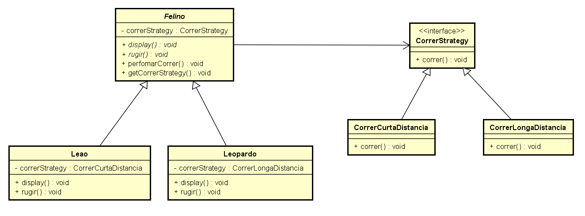
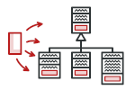

# **Design Pattern**

> *Design Patterns ou Padrões de Projetos são soluções generalistas para problemas recorrentes durante o desenvolvimento de um software. Não se trata de um framework ou um código pronto, mas de uma definição de alto nível de como um problema comum pode ser solucionado.*

Esses conceitos ficaram realmente conhecidos em 1994, quando os engenheiros de software Erich Gamma, Richard Helm, Ralph Johnson e John Vlissides escreveram o livro **“Design Patterns: Elements of Reusable Object-Oriented Software”** com o objetivo de catalogar problemas comuns aos projetos de desenvolvimento de software e as formas de resolver esses problemas. Os autores catalogaram 23 padrões que utilizaram ao longo de suas carreiras. 

### Quais os benefícios de utilizar Design Pattern?

Design Patterns são modelos que já foram utilizados e testados anteriormente, portanto podem representar um bom **ganho de produtividade** para os desenvolvedores. Seu uso também contribui para a **organização e manutenção** de projetos, já que esses padrões se baseiam em baixo acoplamento entre as classes e padronização do código. Além disso, com a padronização dos termos, as **discussões técnicas** são **facilitadas**. É mais fácil falar o nome de um Design Pattern em vez de ter que explicar todo o seu comportamento.

Os autores do livro **“Design Patterns: Elements of Reusable Object-Oriented Software”** agruparam os Design Patterns em três tipos diferentes: Creational (Criação), Structural (Estrutura), Behavioral (Comportamental). Assim como podemos ver na tabela abaixo. 

> **Observação:** Nessa tabela também foram acrescentadas novos Design Patterns. 

| Creational Patterns | Structural Patterns |   Behavioral Patterns   |
| :-----------------: | :-----------------: | :---------------------: |
|  Abstract Factory   |       Adapter       | Chain of Responsibility |
|       Builder       |       Bridge        |         Command         |
|       Factory       |      Composite      |       Interpreter       |
|   Factory Method    |      Decorator      |        Iterator         |
|      Prototype      |       Facade        |        Mediator         |
|      Singleton      |      Flyweight      |         Memento         |
|                     |        Proxy        |       Null Object       |
|                     |                     |        Observer         |
|                     |                     |          State          |
|                     |                     |        Strategy         |
|                     |                     |     Template Method     |
|                     |                     |         Visitor         |

## Creational Patterns

 
### Abstract Factory  

**Definição**

>  *É um padrão de projeto de criação que permite que você produza famílias de objetos relacionados sem ter que especificar suas classes concretas.*

**Utilização**

**Veja um exemplo:**

##### Diagrama de Classes

|  |
| :-----------------------: |

##### Classes

```kotlin
interface Forma{
    fun desenhar()
}
class RetanguloArredondado:Forma {
    override fun desenhar() {
        println("Dentro RetanguloArredondado::desenhar() method.")
    }
}
class QuadradoArredondado:Forma {
    override fun desenhar() {
        println("Dentro QuadradoArredondado::desenhar() method.")
    }
}
class Retangulo: Forma {
    override fun desenhar(){
        println("Dentro Retangulo::desenhar() method.")
    }
}
abstract class AbstractFactory {
    abstract fun getForma(tipoForma:String):Forma?
}
class FormaAbstractFactory:AbstractFactory(){

    override fun getForma(tipoForma: String): Forma? {
        when (tipoForma) {
            "RETANGULO" -> {
                return Retangulo()
            }
            "QUADRADO" -> {
                return Quadrado()
            }
        }
        return null
    }
}
class FormaArredondadoFactory:AbstractFactory() {

    override fun getForma(tipoForma: String): Forma? {
        when (tipoForma) {
            "RETANGULO" -> {
                return RetanguloArredondado()
            }
            "QUADRADO" -> {
                return QuadradoArredondado()
            }
        }
        return null
    }
}
class FactoryProducer {
    companion object{
        fun getFactory(arrendondado:Boolean):AbstractFactory{
            return if (arrendondado){
                FormaArredondadoFactory()
            } else{
                FormaAbstractFactory()

            }
        }
    }
}
//Arquivo AbstractFactory.kt
fun main() {

    //Pega a formFactory
    val formaFactory = FactoryProducer.getFactory(false)
    //Pega um objeto com forma retangular
    val forma1 = formaFactory.getForma("RETANGULO")
    //Chama o metodo desenhar do formato retangular
    forma1?.desenhar()
    //Pega um objeto com forma quadrada
    val forma2 = formaFactory.getForma("QUADRADO")
    //Chama o metodo desenhar do formato quadrado
    forma2?.desenhar()

    //Pega a formFactory
    val formaFactory1 = FactoryProducer.getFactory(true)
    //Pega um objeto com forma retangular
    val forma3 = formaFactory1.getForma("RETANGULO")
    //Chama o metodo desenhar do formato retangular
    forma3?.desenhar()
    //Pega um objeto com forma quadrada
    val forma4 = formaFactory1.getForma("QUADRADO")
    //Chama o metodo desenhar do formato quadrado
    forma4?.desenhar()
}
```

**Saída**

```
Dentro Retangulo::desenhar() method.
Dentro Quadrado::desenhar() method.
Dentro RetanguloArredondado::desenhar() method.
Dentro QuadradoArredondado::desenhar() method.
```

#### **Pontos Positivos**

#### **Pontos Negativos**


###  Builder 

**Definição**

> *É um padrão de projeto de criação que permite que você construa objetos complexos passo a passo. Ele também permite que você produza diferentes tipos e representações de um objeto usando o mesmo código de construção.*

**Utilização**

**Veja um exemplo:**

##### Diagrama de Classe

|  |
| :-----------------------: |

##### Classes

```kotlin
interface Embalagem{
    fun pacote():String
}
interface Item{
    fun nome():String
    fun embalagem():Embalagem
    fun preco():Float
}
class Embrulho:Embalagem{
    override fun pacote(): String = "Embrulho"
}
class Garrafa:Embalagem{
    override fun pacote() = "Garrafa"
}
abstract class Hamburguer:Item{
    override fun embalagem(): Embalagem = Embrulho()
}
abstract class BebidaGelada:Item{
    override fun embalagem(): Embalagem = Garrafa()
}
class HamburguerVegetariano:Hamburguer(){
    override fun nome(): String = "Hamburguer Vegetariano"
    override fun preco(): Float = 25.0f
}
class HamburguerFrango:Hamburguer(){
    override fun nome(): String = "Hamburguer de Frango"
    override fun preco(): Float = 50.5f
}
class Cola:BebidaGelada(){
    override fun nome(): String = "Coca Cola"
    override fun preco(): Float = 30.0f
}
class Pepsi:BebidaGelada(){
    override fun nome(): String = "Pepsi"
    override fun preco(): Float = 35.0f
}
class Refeicao{
    
    private val items = mutableListOf<Item>()
    
    fun addItem(item: Item){
        items.add(item)
    }
    fun getCusto():Float{
        var custo = 0.0f
        items.forEach { item-> custo += item.preco() }
            return custo
    }
    fun mostrarItens(){
        for (item in items){
            println("Item: ${item.nome()}, Embalagem: ${item.embalagem().pacote()}, Preço: ${item.preco()}")
        }
    }
}
class RefeicaoBuilder{
    
    fun prepararRefeicaoVegetariana():Refeicao{
        
        val refeicao = Refeicao()
        refeicao.addItem(HamburguerVegetariano())
        refeicao.addItem(Cola())
        
        return refeicao
    }
    
    fun prepararRefeicaoNaoVegetariana():Refeicao{
        
        val refeicao = Refeicao()
        refeicao.addItem(HamburguerFrango())
        refeicao.addItem(Pepsi())

        return refeicao
    }
}
//Arquivo Builder.kt
fun main() {

    val refeicaoBuilder = RefeicaoBuilder()

    val refeicaoVegetariana = refeicaoBuilder.prepararRefeicaoVegetariana()
    println("Refeição Vegetariana")
    refeicaoVegetariana.mostrarItens()
    println("Custo total: ${refeicaoVegetariana.getCusto()}\n")
    
    val refeicaoNaoVegetariana = prepararRefeicaoNaoVegetariana()
    println("Refeição Não Vegetariana")
    refeicaoNaoVegetariana.mostrarItens()
    println("Custo total: ${refeicaoNaoVegetariana.getCusto()}")
    
}
```

**Saída**

```
Refeição Vegetariana 
Item: Hamburguer Vegetariano, Embalagem: Embrulho, Preço: 25.0
Item: Coca Cola, Embalagem: Garrafa, Preço: 30.0
Custo total: 55.0
    
Refeição Não Vegetariana
Item: Hamburguer de Frango, Embalagem: Embrulho, Preço: 50.5
Item: Pepsi, Embalagem: Garrafa, Preço: 35.0
Custo total: 85.5
```

#### **Pontos Positivos**

#### **Pontos Negativos**


### Factory

**Definição**

> 

**Utilização**

**Veja um exemplo:**

##### Diagrama de Classe

|  |
| :-----------------------: |

##### Classe 

```kotlin
interface Forma{
    fun desenhar()
}
class Circulo: Forma {
    override fun desenhar() {
        println("Dentro Circulo::desenhar() method.")
    }
}
class Quadrado: Forma {
    override fun desenhar(){
        println("Dentro Quadrado::desenhar() method.")
    }
}
class Retangulo: Forma {
    override fun desenhar(){
        println("Dentro Retangulo::desenhar() method.")
    }
}
class FormaFactory{
    fun getForma(tipoForma:String): Forma? {
        when {
            tipoForma.equals("CIRCULO", true) -> {
                return Circulo()
            }
            tipoForma.equals("RETANGULO", true) -> {
                return Retangulo()
            }
            tipoForma.equals("QUADRADO", true) -> {
                return Quadrado()
            }
            else -> tipoForma.let {
                return null
            }
        }
    }
}
//Arquivo Factory.kt
fun main() {

    val formaFactory = FormaFactory()
    //Pega o objeto Circulo e chama o metodo desenhar
    val forma1 = formaFactory.getForma("CIRCULO")
    forma1?.desenhar()
    //Pega o objeto Retangulo e chama o metodo desenhar
    val forma2 = formaFactory.getForma("RETANGULO")
    forma2?.desenhar()
    //Pega o objeto Quadrado e chama o metodo desenhar
    val forma3 = formaFactory.getForma("QUADRADO")
    forma3?.desenhar()

}
```

**Saída**

```
Dentro Circulo::desenhar() method.
Dentro Retangulo::desenhar() method.
Dentro Quadrado::desenhar() method.
```

#### **Pontos Positivos**

#### **Pontos Negativos**


###  Factory Method

**Definição**

> *É um padrão de projeto de criação que fornece uma interface para criar objetos em uma superclasse, mas permite que as subclasses alterem o tipo de objetos que serão criados.*

**Utilização**

##### Diagrama de Classe

|  |
| :-----------------------: |

##### Classes 

```kotlin
interface Notification {
    fun notifyUser()
}

class SmsNotification : Notification {
    override fun notifyUser() = println("Sending an SMS notification")
}

class EmailNotification : Notification {
    override fun notifyUser() = println("Sending an e-mail notification")
}

class PushNotification : Notification {
    override fun notifyUser() = println("Sending a push notification")
}

class NotificationFactory {

    fun createNotification(channel: String): Notification? {

        if (channel.isEmpty()) {
            return null
        }
        when (channel) {
            "SMS" -> {
                return SmsNotification()
            }
            "EMAIL" -> {
                return EmailNotification()
            }
            "PUSH" -> {
                return PushNotification()
            }
        }

        return null

    }
}
//Arquivo FactoryMethod.kt
fun main() {

    val notificationFactory = NotificationFactory()
    val notification = notificationFactory.createNotification("SMS")
    notification?.notifyUser()
    
    /*
    val notification = notificationFactory.createNotification("EMAIL")
    notification?.notifyUser()

    //Saída
    //Sending an e-mail notification

    val notification = notificationFactory.createNotification("PUSH")
    notification?.notifyUser()

    //Saída
    //Sending a push notification
    */

}
```

**Saída**

```
Sending an SMS notification
```

**Veja um exemplo:**

#### **Pontos Positivos**

#### **Pontos Negativos**

 
### Prototype

**Definição**

> *É um padrão de projeto de criação que permite copiar objetos existentes sem fazer seu código ficar dependente de suas classes.*

**Utilização**

##### Diagrama de Classe

|  |
| :-----------------------: |

##### Classes

```kotlin
abstract class Color : Cloneable {

    abstract fun addColor()
    public override fun clone(): Any {
        var clone: Any? = null
        try {
            clone = super.clone()
        } catch (e: CloneNotSupportedException) {
            e.printStackTrace()
        }
        return clone!!
    }
}

class BlueColor : Color() {
    override fun addColor() = println("Blue color added")
}

class BlackColor : Color() {
    override fun addColor() = println("Black color added")
}

class ColorStore {

    private val colorMap: MutableMap<String, Color> = HashMap()

    fun getColor(colorName: String): Color = colorMap[colorName]!!.clone() as Color

    init {
        colorMap["blue"] = BlueColor()
        colorMap["black"] = BlackColor()
    }
}
//Arquivo Prototype.kt
fun main() {

    ColorStore().getColor("blue").addColor()
    ColorStore().getColor("black").addColor()
    ColorStore().getColor("black").addColor()
    ColorStore().getColor("blue").addColor()

}
```

 **Saída**

```
Blue color added
Black color added
Black color added
Blue color added
```

#### **Pontos Positivos**

#### **Pontos Negativos**


### Singleton

**Definição**

> *É um padrão de projeto de criação que permite a você garantir que uma classe tenha apenas uma instância, enquanto provê um ponto de acesso global para essa instância.*

**Utilização**

##### Diagrama de Classe

|  |
| :-----------------------: |

##### Classe

```kotlin
object Singleton {
    init {
        println("Initializing with object: $this")
    }

    fun print() = println("Printing with object: $this")
}
//Arquivo Singleton.kt
fun main() {
    println("Start")
    Singleton.print()
}
```

#####  Saída

```
Start
Initializing with object: Singleton@29453f44
Printing with object: Singleton@29453f44
```

#### **Pontos Positivos**

#### **Pontos Negativos**

## Structural Patterns


### Adapter

**Definição**

> *É um padrão de projeto estrutural que permite que objetos com interfaces incompatíveis colaborarem entre si.*

**Utilização**

##### Diagrama de Classe

|  |
| :-----------------------: |

##### Classes

```kotlin
interface Pato {
    fun grasnar()
    fun voar()
}

class PatoMarreco : Pato {
    override fun grasnar() = println("Quack, quack, quack")
    override fun voar() = println("Voar, voar, voar")
}

interface Peru {
    fun soar()
    fun voar()
}

class PeruAustraliano : Peru {
    override fun soar() = println("Blulu, brulu, brulu")
    override fun voar() = println("Voar")
}

class PeruAdapter(private val peru: Peru) : Pato {

    override fun grasnar() = peru.soar()
    override fun voar() = peru.voar()

}
//Arquivo Adapter.kt
fun main() {

    val patoMarreco = PatoMarreco()
    val peru = PeruAustraliano()

    val peruAdapter = PeruAdapter(peru)

    val patos = arrayOf(patoMarreco, peruAdapter)

    patos.forEach { pato->
        pato.grasnar()
        pato.voar()
    }
    
}
```

**Saída**

```
Quack, quack, quack
Voar, voar, voar
Blulu, brulu, brulu
Voar
```

#### **Pontos Positivos**

#### **Pontos Negativos**


### Bridge

**Definição**

> *É um padrão de projeto estrutural que permite que você divida uma classe grande ou um conjunto de classes intimamente ligadas em duas hierarquias separadas—abstração e implementação—que podem ser desenvolvidas independentemente umas das outras.*

**Utilização**

##### Diagrama de Classe

|  |
| :-----------------------: |

##### Classes 

```kotlin
interface DesenhoAPI {
    fun desenharCirculo(raio: Int, x: Int, y: Int)
}
class CirculoVermelho : DesenhoAPI {
    override fun desenharCirculo(raio: Int, x: Int, y: Int) {
        println("Desenhando Circulo [cor:vermelho, raio: $raio, x: $x, y: $y]")
    }
}
class CirculoVerde : DesenhoAPI {
    override fun desenharCirculo(raio: Int, x: Int, y: Int){
        println("Desenhando Circulo [cor:verde, raio: $raio, x: $x, y: $y]")
    }
}
abstract class Forma(protected val desenhoApi: DesenhoAPI) {
    abstract fun desenhar()
}
class Circulo(private val x: Int, private val y: Int, private val raio: Int, desenhoAPI: DesenhoAPI) : Forma(desenhoAPI) {
    override fun desenhar() = desenhoApi.desenharCirculo(raio, x, y)
}
//Arquivo Bridge.kt
fun main() {

    val circuloVermelho = Circulo(100, 100, 10, CirculoVermelho())
    val circuloVerde = Circulo(100, 100, 10, CirculoVerde())

    circuloVermelho.desenhar()
    circuloVerde.desenhar()

}
```

**Saída**

```
Desenhando Circulo [cor:vermelho, raio: 10, x: 100, y: 100]
Desenhando Circulo [cor:verde, raio: 10, x: 100, y: 100]
```

#### **Pontos Positivos**

#### **Pontos Negativos**


### Composite

**Definição**

> *É um padrão de projeto estrutural que permite que você componha objetos em estruturas de árvores e então trabalhe com essas estruturas como se elas fossem objetos individuais.*

**Utilização**

##### Diagrama de Classe

|  |
| :-----------------------: |

##### Classes

```kotlin
class Empregado(private val nome: String, private val departamento: String, private val salario: Int) {

    private val subordinados: MutableList<Empregado> = ArrayList()
    
    fun adicionar(e: Empregado) = subordinados.add(e)
    fun getSubordinados(): List<Empregado> = subordinados

    override fun toString(): String {
        return "Empregado:[Nome:$nome, departamento:$departamento, salario:$salario]"
    }
}
//Arquivo Composite.kt
fun main() {

    val ceo = Empregado("João", "CEO", 30000)
    val chefeVendas = Empregado("Roberto", "Chefe de Vendas", 20000)
    val chefeMarkerting = Empregado("Michel", "Chefe de Markerting", 20000)

    val escriturario1 = Empregado("Laura", "Marketing", 10000)
    val escriturario2 = Empregado("Bob", "Marketing", 10000)

    val executivoVendas1 = Empregado("Richard", "Vendas", 10000)
    val executivoVendas2 = Empregado("Lucas", "Vendas", 10000)

    ceo.adicionar(chefeVendas)
    ceo.adicionar(chefeMarkerting)

    chefeVendas.adicionar(executivoVendas1)
    chefeVendas.adicionar(executivoVendas2)

    chefeMarkerting.adicionar(escriturario1)
    chefeMarkerting.adicionar(escriturario2)

    //Lista com todos os empregados da empresa
    println(ceo)
    ceo.getSubordinados().forEach { chefeEmpregados->

        println(chefeEmpregados)

        chefeEmpregados.getSubordinados().forEach { empregado -> println(empregado)}

    }

}
```

**Saída**

```
Empregado:[Nome:João, departamento:CEO, salario:30000]
Empregado:[Nome:Roberto, departamento:Chefe de Vendas, salario:20000]
Empregado:[Nome:Richard, departamento:Vendas, salario:10000]
Empregado:[Nome:Lucas, departamento:Vendas, salario:10000]
Empregado:[Nome:Michel, departamento:Chefe de Markerting, salario:20000]
Empregado:[Nome:Laura, departamento:Marketing, salario:10000]
Empregado:[Nome:Bob, departamento:Marketing, salario:10000]
```

#### **Pontos Positivos**

#### **Pontos Negativos**


### Decorator

**Definição**

> *É um padrão de projeto estrutural que permite que você acople novos comportamentos para objetos ao colocá-los dentro de invólucros de objetos que contém os comportamentos.*

**Utilização**

##### Diagrama de Classe

|  |
| :-----------------------: |

##### Classes

```kotlin
interface Shape {
    fun desenhar()
}

class Retangulo : Shape {
    override fun desenhar() = println("Forma: Retângulo")
}

class CirculoDecorator : Shape {
    override fun desenhar() = println("Forma: Circulo")
}

abstract class FormaDecorator(private val decoratedForma: Shape) : Shape {
    override fun desenhar() = decoratedForma.desenhar()
}

class FormaVermelhaDecorator(private val decoratedForma: Shape) : FormaDecorator(decoratedForma) {
    
    override fun desenhar() {
        decoratedForma.desenhar()
        setBordaVermelha()
    }

    private fun setBordaVermelha() = println("Cor da Borda: Vermelha")

}
//Arquivo Decorator.kt
fun main() {

    val circulo = CirculoDecorator()
    val circuloVermelho = FormaVermelhaDecorator(CirculoDecorator())
    val retanguloVermelho = FormaVermelhaDecorator(Retangulo())
    println("Circulo com a borda normal")
    circulo.desenhar()

    println("\nCirculo com a borda Vermelha")
    circuloVermelho.desenhar()

    println("\nRetângulo com a borda Vermelha")
    retanguloVermelho.desenhar()
    
}
```

**Saída**

```
Circulo com a borda normal
Forma: Circulo
    
Circulo com a borda Vermelha
Forma: Circulo
Cor da Borda: Vermelha
    
Retângulo com a borda Vermelha
Forma: Retângulo
Cor da Borda: Vermelha
```

#### **Pontos Positivos**

#### **Pontos Negativos**


### Facade

**Definição**

> *É um padrão de projeto estrutural que fornece uma interface simplificada para uma biblioteca, um framework, ou qualquer conjunto complexo de classes.*

**Utilização**

##### Diagrama de Classe

|  |
| :-----------------------: |

##### Classes

```kotlin
interface Formas {
    fun desenharCircle()
    fun desenharRectangle()
    fun desenharSquare()
}

class Rectangle : Forma {
    override fun desenhar() = println("Rectangle::desenhar()")
}

class Square : Forma {
    override fun desenhar() = println("Square::desenhar()")
}

class Circle : Forma {
    override fun desenhar() = println("Circle::desenhar()")
}

class CriadorForma : Formas {

    private val circle: Forma = Circle()
    private val rectangle: Forma = Rectangle()
    private val square: Forma = Square()

    override fun desenharCircle() = circle.desenhar()
    override fun desenharRectangle() = rectangle.desenhar()
    override fun desenharSquare() = square.desenhar()
}
//Arquivo Facade.kt
fun main() {

    val criadorForma = CriadorForma()
    criadorForma.desenharCircle()
    criadorForma.desenharRectangle()
    criadorForma.desenharSquare()
    
}
```

**Saída**

```
Circle::desenhar()
Rectangle::desenhar()
Square::desenhar()
```

#### **Pontos Positivos**

#### **Pontos Negativos**


### Flyweight

**Definição**

> *É um padrão de projeto estrutural que permite a você colocar mais objetos na quantidade de RAM disponível ao compartilhar partes comuns de estado entre os múltiplos objetos ao invés de manter todos os dados em cada objeto.*

**Utilização**

##### Diagrama de Classe

|  |
| :-----------------------: |

##### Classes

```kotlin
interface Shape {
    fun desenhar()
}
class CircleFlyweight(private val color: String) : Shape {

    var x: Int = 0
    var y: Int = 0
    var radius: Int = 0

    override fun desenhar() {
        println("CircleFlyweight: Draw() [Color:$color, x:$x, y:$y, radius:$radius]")
    }

}

class ShapeFactory {
    private val circleMap: HashMap<*, *> = HashMap<Any?, Any?>()

    fun getCircle(color: String): Shape {
        var circle = circleMap[color] as CircleFlyweight?

        if (circle == null) {
            circle = CircleFlyweight(color)
            println("Criando a cor do circulo: $color")
        }
        return circle
    }
}
//Arquivo Flyweight.kt
class Flyweight{
    
    private val colors = arrayOf("Red", "Green", "Blue", "White", "Black")

    fun getRandomColor():String = colors[(Math.random() * colors.size).toInt()]
    fun getRandomX():Int = (Math.random() * 100).toInt()
    fun getRandomY():Int = (Math.random() * 100).toInt()
    
}
fun main() {

    for (i in 0..19){
        val circle = Flyweight.ShapeFactory().getCircle(Flyweight().getRandomColor()) as Flyweight.CircleFlyweight
        circle.x = Flyweight().getRandomX()
        circle.y = Flyweight().getRandomY()
        circle.radius = 100
        circle.desenhar()
    }

}
```

**Saída**

```
Criando a cor do circulo: Green
CircleFlyweight: Draw() [Color:Green, x:39, y:51, radius:100]
Criando a cor do circulo: White
CircleFlyweight: Draw() [Color:White, x:4, y:44, radius:100]
Criando a cor do circulo: Red
CircleFlyweight: Draw() [Color:Red, x:74, y:14, radius:100]
Criando a cor do circulo: Blue
CircleFlyweight: Draw() [Color:Blue, x:53, y:52, radius:100]
Criando a cor do circulo: Blue
CircleFlyweight: Draw() [Color:Blue, x:26, y:8, radius:100]
Criando a cor do circulo: Red
CircleFlyweight: Draw() [Color:Red, x:35, y:77, radius:100]
Criando a cor do circulo: Black
CircleFlyweight: Draw() [Color:Black, x:66, y:35, radius:100]
Criando a cor do circulo: Red
CircleFlyweight: Draw() [Color:Red, x:82, y:55, radius:100]
Criando a cor do circulo: Red
CircleFlyweight: Draw() [Color:Red, x:82, y:2, radius:100]
Criando a cor do circulo: Red
CircleFlyweight: Draw() [Color:Red, x:90, y:18, radius:100]
Criando a cor do circulo: White
CircleFlyweight: Draw() [Color:White, x:57, y:36, radius:100]
Criando a cor do circulo: Green
CircleFlyweight: Draw() [Color:Green, x:17, y:49, radius:100]
Criando a cor do circulo: Blue
CircleFlyweight: Draw() [Color:Blue, x:19, y:87, radius:100]
Criando a cor do circulo: Blue
CircleFlyweight: Draw() [Color:Blue, x:1, y:9, radius:100]
Criando a cor do circulo: White
CircleFlyweight: Draw() [Color:White, x:65, y:89, radius:100]
Criando a cor do circulo: White
CircleFlyweight: Draw() [Color:White, x:4, y:98, radius:100]
Criando a cor do circulo: Blue
CircleFlyweight: Draw() [Color:Blue, x:6, y:50, radius:100]
Criando a cor do circulo: Red
CircleFlyweight: Draw() [Color:Red, x:10, y:63, radius:100]
Criando a cor do circulo: White
CircleFlyweight: Draw() [Color:White, x:97, y:92, radius:100]
Criando a cor do circulo: Blue
CircleFlyweight: Draw() [Color:Blue, x:78, y:32, radius:100]
```

#### **Pontos Positivos**

#### **Pontos Negativos**


### Proxy

**Definição**

> *É um padrão de projeto estrutural que permite que você forneça um substituto ou um espaço reservado para outro objeto. Um proxy controla o acesso ao objeto original, permitindo que você faça algo ou antes ou depois do pedido chegar ao objeto original.*

**Utilização**

##### Diagrama de Classe

|  |
| :-----------------------: |

##### Classes

```kotlin
interface Image {
    fun display()
}

class RealImage(private val fileName: String) : Image {

    init {
        loadFromDisk(fileName)
    }

    override fun display() = println("Displaying: $fileName\n")

    private fun loadFromDisk(fileName: String) = println("Loading $fileName")

}

class ProxyImage(private val fileName: String) : Image {

    private var realImage: RealImage? = null
    override fun display() {

        if (realImage == null) {
            realImage = RealImage(fileName)
        }
        realImage!!.display()
    }

}
//Arquivo Proxy.kt
fun main() {

    val image = ProxyImage("MinhaFoto.png")

    //Imagem será lida pelo disco
    image.display()
    //Imagem não será lida pelo disco
    image.display()

}
```

**Saída:**

```
Loading MinhaFoto.png
Displaying: MinhaFoto.png

Displaying: MinhaFoto.png
```

#### **Pontos Positivos**

#### **Pontos Negativos**

## Behavioral Patterns


### Chain of Responsibility

**Definição**

> *É um padrão de projeto comportamental que permite que você passe pedidos por uma corrente de handlers. Ao receber um pedido, cada handler decide se processa o pedido ou o passa adiante para o próximo handler na corrente.*

**Utilização**

##### Diagrama de Classe

|  |
| :-----------------------: |

##### Classes

```kotlin
abstract class AbstractLogger {

    companion object {
        const val INFO = 1
        const val DEBUG = 2
        const val ERROR = 3
    }

    var nextLogger: AbstractLogger? = null

    open var level = 0

    open fun logMessage(level: Int, message: String?) {
        if (this.level <= level) {
            write(message)
        }
        nextLogger?.logMessage(level, message)
    }

    protected abstract fun write(message: String?)

}

class ConsoleLogger(override var level: Int) : AbstractLogger() {

    override fun write(message: String?) = println("Standard Console::Logger:$message")
}

class ErrorLogger(override var level: Int) : AbstractLogger() {

    override fun write(message: String?) = println("Error Console::Logger:$message")
}

class FileLogger(override var level: Int) : AbstractLogger() {

    override fun write(message: String?) = println("File::Logger:$message")
}
//Arquivo ChainOfResponsibility.kt
class ChainOfResponsibility{
    fun getChainOfLoggers():AbstractLogger{
        
        val errorLogger = ErrorLogger(ERROR)
        val fileLogger = FileLogger(DEBUG)
        val consoleLogger = ConsoleLogger(INFO)

        errorLogger.nextLogger = fileLogger
        fileLogger.nextLogger = consoleLogger

        return errorLogger
    }
}
fun main() {

    val loggerChain = ChainResponsibility().getChainOfLoggers()
    loggerChain.logMessage(INFO, "This is an information.")
    loggerChain.logMessage(DEBUG, "This is an debug level information.")
    loggerChain.logMessage(ERROR, "This is an error information.")
    
}
```

**Saída**

```
Standard Console::Logger:This is an information.
File::Logger:This is an debug level information.
Standard Console::Logger:This is an debug level information.
Error Console::Logger:This is an error information.
File::Logger:This is an error information.
Standard Console::Logger:This is an error information.
```

#### **Pontos Positivos**

#### **Pontos Negativos**


### Command

**Definição**

> *É um padrão de projeto comportamental que transforma um pedido em um objeto independente que contém toda a informação sobre o pedido. Essa transformação permite que você parametrize métodos com diferentes pedidos, atrase ou coloque a execução do pedido em uma fila, e suporte operações que não podem ser feitas.*

**Utilização**

##### Diagrama de Classe

|  |
| :-----------------------: |

##### Classes

```kotlin
interface Pedido {
    fun executar()
}

class Estoque {

    private val nome = "ABC"
    private val quantidade = 10

    fun comprar() = println("Estoque [Nome: $nome, Quantidade: $quantidade] comprado")

    fun vender() = println("Estoque [Nome: $nome, Quantidade: $quantidade] vendido")

}

class ComprarEstoque(private val estoque: Estoque) : Pedido {
    override fun executar() = estoque.comprar()

}

class VenderEstoque(private val estoque: Estoque) : Pedido {
    override fun executar() = estoque.vender()
}

class Corretor {

    private val listaPedidos: MutableList<Pedido> = ArrayList()

    fun levarPedido(pedido: Pedido) {
        listaPedidos.add(pedido)
    }

    fun colocarPedidos() {

        listaPedidos.forEach { pedido -> pedido.executar() }
        listaPedidos.clear()

    }
}
//Arquivo Command.kt
fun main() {

    val estoque = Estoque()

    val comprarPedidosEstoque = ComprarEstoque(estoque)
    val venderPedidosEstoque = VenderEstoque(estoque)

    val corretor = Corretor()
    corretor.levarPedido(comprarPedidosEstoque)
    corretor.levarPedido(venderPedidosEstoque)

    corretor.colocarPedidos()
    
}
```

**Saída**

```
Estoque [Nome: ABC, Quantidade: 10] comprado
Estoque [Nome: ABC, Quantidade: 10] vendido
```

#### **Pontos Positivos**

#### **Pontos Negativos**

### Interpreter

**Definição**

> 

**Utilização**

##### Diagrama de Classe

|  |
| :-----------------------: |

##### Classes

```kotlin
interface Expression {
    fun interpret(context: String): Boolean
}

class TerminalExpression(private val data: String) : Expression {
    override fun interpret(context: String): Boolean {
        if (context.contains(data)) {
            return true
        }

        return false
    }

}

class OrExpression(private val firstExpression: Expression, private val secondExpression: Expression) : Expression {
    override fun interpret(context: String): Boolean =
        firstExpression.interpret(context) || secondExpression.interpret(context)
}

class AndExpression(private val firstExpression: Expression, private val secondExpression: Expression) : Expression {
    override fun interpret(context: String): Boolean =
        firstExpression.interpret(context) && secondExpression.interpret(context)
}
//Arquivo Interpreter.kt
class Interpreter{
    
    //Regra: Roberto e John são do gênero masculino
    fun getMaleExpression():Expression{

        val roberto = TerminalExpression("Roberto")
        val john = TerminalExpression("John")

        return OrExpression(roberto, john)

    }
    //Regra: Julia é uma mulher casada
    fun getMarriedWomanExpression():Expression{

        val julia = TerminalExpression("Julia")
        val married = TerminalExpression("Casada")

        return AndExpression(julia, married)
    }
}
fun main() {

    val isMale = Interpreter().getMaleExpression()
    val isMarriedWoman = Interpreter().getMarriedWomanExpression()

    println("John é do gênero masculino? Resposta: ${isMale.interpret("John")}")
    println("Julia é uma mulher casada? Resposta: ${isMarriedWoman.interpret("Julia Casada")}")

}
```

**Saída**

```
John é do gênero masculino? Resposta: true
Julia é uma mulher casada? Resposta: true
```

#### **Pontos Positivos**

#### **Pontos Negativos**


### Iterator

**Definição**

> *É um padrão de projeto comportamental que permite a você percorrer elementos de uma coleção sem expor as representações dele (lista, pilha, árvore, etc.)*

**Utilização**

##### Diagrama de Classe

|  |
| :-----------------------: |

##### Classes

```kotlin
interface Iterator {
    fun hasNext(): Boolean
    fun next(): Any?
}

interface Container {
    fun getIterator(): Iterator
}

class NameRepository : Container {

    val names = arrayOf("Roberto", "John", "Julia", "Larissa")

    override fun getIterator(): Iterator {
        return NameIterator()
    }

    inner class NameIterator : Iterator {

        private var index: Int = 0

        override fun hasNext(): Boolean {
            if (index < names.size) {
                return true
            }
            return false
        }

        override fun next(): Any? {
            if (hasNext()) {
                return names[index++]
            }
            return null
        }

    }
    
}
//Arquivo Iterator.kt
fun main() {

    val namesRepository = NameRepository()

    val iterator = getIterator()
    
    while (iterator.hasNext()){
        val name = iterator.next() as String
        println("Nome: $name")
    }
    
}
```

**Saída**

```
Nome: Roberto
Nome: John
Nome: Julia
Nome: Larissa
```

#### **Pontos Positivos**

#### **Pontos Negativos**


### Mediator

**Definição**

> *É um padrão de projeto comportamental que permite que você reduza as dependências caóticas entre objetos. O padrão restringe comunicações diretas entre objetos e os força a colaborar apenas através do objeto mediador.*

**Utilização**

##### Diagrama de Classe

|  |
| :-----------------------: |

##### Classes

```kotlin
class ChatRoom {

    fun mostrarMensagem(usuario: Usuario, message: String) {
        val hoje = LocalDateTime.now().toString()
        println("$hoje [${usuario.nome}]: $message")
    }
}

class Usuario(val nome: String) {

    fun enviarMensagem(message: String) {
        ChatRoom().mostrarMensagem(this, message)
    }
}
//Arquivo Mediator.kt
fun main() {

    val robert = Usuario("Roberto")
    val john = Usuario("John")

    robert.enviarMensagem("Olá! John")
    john.enviarMensagem("Oi! Roberto")

}
```

**Saída:**

```
2021-06-20T09:50:48.480 [Roberto]: Olá! John
2021-06-20T09:50:48.481 [John]: Oi! Roberto
```

#### **Pontos Positivos**

#### **Pontos Negativos**


### Memento

**Definição**

> *É um padrão de projeto comportamental que permite que você salve e restaure o estado anterior de um objeto sem revelar os detalhes de sua implementação.*

**Utilização**

##### Diagrama de Classe

|  |
| :-----------------------: |

##### Classes

```kotlin
data class MementoPattern(val state: String)

class Originator {

    lateinit var state: String

    fun saveStateToMemento(): MementoPattern = MementoPattern(state)
    fun getStateFromMemento(memento: MementoPattern) {
        state = memento.state
    }
}

class CareTaker {

    private val mementoList: MutableList<MementoPattern> = arrayListOf()

    fun add(state: MementoPattern) = mementoList.add(state)
    fun getIndex(index: Int): MementoPattern = mementoList[index]

}
//Arquivo Memento.kt
fun main() {

    val originator = Originator()
    val careTaker = CareTaker()

    originator.state = "State #1"
    originator.state = "State #2"
    careTaker.add(originator.saveStateToMemento())

    originator.state = "State #3"
    careTaker.add(originator.saveStateToMemento())

    originator.state = "State #4"
    println("Current State: ${originator.state}")

    originator.getStateFromMemento(careTaker.getIndex(0))
    println("First saved state: ${originator.state}")
    originator.getStateFromMemento(careTaker.getIndex(1))
    println("Second saved state: ${originator.state}")

}
```

**Saída**

```
Current State: State #4
First saved state: State #2
Second saved state: State #3
```

#### **Pontos Positivos**

#### **Pontos Negativos**

### Null Object

**Definição**

> *É um padrão de projeto comportamental que permite que você crie uma classe para representar objetos nulos em uma aplicação.*

**Utilização**

Essa classe deve estender a classe original e implementar seus métodos de forma a executar o comportamento esperado da aplicação quando um valor nulo for recebido. Dessa forma, em vez de se retornar um valor nulo, retorna-se uma instância dessa nova classe.

##### Diagrama de Classe

|  |
| :--------------------------: |

##### Classes

```kotlin
abstract class ClienteAbstrato{
    abstract fun isNulo():Boolean
    abstract fun getNome():String
}
class ClienteReal(private var nome:String):ClienteAbstrato(){
    override fun isNulo(): Boolean = false
    override fun getNome(): String = nome
}
class ClienteNulo:ClienteAbstrato(){
    override fun isNulo(): Boolean = true
    override fun getNome(): String = "Não existe esse nome na lista"
}
//Arquivo NullObject.kt
class NullObject {

    private val listaNomes = listOf("Lucas", "João", "Maria")

    fun getCliente(nome: String): ClienteAbstrato {

        listaNomes.forEach { nomes ->

            if (nomes == nome) {
                return ClienteReal(nome)
            }

        }

        return ClienteNulo()

    }

}
fun main() {


    val cliente1 = NullObject().getCliente("Lucas")
    val cliente2 = NullObject().getCliente("Marcelo")
    val cliente3 = NullObject().getCliente("Maria")
    val cliente4 = NullObject().getCliente("Matheus")

    println("Clientes\n")
    println(cliente1.getNome())
    println(cliente2.getNome())
    println(cliente3.getNome())
    println(cliente4.getNome())

}
```

**Saída**

```
Clientes

Lucas
Não existe esse nome na lista
Maria
Não existe esse nome na lista
```

#### **Pontos Positivos**

- **Leitura mais eficiente:** quando usamos esse padrão em nosso projeto, isso torna o nosso *código mais legível e organizado*. Além disso, ela *facilita a leitura e entendimento por parte de outros programadores*.

- **Melhor tratamento de valores nulos no projeto:** uma consequência interessante da aplicação desse padrão é que ele *remove a necessidade de ter lógica especial para verificar cada valor nulo*. 
- **Uso de herança:** esse padrão demonstra bem as *características da herança*, pois ele permite que o código cliente possa ser utilizado, mesmo para o caso de um objeto nulo.

> **Herança:** é um mecanismo que permite que características comuns a diversas classes sejam fatoradas em uma classe base, ou superclasse. Esse importante conceito possibilita que as classes compartilhem seus atributos, métodos e outros membros da classe entre si. Para a ligação entre as classes, a herança adota um relacionamento esquematizado hierarquicamente. Na Herança temos dois tipos principais de classe:
>
> - **Classe Base, Classe Pai ou Superclasse**: é a classe que concede as características a uma outra classe.
> - **Classe Derivada, Classe Filho ou Subclasse**: é a classe que herda as características da classe base (também chamada de classe pai ou superclasse).

> **Dica:** Uma bom teste para verificar se o uso de herança é adequado em uma determinada situação é ver se faz sentido substituir a implementação por uma de suas subclasses em todos os contextos. Isso respeita o *Princípio da Substituição de Liskov*  (Para mais detalhes, veja o projeto que eu criei falando mais sobre a importância do SOLID clicando aqui).

#### **Pontos Negativos**

- **O tratamento de valores nulos não fica explícito:** isso pode gerar uma certa confusão na hora de ler e dar manutenção nesse código.
- **Casos específicos:** caso o padrão não seja aplicado da maneira a trabalhar com Interface (estrutura de linguagem) e outros programadores do projeto não estejam ciente da aplicação dele no algoritmo, esses outros programadores podem acabar colocando verificações para valores **nulos** quando esses nunca ocorreram, inflando o código ainda mais.

#### Regras de Ouro

- **A classe do padrão** *Null Object* **geralmente é implementada como um padrão** *Singleton*. Como um ***objeto nulo geralmente não tem nenhum estado, seu estado não pode ser alterado***, portanto, várias instâncias são idênticas. Em vez de usar várias instâncias idênticas, ***o sistema pode apenas usar uma única instância repetidamente***.
- Se alguns clientes **esperam que o objeto nulo não faça nada de uma maneira e de outra**, várias ***classes do padrão Null Object serão necessárias***. Se o **comportamento da classe não faz nada**, então ***a classe deve ser customizada em tempo de execução***. A classe do padrão Null Object exigirá variáveis conectadas para que o cliente possa especificar que o objeto nulo não deve fazer nada. 
- **Um objeto nulo não se transforma em um objeto real**. Se o objeto decidir parar de fornecer um comportamento que não faz nada e *começar a fornecer um comportamento real, então ele não é um objeto nulo*. **Se um objeto que não faz nada** (ou seja, um objeto nulo), **sofre mudanças para um objeto real**, então ele *deve ser implementado com o padrão State ou talvez o padrão Proxy*. Nesse caso, um Estado Nulo (ou **State Null**) pode ser usado ou o padrão Proxy pode conter um objeto nulo.
- **O uso de um objeto nulo pode ser semelhante ao uso do padrão *Proxy***, mas *os dois padrões têm finalidades diferentes*. Um objeto proxy acessa o um objeto real de forma indireta controlando assim o acesso. Um colaborador nulo não oculta um objeto real e controla o acesso a ele, ele substitui o objeto real. Um objeto proxy pode eventualmente sofrer mudanças para começar a agir como um objeto real. Um objeto nulo não sofrerá mudanças para começar a fornecer um comportamento real, ele sempre fornecerá um comportamento nulo, ou seja um comportamento que não faz nada.
- **Um objeto nulo pode ser um caso especial do padrão *Strategy***. O padrão *Strategy* especifica várias classes com diferentes abordagens para realizar uma tarefa. Por exemplo: s*e uma das classes Strategy não faz nada de forma consistente* (essa classe pode ser chamada de ConcreteStrategy, por exemplo), *essa classe é um classe Null Object*.
- **Um objeto nulo pode ser um caso especial do padrão** *State*. Normalmente, cada classe de estado (*State*) tem alguns métodos que não fazem nada, ou seja, métodos nulos. Isso acontece porque eles não são apropriados para aquele tipo de estado. Na verdade, um determinado método é frequentemente implementado para fazer algo útil na maioria dos estados, mas a ação de não fazer nada , ou seja, uma ação nula, acontece em pelo menos um estado. Se uma determinada classe de estado implementa a maioria de seus métodos nulos ou pelo menos fornecer resultados nulos, ele se torna um estado nulo.
- **Um objeto nulo pode ser usado para** permitir que uma classe do padrão *Visitor* *inspecione uma hierarquia com segurança e trate de uma situação nula*.
- *Null Object* **é uma classe colaborativa.** Ela atua como o colaborador para um cliente que precisa de um. *O comportamento nulo*, ou seja, que não faz nada, *não foi projetado para ser misturado a um objeto que precisa de algum comportamento nulo*. Ele é projetado para uma classe que delega a outra todos os comportamentos que podem ou não ter comportamentos nulos.


### Observer

**Definição**

> *É um padrão de projeto comportamental que permite que você defina um mecanismo de assinatura para notificar múltiplos objetos sobre quaisquer eventos que aconteçam com o objeto que eles estão observando.*

**Utilização**

##### Diagrama de Classe

|  |
| :-----------------------: |

##### Classes

```kotlin
abstract class Observer {
    abstract fun atualizar()
}

class Sujeito {
    private val observers: MutableList<Observer> = ArrayList()
    var state = 0
        set(state) {
            field = state
            notifyAllObservers()
        }

    fun attach(observer: Observer) = observers.add(observer)
    fun notifyAllObservers() = observers.forEach { observer -> observer.atualizar() }
}

class BinaryObserver(private val sujeito: Sujeito) : Observer() {

    init {
        sujeito.attach(this)
    }

    override fun atualizar(){
        println("Binary String: ${Integer.toBinaryString(sujeito.state)}\n")
    }

}

class HexaObserver(private val sujeito: Sujeito) : Observer() {

    init {
        sujeito.attach(this)
    }
    
    override fun atualizar() = println("Hexa String: ${Integer.toHexString(sujeito.state).uppercase(Locale.getDefault())}")

}

class OctalObserver(private val sujeito: Sujeito) : Observer() {

    init {
        sujeito.attach(this)
    }

    override fun atualizar() = println("Octal String: ${Integer.toOctalString(sujeito.state)}")

}
//Arquivo Observer.kt
fun main() {

    val sujeito = Sujeito()
    HexaObserver(sujeito)
    OctalObserver(sujeito)
    BinaryObserver(sujeito)

    println("O primeiro estado muda para: 15")
    sujeito.state = 15
    println("O segundo estado muda para: 10")
    sujeito.state = 10

}
```

**Saída**

```
O primeiro estado muda para: 15
Hexa String: F
Octal String: 17
Binary String: 1111

O segundo estado muda para: 10
Hexa String: A
Octal String: 12
Binary String: 1010
```

#### **Pontos Positivos**

#### **Pontos Negativos**


### State

**Definição**

> *É um padrão de projeto comportamental que permite que um objeto altere seu comportamento quando seu estado interno muda. Parece como se o objeto mudasse de classe.*

**Utilização**

##### Diagrama de Classe

|  |
| :-----------------------: |

##### Classes

```kotlin
interface State {
    fun doAction(context: Context)
}

class Context {
    var state: State? = null
}

class IniciarEstado : State {
    override fun doAction(context: Context) {
        println("O jogador iniciou o estado")
        context.state = this
    }

    override fun toString(): String = "Estado Iniciado"

}

class PararEstado : State {
    override fun doAction(context: Context) {
        println("O jogador parou o estado")
        context.state = this
    }

    override fun toString(): String = "Estado Parado"

}
//Arquivo State.kt
fun main() {

    val context = Context()

    val iniciarEstado = IniciarEstado()
    iniciarEstado.doAction(context)

    println(context.state.toString())

    val pararEstado = PararEstado()
    pararEstado.doAction(context)

    println(context.state.toString())

}
```

**Saída**

```
O jogador iniciou o estado
Estado Iniciado
O jogador parou o estado
Estado Parado
```

#### **Pontos Positivos**

#### **Pontos Negativos**


### Strategy

**Definição**

> *É um padrão de projeto comportamental que permite que você defina uma família de algoritmos, coloque-os em classes separadas, e faça os objetos deles intercambiáveis.*

**Utilização**

O Strategy é um padrão que deve ser utilizado quando ***uma classe possuir diversos algoritmos que possam ser utilizados de forma intercambiável***. A solução proposta pelo padrão consiste em ***delegar a execução do algoritmo para uma instância que compõe a classe principal***. Dessa forma, quando a funcionalidade for invocada, no momento da execução do algoritmo, será invocado um método da instância que a compõe.

##### Diagrama de Classe

|  |
| :-----------------------: |

##### Classes

```kotlin
interface OperationStrategy {
    fun doOperation(num1:Double, num2: Double):Double
}
class Soma:OperationStrategy {
    override fun doOperation(num1: Double, num2: Double): Double = num1.plus(num2)
}
class Subtracao:OperationStrategy {
    override fun doOperation(num1: Double, num2: Double): Double = num1.minus(num2)
}
class Multiplicacao:OperationStrategy {
    override fun doOperation(num1: Double, num2: Double): Double = num1.times(num2)
}
class Divisao:OperationStrategy {
    override fun doOperation(num1: Double, num2: Double): Double = num1.div(num2)
}
class Context(private val strategy: OperationStrategy) {

    fun executeOperation(num1:Double, num2:Double):Double = strategy.doOperation(num1, num2)

}
//Arquivo Strategy.kt
fun main() {

    val soma = Context(Soma())
    println("10 + 5 = ${soma.executeOperation(10.0, 5.0)}")
    val subtracao = Context(Subtracao())
    println("10 - 5 = ${subtracao.executeOperation(10.0, 5.0)}")
    val multiplicacao = Context(Multiplicacao())
    println("10 * 5 = ${multiplicacao.executeOperation(10.0, 5.0)}")
    val divisao = Context(Divisao())
    println("10 / 5 = ${divisao.executeOperation(10.0, 5.0)}")

}
```

**Saída**

```
10 + 5 = 15.0
10 - 5 = 5.0
10 * 5 = 50.0
10 / 5 = 2.0
```

#### **Pontos Positivos**

- **Leitura mais eficiente:** quando usamos esse padrão em nosso projeto, ou em parte dele, isso torna o nosso *código mais legível e organizado*. Além disso, ela facilita a leitura e entendimento por parte de outros programadores.
- **Reutilização de código:**  isso é bem evidente nesse padrão de projeto, sendo que as famílias de algoritmos podem ser *utilizadas por outras classes com diversos contextos diferentes*.
- **Evolução eficiente no seu projeto:** Isso é possível porque o foco aqui é a **composição**. Isso *evita que as classes e subclasses sejam alteradas caso novas funcionalidades sejam adicionadas ou atualizadas*. 

- **O algoritmo pode ser alterado sem a modificação da classe:** a partir dessa estrutura, *novas implementações dele podem ser criadas e introduzidas posteriormente*.
- **A lógica condicional na classe principal é reduzida:** como a escolha do algoritmo está na implementação do objeto que está compondo a classe, isso *elimina a necessidade de ter condicionais para selecionar a lógica a ser executada*. 
- **A implementação pode ser trocada em tempo de execução:** isso faz com que o *comportamento da classe possa ser trocado dinamicamente*. Além disso, o seu projeto se *torna mais dinâmico permitindo assim mais opções de funcionalidades*.

> **Composição (de Objetos):** em ciência da computação, composição de objetos é uma maneira de se combinar objetos simples ou tipos de dados em objetos mais complexos. Ela costuma ser usada como alternativa ao uso de **Herança**.

> **Herança:** é um mecanismo que permite que características comuns a diversas classes sejam fatoradas em uma classe base, ou superclasse. Esse importante conceito possibilita que as classes compartilhem seus atributos, métodos e outros membros da classe entre si. Para a ligação entre as classes, a herança adota um relacionamento esquematizado hierarquicamente. Na Herança temos dois tipos principais de classe:
>
> - **Classe Base**: a classe que concede as características a uma outra classe.
> - **Classe Derivada**: a classe que herda as características da classe base.

#### **Pontos Negativos**

- **Complexidade na criação do objeto:** a instância da dependência *precisa ser criada e configurada*. Caso o atributo seja nulo, *a classe pode apresentar um comportamento inesperado*. 
- **Aumento no número de classes:** há uma para cada algoritmo, criando uma *maior dificuldade em seu gerenciamento*. Isso pode ser muito ruim, se houverem muitas funcionalidades que não podem ser implementadas por classes de uma mesma família de classes Strategy.
- **Complexidade do projeto:** o projeto pode ficar mais *complexo caso uma solução com herança seja mais simples de implementar e manter*.

#### Regras de Ouro

- O padrão *Strategy* é semelhante ao padrão *Template Method*, exceto em sua **granularidade**.
- O padrão *Strategy* é semelhante ao padrão *State*, exceto em sua ***intenção***.
- O padrão Strategy permite que você ***mude o que tem dentro de um objeto***. Já o padrão *Decorator* permite que você ***mude a aparência externa de um objeto***.
- Os padrões *State*, *Strategy*, *Bridge* (e até certo ponto o padrão *Adapter*) têm ***estruturas de solução semelhantes***. Todos eles compartilham elementos do **Handle-Body Idioms**. Eles ***diferem em intenções***, ou seja, eles resolvem problemas diferentes.
- O padrão *Strategy* tem ***duas implementações diferentes***, a primeira é semelhante ao padrão *State*. A diferença está no seu **Binding Times** (O padrão Strategy só tem o seu Binding Times uma vez, enquanto o padrão *State* é mais dinâmico).
- Objetos do padrão *Strategy* costumam usar bem o padrão *Flyweight*.

> **Granularidade (de Dados)**: é a extensão à qual um sistema é dividido em partes pequenas, ou o sistema propriamente dito ou sua descrição ou observação. 

> **Handle-Body Idioms (Idioma de Alça-Corpo):** é usado quando dois objetos são compostos para aparecer como um único objeto. Um objeto, chamado de identificador (ou alça), gerencia a interface, enquanto outro objeto, chamado de corpo, fornece a lógica do aplicativo

> **Binding Times (ou tempo de vinculação) :** é o momento do ciclo de vida do programa em que uma variável é atribuída a seu tipo (inteiro, string, etc). Muitas propriedades de uma linguagem de programação são definidas durante sua criação. Por exemplo, o significado de palavras-chave como ***while*** ou ***for***, ou o tamanho do tipo de dados de uma variável, são propriedades definidas em tempo de design da linguagem. 
>
> **Observação:** Linguagens orientadas a objetos tem o seu tempo de vinculação de forma tardia e atribuem tipos em tempo de execução quando a variável recebe um valor do teclado ou de outra fonte.


### Template Method

**Definição**

> *É um padrão de projeto comportamental que define o esqueleto de um algoritmo na superclasse, mas deixa as subclasses sobrescreverem etapas específicas do algoritmo sem modificar sua estrutura.*

**Utilização**

Este padrão é aplicável quando se deseja ***definir um algoritmo geral***, que ***estabelece uma série de passos para cumprir um requisito da aplicação***. Porém, seus passos podem variar e é desejável que a estrutura da implementação forneça uma forma para que eles sejam facilmente substituídos.

##### Diagrama de Classe

|  |
| :-----------------------: |

##### Classes

```kotlin
abstract class Game{
    
    abstract fun initialize()
    abstract fun startPlay()
    abstract fun endPlay()
    
    fun play(){
        initialize()
        startPlay()
        endPlay()
    }
}
class Volei:Game(){
    override fun initialize() = println("Volei Game Initialized! Start playing.")
    override fun startPlay() = println("Volei Game Started. Enjoy the game!")
    override fun endPlay() = println("Volei Game Finished!")
}
class Football:Game(){
    override fun initialize() = println("Football Game Initialized! Start playing.")
    override fun startPlay() = println("Football Game Started. Enjoy the game!")
    override fun endPlay() = println("Football Game Finished!")
}
//Arquivo TemplateMethod.kt
fun main() {
    
    var game:Game = Volei()
    game.play()
    println()
    game = Football()
    game.play()
    
}
```

**Saída**

```
Volei Game Initialized! Start playing.
Volei Game Started. Enjoy the game!
Volei Game Finished!
    
Football Game Initialized! Start playing.
Football Game Started. Enjoy the game!
Football Game Finished!
```

#### **Pontos Positivos**

#### **Pontos Negativos**


### Visitor

**Definição**

> *É um padrão de projeto comportamental que permite que você separe algoritmos dos objetos nos quais eles operam.*

**Utilização**

##### Diagrama de Classe

|  |
| :-----------------------: |

##### Classes

```kotlin
interface PartesComputadorVisitor {
    fun visit(computador: Computador)
    fun visit(monitor: Monitor)
    fun visit(teclado: Teclado)
    fun visit(mouse: Mouse)
}

interface PartesComputador {
    fun aceitar(partesComputadorVisitor: PartesComputadorVisitor)
}

class Computador : PartesComputador {

    private val partes: Array<PartesComputador> = arrayOf(Mouse(), Teclado(), Monitor())

    override fun aceitar(partesComputadorVisitor: PartesComputadorVisitor) {

        partes.forEach { partesComputador -> partesComputador.aceitar(partesComputadorVisitor) }
        partesComputadorVisitor.visit(this)
    }

}

class Monitor : PartesComputador {
    override fun aceitar(partesComputadorVisitor: PartesComputadorVisitor) {
        partesComputadorVisitor.visit(this)
    }

}

class Teclado : PartesComputador {
    override fun aceitar(partesComputadorVisitor: PartesComputadorVisitor) {
        partesComputadorVisitor.visit(this)
    }

}

class Mouse : PartesComputador {
    override fun aceitar(partesComputadorVisitor: PartesComputadorVisitor) {
        partesComputadorVisitor.visit(this)
    }

}

class ParteComputadorDisplayVisitor : PartesComputadorVisitor {

    override fun visit(computador: Computador) = println("Displaying Computador.")
    override fun visit(monitor: Monitor) = println("Displaying Monitor.")
    override fun visit(teclado: Teclado) = println("Displaying Teclado.")
    override fun visit(mouse: Mouse) = println("Displaying Mouse.")

}
//Arquivo Visitor.kt
fun main() {

    val computador:PartesComputador = Computador()
    computador.aceitar(ParteComputadorDisplayVisitor())

}
```

**Saída**

```
Displaying Mouse.
Displaying Teclado.
Displaying Monitor.
Displaying Computador.
```

#### **Pontos Positivos**

#### **Pontos Negativos**

## Fontes

1. https://www.opus-software.com.br/design-patterns/
2. **Livro:** Design Patterns com Java - Projeto orientado a objetos guiados por padrões - Eduardo Guerra
3. http://www.cs.sjsu.edu/faculty/pearce/patterns/hanbod/hanbod.html
4. https://www.pcmag.com/encyclopedia/term/binding-time
5. https://www.thiengo.com.br/padrao-de-projeto-template-method-metodo-template
6. https://www.thiengo.com.br/padrao-de-projeto-strategy-estrategia
7. https://sourcemaking.com/design_patterns/strategy
8. https://www.geeksforgeeks.org/prototype-design-pattern/
9. https://www.geeksforgeeks.org/factory-method-design-pattern-in-java/
